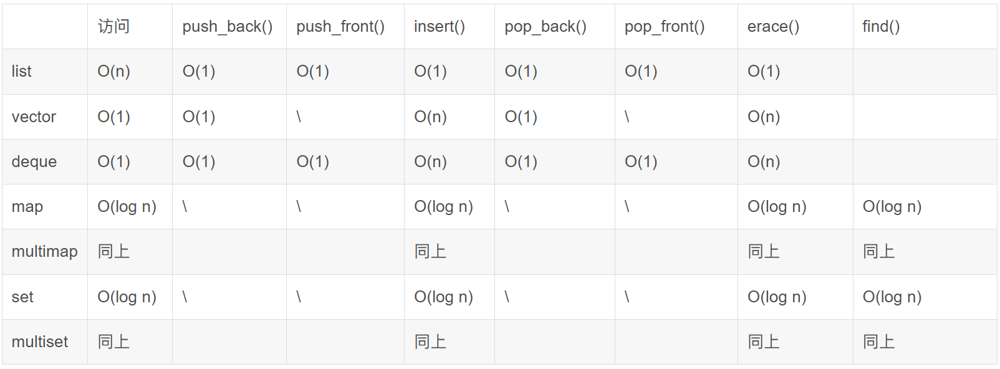

- [A 多态](#a-多态)
  
  - [1. A, B类都有虚函数, C继承A和B, C的大小, C有几个虚指针](#1-a-b类都有虚函数-c继承a和b-c的大小-c有几个虚指针)
  - [2. c++类的对象大小由什么决定](#2-c类的对象大小由什么决定)
  - [3. C++的多态](#3-c的多态)
  - [4.1 构造函数不可以是虚函数](#41-构造函数不可以是虚函数)
  - [4.2 析构函数可以是虚函数](#42-析构函数可以是虚函数)
  - [5. 请描述一下重载、重写、隐藏、覆盖之间有什么不同？](#5-请描述一下重载重写隐藏覆盖之间有什么不同)
  - [6. 多继承和菱形继承](#6-多继承和菱形继承)
  - [7. 友元](#7-友元)
  
- [B STL](#b-stl)
  - [1. STL 容器](#1-stl-容器)
  - [2. 有指针为什么还要用迭代器](#2-有指针为什么还要用迭代器)
  - [3. 迭代器失效问题](#3-迭代器失效问题)
  - [4. push\_back \& emplace\_back](#4-push_back--emplace_back)
  - [5. STL 堆栈内存相关](#5-stl-堆栈内存相关)
  
- [C 内存相关](#c-内存相关)
  - [1. 定义类在堆/栈上](#1-定义类在堆栈上)
  - [2. new \& malloc](#2-new--malloc)
  - [3. new、new\[\]、delete、delete\[\]](#3-newnewdeletedelete)
  - [4. 常见的内存泄漏的情况](#4-常见的内存泄漏的情况)
  - [5. 内存泄漏怎么排查？](#5-内存泄漏怎么排查)
  - [6. 如何避免内存泄露？](#6-如何避免内存泄露)
  - [7. 指针和引用](#7-指针和引用)
  - [7. C++ 内存布局](#7-c-内存布局)
  
- [D C++ 11](#d-c-11)
  - [1. std::move](#1-stdmove)
  - [2. 右值引用](#2-右值引用)
  - [3. 万能引用](#3-万能引用)
  - [4. 完美转发](#4-完美转发)
  - [5. 移动构造函数](#5-移动构造函数)
  - [6. static\_cast、reinterpret\_cast、dynamic\_cast](#6-static_castreinterpret_castdynamic_cast)
  - [7. 智能指针](#7-智能指针)
      - [1. shared\_ptr](#1-shared_ptr)
      - [2. unique\_ptr](#2-unique_ptr)
      - [3. weak\_ptr](#3-weak_ptr)
  
- [E 设计模式](#e-设计模式)
  - [1. 单例模式](#1-单例模式)
  - [2. 工厂模式](#2-工厂模式)
  
- [其他](#其他)
  - [1. printf 原理](#1-printf-原理)
  - [2. 链接库](#2-链接库)
    - [静态库](#静态库)
    - [动态库](#动态库)
    - [动态链接器](#动态链接器)
    - [优缺点](#优缺点)
  - [3. C语言编译过程](#3-c语言编译过程)
  - [4. 结构体对齐原则](#4-结构体对齐原则)
  - [5. volatile 关键字](#5-volatile-关键字)
  - [6. GDB 调试原理和相关命令](#6-gdb-调试原理和相关命令)
  
  


## A 多态

### 1. A, B类都有虚函数, C继承A和B, C的大小, C有几个虚指针

C有俩个虚表，俩个虚函数指针


### 2. c++类的对象大小由什么决定

空类1、非空类由非静态成员变量决定


### 3. C++的多态

C++的多态机制是指：派生类对象的地址可以赋值给基类指针。对于通过基类指针调用基类和派生类中都有同名、同参数表的虚函数语句，编译时并不需要确定调用的这个函数是基类的函数派生类的，在程序运行到这条语句的时候，如果基类指针指向的是一个基类对象，则基类的虚函数被调用，如果基类的指针指向的是一个派生类的对象，则派生类的虚函数被调用。

**C++有哪些多态的典型例子？**静态多态：模板和函数重载。动态多态：virtual 


### 4.1 构造函数不可以是虚函数

一个类有虚函数时，编译器会为它创建一个虚函数表指针和虚函数表。对象创建时，构造函数要初始化这个虚函数表指针。如果构造函数是虚函数，则对象创建时要先通过虚表指针来找到构造函数，但这个时候虚表指针还没有初始化。

### 4.2 析构函数可以是虚函数

析构函数是虚函数时，基类指针指向子类时，对象析构会调用虚函数表里的析构函数，这样才会调用到子类的析构函数，子类析构函数回收子类资源，然后调用父类构造函数回收父类资源。

如果父类析构函数不是虚函数，则基类指针指向派生类，销毁时，只会调用基类的析构函数。


### 5. 请描述一下重载、重写、隐藏、覆盖之间有什么不同？

- 重载：在某一个指定的域内，存在多个函数名相同，但是参数列表不同的函数，这些函数构成了重载（函数的返回值并不参与重载）。
- 重写、覆盖：指在派生类中重新定义基类中已有的虚函数，从而覆盖基类的行为。通过这种方式，可以使派生类对基类的虚函数重新实现，从而改变该函数的行为。
- 隐藏：在继承关系中，派生类中出现了和基类相同的属性或者方法，那么就会将基类中与之同名的属性或者方法隐藏，从而在调用的时候，在不指明作用域的情况下调用的是派生类的这个属性或者方法。


### 6. 多继承和菱形继承

菱形继承会产生二义性的问题。比如有一个基类A，子类B和C分别继承了A，然后又有一个D类继承了B、C。如果基类A里面有一个成员变量，D类再访问时，就会产生二义性，不知道该访问的是B中的变量还是C中的变量（A有一个成员x，B, C都继承它，D访问时，到底访问的是B的A的x还是C的A的x？）。

解决方法是B、C通过虚继承来继承A类，这样相同的成员变量只会有一份实例。对这个实例的访问，会通过虚基表和虚基表指针来访问。


### 7. 友元

在 C++ 中，一个类中可以有 public、protected、private 三种属性的成员，通过对象可以访问 public 成员，只有本类中的函数可以访问本类的 private 成员。借助友元（friend），可以使得其他类中的成员函数以及全局范围内的函数访问当前类的 private 成员。

**友元函数：**在当前类以外定义的、不属于当前类的函数也可以在类中声明，但要在前面加 friend 关键字。友元函数不同于类的成员函数，在友元函数中不能直接访问类的成员，必须要借助对象。

**友元类：**友元类中的所有成员函数都是另外一个类的友元函数。

- 友元的关系是单向的而不是双向的。如果声明了类 B 是类 A 的友元类，不等于类 A 是类 B 的友元类，类 A 中的成员函数不能访问类 B 中的 private 成员。
- 友元的关系不能传递。如果类 B 是类 A 的友元类，类 C 是类 B 的友元类，不等于类 C 是类 A 的友元类。

除非有必要，一般不建议把整个类声明为友元类，而只将某些成员函数声明为友元函数，这样更安全一些。


## B STL

### 1. STL 容器

| 顺序容器     | 简介说明                                                     |
| ------------ | ------------------------------------------------------------ |
| vector       | 可变大小数组。底层实现是一个连续的、线性的内存空间。vector 通过一个指针指向存储元素的内存空间的起始位置，而 vector 中的每个元素都占据连续的内存空间。支持随机访问，无头插和尾插，仅支持insert插入，除尾部外的元素删除比较麻烦。但使用最为广泛。**扩容流程为：申请新的内存空间（空间大小为原空间的2倍或1.5倍）—> 把原空间的元素拷贝到新的空间里 —> 释放原空间 —> 数组指针指向新空间。** |
| deque        | 双端队列。它的结构是采用多个连续的存储块，并且在一个映射结构中保存对这些块及其顺序的跟踪。向deque两端添加或删除元素的开销很小。支持头插、删，尾插、删，随机访问较vector容器来说慢，但对于首尾的数据操作比较方便。插入和删除是O(n)。 |
| list         | 双向循环链表。使用起来很高效，对于任意位置的插入和删除都很快O(1)，在操作过后指针、迭代器、引用都不会失效 |
| forward_list | 单向链表。只支持单向访问，在链表的任何位置进行插入/删除操作都非常快 |
| array        | 固定数组。vector的底层即为array数组，它保存了一个以严格顺序排列的特定数量的元素 |

| 关联式容器   | 简介说明                                                     |
| ------------ | ------------------------------------------------------------ |
| set/multiset | 集合/多重集合。对于set，在使用insert插入元素时，已插入过的元素不可重复插入，这正好符合了集合的互异性，在插入完成显示后，会默认按照升序进行排序，对于multiset，可插入多个重复的元素 |
| map/multimap | 映射/多重映射。二者均为二元关联容器（在构造时需要写两个参数类型，前者对key值，后者对应value值），因为有两个参数，因此在插入元素的时候需要配合对组pair进行插入 |

| 容器适配器     | 简介说明                                                     |
| -------------- | ------------------------------------------------------------ |
| stack          | 堆栈。其原理是先进后出（FILO），其底层容器可以是任何标准的容器适配器，默认为deque双端队列。**没有迭代器** |
| queue          | 队列。其原理是先进先出（FIFO），只有队头和队尾可以被访问，故不可有遍历行为，默认也为deque双端队列。**没有迭代器** |
| pirority_queue | 优先队列。它的第一个元素总是它所包含的元素中优先级最高的，就像数据结构里的堆，会默认形成大堆，还可以使用仿函数来控制生成大根堆还是生成小根堆，若没定义，默认使用vector容器。**没有迭代器** |




### 2. 有指针为什么还要用迭代器

主要体现的是封装的思想。

（1）通过迭代器访问容器，可以避免许多错误，同时还能隐藏容器的具体实现。

（2）迭代器可以保证对所有容器的基本遍历方式都是一样的，实现算法时若需要遍历，则使用迭代器，则可以不用关注容器的具体类型，实现数据结构和算法的分离。

迭代器不是指针，是类模板，表现的像指针。他只是模拟了指针的一些功能，重载了指针的一些操作符，迭代器封装了指针，是一个“可遍历STL容器内全部或部分元素”的对象，本质是封装了原生指针，是指针概念的一种提升（lift），提供了比指针更高级的行为。


### 3. 迭代器失效问题

数组类容器，使用迭代器删除一个元素后，由于内存是连续分配的，会使得后面所有元素的迭代器失效。用erase方法，可以返回下一个有效的迭代器。

链表型容器，只会使当前删除的迭代器失效。因此，使用erase方法获取下一个有效的迭代器即可。

树形结构容器，删除一个结点时不会对其他结点造成影响。


### 4. push_back & emplace_back

- 左值参数的push_back要调用构造函数和复制构造
- 右值参数的push_back要调用构造函数和移动构造
- emplace_back只需调用一次构造

emplace_back可以传对象，此时和push_back效果相同


### 5. STL 堆栈内存相关

vector，string等分配时，自己本身通常是个栈对象，但里面的allocator（内存分配器）分配的空间是在堆上的。


## C 内存相关

### 1. 定义类在堆/栈上

**在堆上定义变量：**

1. 将类的构造函数私有，拷贝构造声明成私有。防止别人调用拷贝在栈上生成对象。
2. 提供一个静态的成员函数，在该静态成员函数中完成堆对象的创建

**在栈上定义变量：**

new的功能屏蔽掉即可，即屏蔽掉operator new和定位new表达式。注意：屏蔽了operator new，实际也是将定位new屏蔽掉。

### 2. new & malloc

- malloc是库函数，new是C++的运算符
- malloc 需要强制类型转换，它不做类型检查。new会做类型检查
- malloc 不会清空内存区域
- **malloc函数 不会 调用类/结构体的构造函数。 new运算符 会 调用类/结构体的构造函数**。 malloc失败时，会返回NULL指针。 new失败时，会抛出std::bad_alloc异常


- **new的原理**
  - 调用operator new函数申请空间
  - 在申请的空间上执行构造函数，完成对象的构造
- **delete的原理**
  - 在空间上执行析构函数，完成对象中资源的清理工作
  - 调用operator delete函数释放对象的空间


### 3. new、new[]、delete、delete[]

- 对于内置类型：

  new []不会在首地址前4个字节定义数组长度。

  delete 和 delete[]是一样的执行效果，都会删除整个数组，要删除的长度从new时即可知道。

- 对于自定义类型：

  new []会在首地址前4个字节定义数组长度。因为需要逐个调用构造函数。

  当delete[]时，会根据前4个字节所定义的长度来执行析构函数删除整个数组。


### 4. 常见的内存泄漏的情况

1. **在类的构造函数和析构函数中没有匹配的调用new和delete函数**
2. 没有正确地清除嵌套的对象指针
3. **在释放对象数组时在delete中没有使用方括号**
4. 指向对象的指针数组不等同于对象数组
5. **缺少拷贝构造函数，浅拷贝了**
6. **缺少重载赋值运算符**
7. 返回值为野指针
8. **没有将基类的析构函数定义成虚函数**


### 5. 内存泄漏怎么排查？

1. 取一份程序拷贝准备复现问题
2. 两个方面来确定问题的来源
   1. 用更高的业务访问频率（业务参数）来模拟在线程序的情况，让问题显现更清楚
   2. 满足上面一条之后，（如果是巨大循环的算法）每次注释掉一个模块，来排查问题。找到是那个大模块之后，再从大模块入手使用同样方法，直到找到泄露点。

1. 尽量避免注释掉依赖模块。从底层开始。
2. 模块的划分粒度大小很重要，影响排查速度
3. 如果是由独立业务堆砌出来的大型程序，要从业务划分来找到一个或者多个业务发生泄露，然后使用上面的方法
4. 如果十分确定使用上面两条找不到。最后一招CodeReview。
5. 找到来源之后修复一下，做项目回归测试。


### 6. 如何避免内存泄露？
- 确保没有在访问空指针。
- 每个内存分配函数都应该有一个 free 函数与之对应，alloca 函数除外。
- 每次分配内存之后都应该及时进行初始化，可以结合 memset 函数进行初始化，calloc 函数除外。
- 每当向指针写入值时，都要确保对可用字节数和所写入的字节数进行交叉核对。
- 在对指针赋值前，一定要确保没有内存位置会变为孤立的。
- 每当释放结构化的元素（而该元素又包含指向动态分配的内存位置的指针）时，都应先遍历子内存位置并从那里开始释放，然后再遍历回父节点。
- 始终正确处理返回动态分配的内存引用的函数返回值。

或者使用检测程序，如valgrind等


### 7. 指针和引用

1. 内存空间：指针是一个变量，存储的是一个内存地址，可以通过指针访问该地址上的变量；而引用是一个别名，不占用额外的内存空间，它指向的是已经存在的内存空间。
2. 空指针和空引用：指针可以是空指针（nullptr），也可以指向一个具体的内存地址；而引用必须初始化并指向一个已有的变量，不可以是空引用。
3. 语法：使用指针时需要通过解引用符号 * 访问所指向的变量，而引用可以直接使用原始变量的名称来访问该变量。
4. 类型：指针可以指向任何类型的变量，而引用只能绑定到与其类型相同的变量上。
5. 可变性：指针可以被重新赋值，指向不同的内存空间；而引用在绑定后无法再次绑定到其他变量上。
6. 但是从汇编视角看，他们都是指针，对内存地址进行控制。


### 7. C++ 内存布局

代码段：.text

数据段：.data .rodata .bss

堆、栈


## D C++ 11

### 1. std::move

`std::move`用于将一个对象的内容“移动”到另一个对象中，通常用于优化传递临时对象和避免拷贝大量内存的操作。**实际上是把一个变量转换成右值引用**。

通常来说，move的参数，在调用之后，就不再使用了。


### 2. 右值引用

- 左值是指存储在内存中、有明确存储地址（可取地址）的数据；

- 右值是指可以提供数据值的数据（不可取地址）
  - 纯右值：非引用返回的临时变量、运算表达式产生的临时变量、原始字面量和 lambda 表达式等
  - 将亡值：与右值引用相关的表达式，比如，T&& 类型函数的返回值、 std::move 的返回值等。

**右值引用主要用于移动构造函数，对构造函数内参数的所有权进行转移。**

关于&&的使用：

- auto&&或者函数参数类型自动推导的T&&是一个未定的引用类型，它可能是左值引用也可能是右值引用类型，这取决于初始化的值类型（上面有例子）。
- 通过右值推导 T&& 或者 auto&& 得到的是一个右值引用类型，其余都是左值引用类型。


### 3. 万能引用

万能引用通常用于模板函数参数，T &&，参数传递时会根据参数的类型，自动推导出引用类型。如果参数传递进来的是左值，推导出的结果就是左值引用；否则就是右值引用。


### 4. 完美转发

一个右值引用作为函数参数的形参时，在函数内部转发该参数给内部其他函数时，它就变成一个左值，并不是原来的类型了。（因为这个形参在函数栈上有了明确的值和地址，可以取得）如果需要按照参数原来的类型转发到另一个函数，可以使用 C++11 提供的 std::forward () 函数，该函数实现的功能称之为完美转发。


### 5. 移动构造函数

移动构造函数通常和右值引用相关，通常的场景是将参数的内容移动到构造函数的变量中。和拷贝构造函数的区别在于，对于指针等资源的引用，通常是直接转移引用，而不是创建一个新的内存区域然后把值复制过去。


### 6. static_cast、reinterpret_cast、dynamic_cast

- **static_cast**通常用于向上转换，它不会有运行时的检查来保证安全性。不确保转换到目标类型上的指针所指向的对象有效且完整。但向下转换也是可以的，容易产生截断等行为，因此需要程序员自己注意是否该转换是否有效。

- **dynamic_cast**只能用在指针或者引用上。它会确保转换的结果是有效且完整的。比如创建了一个基类指针，指向了派生类，这时候用dynamic_cast是合法的。

  上行转换（子类转父类），转换安全，成功返回类对象指针, 此时和static_cast 作用一样。

  下行转换（父类转子类）， 父类中要有虚函数，否则编译器报错。转换分几种情况：
  a. 父类指针指向子类对象，转换安全， dynamic_cast返回类对象指针。
  b.父类指针指向父类对象，转换不安全，dynamic_cast 返回nullptr。
  此时若使用static_cast, 返回非空指针，更不安全。

- **reinterpret_cast**能够完成任意类型的转换，不会有任何检查。是在二进制层面上进行指针的解析。
- **const_cast**用于移除const。


### 7. 智能指针

智能指针是存储指向动态分配（堆）对象指针的类，用于生存期的控制，能够确保在离开指针所在作用域时，自动地销毁动态分配的对象，防止内存泄露。智能指针的核心实现技术是引用计数，每使用它一次，内部引用计数加1，每析构一次内部的引用计数减1，减为0时，删除所指向的堆内存。

##### 1. shared_ptr

多个 shared_ptr 智能指针可以共同使用同一块堆内存。该类型智能指针在实现上采用的是引用计数机制，即便有一个 shared_ptr 指针放弃了堆内存的“使用权”（引用计数减 1），也不会影响其他指向同一堆内存的 shared_ptr 指针（只有引用计数为 0 时，堆内存才会被自动释放）。

make_shared申请一个单独的内存块来同时存放对象和控制块。这个优化减少了程序的静态大小，因为代码只包含一次内存分配的调用，并且这会加快代码的执行速度，因为内存只分配了一次。另外，使用make_shared消除了一些控制块需要记录的信息，这样潜在地减少了程序的总内存占用。

在初始化 shared_ptr 智能指针时，还可以自定义所指堆内存的释放规则，这样当堆内存的引用计数为 0 时，会优先调用我们自定义的释放规则。在某些场景中，自定义释放规则是很有必要的。**比如，对于申请的动态数组来说，shared_ptr 指针默认的释放规则是不支持释放数组的，只能自定义对应的释放规则，才能正确地释放申请的堆内存。**


shared_ptr的引用计数本身是安全且无锁的，但对象的读写则不是，因为shared_ptr 有两个数据成员，读写操作不能原子化。shared_ptr 的线程安全级别和内建类型、标准库容器、std::string 一样，即：

- 一个 shared_ptr 对象实体可被多个线程同时读取
- 两个 shared_ptr 对象实体可以被两个线程同时写入，“析构”算写操作
- 如果要从多个线程读写同一个 shared_ptr 对象，那么需要加锁

##### 2. unique_ptr

- 拷贝构造函数，禁用，不支持
- 拷贝赋值函数，禁用，不支持

##### 3. weak_ptr

弱引用智能指针 weak_ptr 可以看做是 shared_ptr 的助手，它不管理 shared_ptr 内部的指针。weak_ptr 没有重载操作符 * 和 ->，因为它不共享指针，不能操作资源，所以它的构造不会增加引用计数，析构也不会减少引用计数，它的主要作用就是作为一个旁观者监视 shared_ptr 中管理的资源是否存在。

通过调用 weak_ptr 类提供的 lock() 方法来获取管理所监测资源的 shared_ptr 对象。相当于创建一个新的 shared_ptr。


##### shared_ptr 代码实现

先实现对 raw 指针的封装（构造和析构），然后实现几个运算符重载 *、->、bool()、然后实现两种构造函数，两种=运算符重载（复制和移动）

````c++
```cpp
#include <iostream>
#include <cstdio>
#include <memory>

class Point {
public:
    int a;
    int b;
    int c;

    Point(int _a, int _b, int _c) : a(_a), b(_b), c(_c) { }
    Point();
};


class _ref_count {
public:
    int increase() {
        return ++count;
    }

    int decrease() {
        return --count;
    }

    int get_count() const {
        return count;
    }

    _ref_count(int _count = 1) : count(_count) { }


private:
    int count;
};


template<typename T>
class shared_pointer {
public:
    shared_pointer(T* ptr = nullptr) : m_ptr(ptr) {
        if (m_ptr) {
            m_ref_count = new _ref_count();
        }
    }

    ~shared_pointer() {
        if (m_ptr) {
            m_ref_count->decrease();

            if (m_ref_count->get_count() == 0) {
                delete m_ptr;
                delete m_ref_count;
                m_ptr = nullptr;
                m_ref_count = nullptr;
            }
        }
    }

    shared_pointer(const shared_pointer& rhs) {
        if (rhs) {
            m_ptr = rhs.m_ptr;
            m_ref_count = rhs.m_ref_count;
            m_ref_count->increase();
        }
    }

    shared_pointer(shared_pointer&& rhs) {
        if (rhs) {
            m_ptr = rhs.m_ptr;
            m_ref_count = rhs.m_ref_count;
            rhs.m_ptr = nullptr;
            rhs.m_ref_count = nullptr;
        }
    }

    shared_pointer& operator=(const shared_pointer& rhs) {
        if (m_ptr && m_ptr == rhs.m_ptr) {
            return *this;
        }
        // else if (m_ptr) {
        //     m_ref_count->decrease();
        //     if (m_ref_count->get_count() == 0) {
        //         delete m_ptr;
        //         delete m_ref_count;
        //         m_ptr = nullptr;
        //         m_ref_count = nullptr;
        //     }

        //     m_ptr = rhs.m_ptr;
        //     m_ref_count = rhs.m_ref_count;
        // }

        shared_pointer(rhs).swap(*this);

        return *this;
    }

    shared_pointer& operator=(shared_pointer&& rhs) {
        if (m_ptr && m_ptr == rhs.m_ptr) {
            return *this;
        }
        // else if (m_ptr) {
        //     m_ref_count->decrease();
        //     if (m_ref_count->get_count() == 0) {
        //         delete m_ptr;
        //         delete m_ref_count;
        //         m_ptr = nullptr;
        //         m_ref_count = nullptr;
        //     }

        //     m_ptr = rhs.m_ptr;
        //     m_ref_count = rhs.m_ref_count;

        //     rhs.m_ptr = nullptr;
        //     rhs.m_ref_count = nullptr;
        // }

        shared_pointer(std::move(rhs)).swap(*this);

        return *this;
    }

    T& operator*() const {
        return *m_ptr;
    }

    T* operator->() const {
        return m_ptr;
    }

    operator bool() const {
        return m_ptr;
    }

    int get_count() const {
        return m_ref_count->get_count();
    }

    void reset(T* ptr) {
        if (m_ptr) {
            m_ref_count->decrease();
            if (m_ref_count->get_count() == 0) {
                delete m_ptr;
                delete m_ref_count;
                m_ptr = nullptr;
                m_ref_count = nullptr;
            }
        }

        m_ptr = ptr;
        m_ref_count = new _ref_count();
    }

    bool unique() const {
        return m_ref_count->get_count() == 1;
    }

    void swap(shared_pointer& rhs) {
        using std::swap;
        swap(rhs.m_ptr, m_ptr);
        swap(rhs.m_ref_count, m_ref_count);
    }


private:
    T* m_ptr;
    _ref_count* m_ref_count;
};

int main() {
    using namespace std;

    #define ENABLE

    #ifndef ENABLE
        #define shared_pointer shared_ptr
        #define get_count use_count
    #endif

    shared_pointer<Point> sptr(new Point(1, 2, 3));
    shared_pointer<Point> sptr2(sptr);

    cout << sptr->a << endl;
    cout << sptr->b << endl;
    cout << sptr2->c << endl;
    cout << sptr.get_count() << endl;

    shared_pointer<Point> sptr3(sptr2);

    cout << sptr.get_count() << endl;

    shared_pointer<Point> sptr4 = sptr2;

    cout << sptr.get_count() << endl;

    if (sptr4) {
        cout << "sptr4 enabled" << endl;
    }

    sptr4 = shared_pointer<Point>(new Point(4, 5, 6));

    cout << sptr.get_count() << endl;

    cout << sptr4.get_count() << endl;

    sptr = sptr2;

    cout << sptr.get_count() << endl;


    return 0;
}
```

````


## E 设计模式

### 1. 单例模式

在一个项目中，全局范围内，某个类的实例有且仅有一个，通过这个唯一实例向其他模块提供数据的全局访问，这种模式就叫单例模式。

为了把一个类可以实例化多个对象的路堵死，可以做如下处理：

- 构造函数私有化，在类内部只调用一次，这个是可控的。

  - 由于使用者在类外部不能使用构造函数，所以在类内部创建的这个唯一的对象必须是静态的，这样就可以通过类名来访问了，为了不破坏类的封装，我们都会把这个静态对象的访问权限设置为私有的。
  - 在类中只有它的静态成员函数才能访问其静态成员变量，所以可以给这个单例类提供一个静态函数用于得到这个静态的单例对象。
- 拷贝构造函数私有化或者禁用（使用 = delete）
- 拷贝赋值操作符重载函数私有化或者禁用


饿汉模式：饿汉模式就是在类加载的时候立刻进行实例化，这样就得到了一个唯一的可用对象。

```c++
// 饿汉模式
class TaskQueue {
public:
    // = delete 代表函数禁用, 也可以将其访问权限设置为私有
    TaskQueue(const TaskQueue& obj) = delete;
    TaskQueue& operator=(const TaskQueue& obj) = delete;
    static TaskQueue* getInstance() {
        return m_taskQ;
    }
private:
    TaskQueue() = default;
    static TaskQueue* m_taskQ;
};
// 静态成员初始化放到类外部处理
TaskQueue* TaskQueue::m_taskQ = new TaskQueue;

int main() {
    TaskQueue* obj = TaskQueue::getInstance();
}

```


懒汉模式：在类加载的时候不去创建这个唯一的实例，而是在需要使用的时候再进行实例化。

```
class TaskQueue
{
public:
    // = delete 代表函数禁用, 也可以将其访问权限设置为私有
    TaskQueue(const TaskQueue& obj) = delete;
    TaskQueue& operator=(const TaskQueue& obj) = delete;
    static TaskQueue* getInstance() {
        if (m_taskQ == nullptr) {
            m_mutex.lock();
            if (m_taskQ == nullptr) {
                m_taskQ = new TaskQueue;
            }
            m_mutex.unlock();
        }
        return m_taskQ;
    }
private:
    TaskQueue() = default;
    static TaskQueue* m_taskQ;
    static mutex m_mutex;
};
TaskQueue* TaskQueue::m_taskQ = nullptr;
mutex TaskQueue::m_mutex;
```


### 2. 工厂模式

工厂模式是一种创建型设计模式，它提供了一种将对象的创建过程封装起来的方法，使得客户端无需知道具体的对象创建过程。将对象的创建过程委托给一个工厂对象来完成，客户端只需要告诉工厂需要创建什么类型的对象，而无需关心对象创建的具体过程。

```c++
#include <iostream>
using namespace std;

class AbstractSmile {
public:
    virtual void transform() = 0;
    virtual void ability() = 0;
    virtual ~AbstractSmile() {}
};
// 人造恶魔果实· 绵羊形态
class SheepSmile : public AbstractSmile {
public:
    void transform() override {
        cout << "变成人兽 -- 山羊人形态..." << endl;
    }
    void ability() override {
        cout << "将手臂变成绵羊角的招式 -- 巨羊角" << endl;
    }
};

// 人造恶魔果实· 狮子形态
class LionSmile : public AbstractSmile {
public:
    void transform() override {
        cout << "变成人兽 -- 狮子人形态..." << endl;
    }
    void ability() override {
        cout << "火遁· 豪火球之术..." << endl;
    }
};

class BatSmile : public AbstractSmile {
public:
    void transform() override {
        cout << "变成人兽 -- 蝙蝠人形态..." << endl;
    }
    void ability() override {
        cout << "声纳引箭之万剑归宗..." << endl;
    }
};

// 恶魔果实工厂类
class AbstractFactory {
public:
    virtual AbstractSmile* createSmile() = 0;
    virtual ~AbstractFactory() {}
};

class SheepFactory : public AbstractFactory {
public:
    AbstractSmile* createSmile() override {
        return new SheepSmile;
    }
    ~SheepFactory() {
        cout << "释放 SheepFactory 类相关的内存资源" << endl;
    }
};

class LionFactory : public AbstractFactory {
public:
    // 工厂函数
    AbstractSmile* createSmile() override {
        return new LionSmile;
    }
    ~LionFactory() {
        cout << "释放 LionFactory 类相关的内存资源" << endl;
    }

};

class BatFactory : public AbstractFactory {
public:
    // 工厂函数
    AbstractSmile* createSmile() override {
        return new BatSmile;
    }
    ~BatFactory() {
        cout << "释放 BatFactory 类相关的内存资源" << endl;
    }
};

int main() {
    AbstractFactory* factory = new BatFactory;
    AbstractSmile* obj = factory->createSmile();
    obj->transform();
    obj->ability();
    return 0;
}
```


## 其他

### 1. printf 原理

概括来说，是涉及到变长参数的使用的问题。在调取参数时，会调用一个宏，让一个指针指向栈上的变参列表里第一个参数的地址。然后根据格式化字符串，扫描字符串中涉及到的变量的类型，然后解析。当要指向下一个参数时，会使用一个宏，根据变量类型来调整指针的位置。扫描格式化字符串时，每读取到一个变量，就推进一次指针，直到扫描字符串结束。

### 2. 链接库

#### 静态库

**静态库**是编译时生成的一个文件。里面的代码是编译好的二进制目标文件，可以提供头文件给其他程序使用。

**如何被加载：**在程序编译的最后一个阶段也就是链接阶段，提供的静态库会被打包到可执行程序中。当可执行程序被执行，静态库中的代码也会一并被加载到内存中。

#### 动态库

**动态库**动态链接库是程序运行时加载的库，当动态链接库正确部署之后，运行的多个程序可以使用同一个加载到内存中的动态库，因此在 Linux 中动态链接库也可称之为共享库。动态链接库是程序运行时加载的库，当动态链接库正确部署之后，运行的多个程序可以使用同一个加载到内存中的动态库，因此在 Linux 中动态链接库也可称之为共享库。

**如何被加载：**

- 在程序编译的最后一个阶段也就是链接阶段：

  - 在 gcc 命令中虽然指定了库路径 (使用参数 -L ), 但是这个路径并没有记录到可执行程序中，只是检查了这个路径下的库文件是否存在。
  - 同样对应的动态库文件也没有被打包到可执行程序中，只是在可执行程序中记录了库的名字。
- 可执行程序被执行起来之后:
  - 程序执行的时候会先检测需要的动态库是否可以被加载，加载不到就会提示上边的错误信息
  - 当动态库中的函数在程序中被调用了, 这个时候动态库才加载到内存，如果不被调用就不加载


#### 动态链接器

动态链接器是一个独立于应用程序的进程，属于操作系统。动态链接器是如何搜索某一个动态库的呢，在它内部有一个默认的搜索顺序。需要将动态库的路径放到对应的环境变量或者系统配置文件中，同样也可以将动态库拷贝到系统库目录（或者是将动态库的软链接文件放到这些系统库目录中）。


#### 优缺点

**静态库：**优点：加载速度快。缺点：相同库文件在内存中被加载多份；库更新需要重新编译可执行程序

**动态库：**优点：升级简单，不用重新编译可执行文件。多个程序只需要使用一份内存


### 3. C语言编译过程

1. **预处理**
   读取C语言源程序，对其中的伪指令（以#开头的指令）和特殊符号进行处理。
   　　伪指令主要包括以下四个方面：
   　　（1）宏定义指令
   　　（2）条件编译指令，如#ifdef, #ifndef, #else, #elif, #endif
   　　（3）头文件包含指令，如#include “FileName” 或者 #include 等。
   　　（4）特殊符号，预编译程序可以识别一些特殊的符号。
   　　预编译程序所完成的基本上是对源程序的“替代”工作。经过此种替代，生成一个没有宏定义、没有条件编译指令、没有特殊符号的输出文件。这个文件的含义同没有经过预处理的源文件是相同的，但内容有所不同。下一步，此输出文件将作为编译程序的输出而被翻译成为机器指令。
2. **编译阶段**
   经过预编译得到的输出文件中，将只有常量，如数字、字符串、变量的定义，以及C语言的关键字，如main, if, else, for, while, {, }, +, -, *, , 等等。预编译程序所要做的工作就是通过词法分析和语法分析，在确认所有的指令都符合语法规则之后，将其翻译成等价的中间代码表示或汇编代码。
4. **汇编过程**
   汇编过程实际上指把汇编语言代码翻译成目标机器指令的过程。对于被翻译系统处理的每一个C语言源程序，都将最终经过这一处理而得到相应的目标文件。目标文件中所存放的也就是与源程序等效的目标的机器语言代码。
5. **链接程序**
   由汇编程序生成的目标文件并不能立即就被执行，其中可能还有许多没有解决的问题。例如，某个源文件中的函数可能引用了另一个源文件中定义的某个符号（如变量或者函数调用等）；在程序中可能调用了某个库文件中的函数，等等。所有的这些问题，都需要经链接程序的处理方能得以解决。链接程序的主要工作就是将有关的目标文件彼此相连接，也即将在一个文件中引用的符号同该符号在另外一个文件中的定义连接起来。


### 4. 结构体对齐原则

1. 结构体变量的**起始地址**能够被其最宽的成员大小整除
2. 结构体每个成员相对于**起始地址的偏移**能够被其**自身大小整除**，如果不能则在**前一个成员后面**补充字节
3. 结构体总体大小能够**被最宽的成员的大小**整除，如不能则在**后面**补充字节
3. （猜测）如果结构体里面包了结构体，则在保证这个内部结构体遵循以上原则的同时，相当于将变量打散了放进去


### 5. volatile 关键字

`volatile`关键字的主要作用是告诉编译器不要对被声明为`volatile`的变量进行某些优化，以确保程序能够正确地处理该变量的改变。具体来说，它有以下几个作用：

1. 禁止编译器优化：编译器在优化代码时，可能会对变量进行缓存、重排操作，以提高执行效率。但是对于被声明为`volatile`的变量，编译器会禁止对其进行一些优化操作，以确保每次访问该变量都是从内存中读取最新的值，而不是使用缓存值。
2. 处理中断和信号：在并发编程或嵌入式系统中，`volatile`关键字常用于处理中断和信号。由于中断和信号可能会在程序执行期间随时改变变量的值，使用`volatile`关键字可以确保编译器不会对这些变量进行优化，从而保证在中断或信号处理程序中正确处理这些变量的改变。

需要注意的是，`volatile`关键字只能确保对变量的单个读取和写入操作是原子的，但不能保证整个操作的原子性。如果需要保证原子性操作，应该使用原子类型或互斥锁等机制。

此外，从C++11开始，引入了`std::atomic`模板类来提供原子操作的支持，它比`volatile`关键字更适合处理多线程编程中的原子性需求。因此，在多线程编程中，推荐使用`std::atomic`来保证原子性，而不是依赖于`volatile`关键字。


### 6. GDB 调试原理和相关命令

1. 启动gdb进程，这个进程会调用系统函数fork()来创建一个子进程，这个子进程做两件事情：
2. 调用系统函数ptrace(PTRACE_TRACEME，[其他参数])。通过ptrace，一个进程(gdb)可以读写另外一个进程(test)的指令空间、数据空间、堆栈和寄存器的值。而且gdb进程接管了test进程的所有信号，也就是说系统向test进程发送的所有信号，都被gdb进程接收到，这样一来，test进程的执行就被gdb控制了，从而达到调试的目的。
3. 通过exec来加载、执行可执行程序

**break 原理：**

在打断点的指令处插入了一条INT3断点中断，程序执行到此处时，操作系统会发送SIGTRAP信号给进程。由于gdb接管了信号，因此gdb会先收到它，然后把INT3替换为原来的代码，并把PC指针回退一步。然后gdb等待用户发送调试指令即可。


**在程序编译时增加-g选项以支持gdb调试**

$ gcc -g example.c -o example.x

通过上述命令对example.c编译之后，使用下列命令进入到gdb调试：

$ gdb example.x


在gdb调试中，常用的命令有以下几个：

**`$ list` 缩略为 l** 列出程序源码，每次列出10行，按回车重复运行上一命令；

**`$ run` 缩略为 r** 程序开始运行，在r后可以加入程序启动参数，程序运行到断点处暂停；

**`$ continue` 缩略为 c **程序继续运行，到下一断点处暂停；

单步调试

**`$ step` 缩略为 s** 可进入到函数内部

**`$ next` 缩略为 n** 跳过函数执行

**`$ break` 缩略为 b** 在程序某一位置设置断点；

**`$ info break` 缩略为 i b** 查看断点信息；

**`$ x/28hx`** 以十六进制输出内存块数据

段错误调试，core文件样例

**`$ bt`** 查看堆栈信息


### 7 ptrace

- ptrace 可以让父进程控制子进程运行，并可以直接读写子进程的内存内容。
- 当使用了 ptrace 跟踪后，所有发送给被跟踪的子进程的信号(除了SIGKILL)，都会被转发给父进程，而子进程则会被阻塞，这时子进程的状态就会被系统标注为TASK_TRACED，而父进程收到信号后，就可以对停止下来的子进程进行检查和修改，然后让子进程继续运行。
- 
