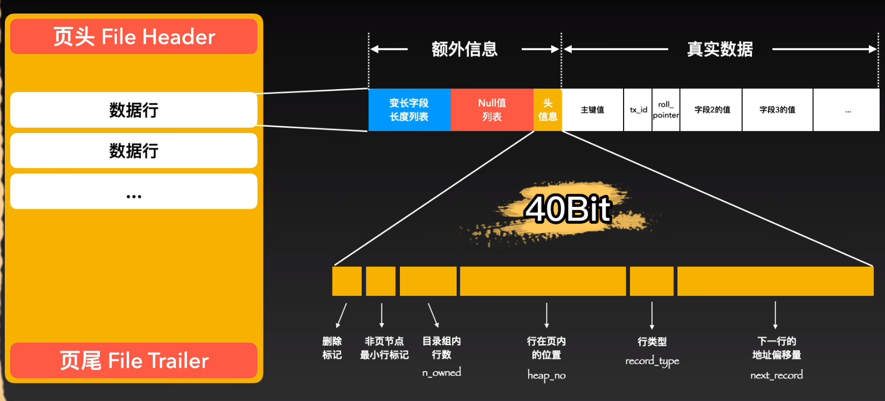

[TOC]

## 〇、MySQL 总览

### 1. SQL 语句的执行流程

#### - 应用层：连接、解析器、预处理器、优化器

- 先通过客户端的连接驱动和连接池建立连接，通过半双工的方式。
- 连接池接收到 SQL 语句后，会现在查询缓存中进行查找。但是这个功能基本不用。
- 进入 SQL 解析器，对 SQL 语句进行词法分析：
  - 首先将 SQL 语句切分成各种 token 词，通过其中一个定义了各类关键字、操作符的数组 symbols[] 进行关键字、非关键字的标记；
  - 使用 bison 语法分析器，将语句解析为语法树，在这个过程中会对根据语法规则对 SQL 语句进行验证。
- 通过预处理器，将请求进行拆分：
  - 先提交 SQL模板语句，再提交参数进行执行。（对于多次重复执行的语句来说，可以提交并处理一次模板即可，提高效率）
  - 在这一步中还会做进一步语法验证，比如表、列是否存在，别名歧义验证等
- 执行到 SQL 优化器，通过优化器选择成本最小的执行路径作为执行计划。成本指的是根据数据表、数据量、索引等等信息，计算出的 IO 成本消耗值和 CPU 成本消耗值。
  - 在优化过程中涉及到很多优化规则，比如关联查询重排、索引优选、连接查询重组、优化排序、优化min/max等函数、提前终止查询、等价变换等等。
- 然后生成了一个 执行计划，在 执行器 中查找相关的 handler API，调用，并得到返回结果。“索引查询、遍历查询、构建临时表”等工作，在这一步完成。
- 将结果通过 TCP 返回客户端。


#### - 执行器的工作

执行计划就是 发给 InnoDB 中 Handler API 的命令。

- 在 InnoDB 收到命令后，会对命令拆分为：增删改查
- 如果是“读”指令：
  - 则会在内存的 Buffer Pool 中，通过“自适应哈希索引”进行查找。InnoDB 会为一些频繁访问的页，建立“哈希索引”，提升这些热点页的查询速度。
  - 如果 Buffer Pool 中没有找到所需数据对应的页，则会用一些预读算法，磁盘的表数据加载到内存中。
  - Buffer Pool 会通过一些链表（LRU链、Free链、Flush链）管理这些数据页的写入位置、刷盘位置以及数据页淘汰。
  - 一般来说，可能会有多个“读”指令，来找到最终的查询结果。如果建立了索引等，可以加快这个过程，减少查询的次数。
- 如果是“写”指令：
  - 先写入负责事务回滚的 Undo buffer，再根据一定规则写入 Undo 表空间中。
  - 把数据记录写入 Redo log buffer，同时根据一定的规则刷到磁盘的 Redo log 中。
  - Log 写完之后，需要把真实数据写入 buffer pool。为了保证页的完整传输，会先将数据写入 Double write buffer，然后写入到系统表空间的的 Double write 中，这样，如果系统崩溃，也可以借助 Double write 信息进行恢复。


### 2. 磁盘存储结构

#### - 文件类别

- `frm` 存储表结构等信息
- `ibd`  存储数据和索引，又称为“独立表空间”


#### - 读取数据：页

存储引擎每次和磁盘交互时，最小的交互单位为 4KB 的页。将磁盘中连续的页保存在内存的 Buffer Pool 中，这一段连续的页一般大小为 16KB，每页有一个页头和页尾，有很多种页类型。最常见的是索引页类型，页面内有“数据行”，是最大为 8KB 但大小不固定的结构，记录了表内某一行的真实数据和额外信息：

{ 变长列表、NULL 列表、记录头、列值1、列值2 ... 等等 }





#### - 读取数据：区

为了减少零散的页，使用 “区” 结构，大小为 1MB，存放 64 个地址连续的页。作用：

- 即使跨页读取，也大概率会在同一个区内；
- 如果这一个区被频繁读取，则可以全部读入内存，直接作为缓存，减少磁盘 I/O


#### - 创建一个新表时，页的分配情况

- 在 MySQL 8.0 以前，创建一个新表，会分配 6 个页，而不是完整的“区”。前4个页记录了：表空间、区组条目信息、buffer 相关信息、段信息、索引根信息等。后2个页是空闲页。
- 当一个 区 满了一定的页数后（32个？），后续会申请其它的区，来管理数据。
- 每 256 个区会构成一个 组。
- 在内存中，有一个逻辑概念 称为 “段”，用于管理索引树中的叶子节点和非叶子节点。
- **总之，InnoDB 通过这些结构，可以高效定位到数据内容**


## 一、索引

### 1. 索引定义

索引的定义就是帮助存储引擎快速获取数据的一种数据结构，形象的说就是**索引是数据的目录**。

存储引擎，概括性的说就是存储数据、为存储的数据建立索引和更新、查询数据等技术的实现方法。MySQL 存储引擎有 MyISAM 、InnoDB、Memory，其中 InnoDB 是在 MySQL 5.5 之后成为默认的存储引擎。


### 2. B 树和 B+ 树

#### - B 树

B 树是一种多叉树，每一个节点最多可以包括 M 个子节点，M 称为 B 树的阶。

B 树的所有节点既存放键 (key) 也存放 数据(data)。

**优势：**比 AVL 树查找要快，因为降低了树高，减少了磁盘 I/O 的次数。

**缺点：**

- B 树的每个节点都包含数据（索引+记录），而用户的记录数据的大小很有可能远远超过了索引数据，这就需要花费更多的磁盘 I/O 操作次数来读到「有用的索引数据」。
- 在查询位于底层的某个节点（比如 A 记录）过程中，「非 A 记录节点」里的记录数据会从磁盘加载到内存，这些数据对我们是没用的，这样不仅增多磁盘 I/O 操作次数，也占用内存资源。


#### - B+ 树

B+ 树与 B 树差异的点，主要是以下这几点：

- 叶子节点（最底部的节点）才会存放实际数据（索引+记录），非叶子节点只会存放索引；
- 所有索引都会在叶子节点出现，叶子节点之间构成一个有序链表。**这样可以高效地进行范围查询**；
- 非叶子节点的索引也会同时存在在子节点中；
- 非叶子节点中有多少个子节点，就有多少个索引。


#### - 效率对比

**1. 单点查询**

B 树进行单个索引查询时，最快可以在 O(1) 的时间代价内就查到，而从平均时间代价来看，会比 B+ 树稍快一些。

但是 B 树的查询波动会比较大，因为每个节点即存索引又存记录，所以有时候访问到了非叶子节点就可以找到索引，而有时需要访问到叶子节点才能找到索引。

**B+ 树的非叶子节点不存放实际的记录数据，仅存放索引，因此数据量相同的情况下，相比存储即存索引又存记录的 B 树，B+树的非叶子节点可以存放更多的索引，因此 B+ 树可以比 B 树更「矮胖」，查询底层节点的磁盘 I/O次数会更少**。


**2. 插入和删除**

- B+ 树有大量的冗余节点，这样使得删除一个节点的时候，可以直接从叶子节点中删除，可以不动非叶子节点，这样删除非常快；不会发生复杂的树的变形。
- B 树则不同，B 树没有冗余节点，删除节点的时候非常复杂，比如删除根节点中的数据，可能涉及复杂的树的变形。
- B+ 树的插入也有冗余节点，插入可能存在节点的分裂（如果节点饱和），但是最多只涉及树的一条路径。而且 B+ 树会自动平衡，不需要像更多复杂的算法，类似红黑树的旋转操作等。


**3. 范围查询**

B 树和 B+ 树等值查询原理基本一致，先从根节点查找，然后对比目标数据的范围，最后递归的进入子节点查找。

因为 **B+ 树所有叶子节点间还有一个链表进行连接，这种设计对范围查找非常有帮助**，比如说想知道 12 月 1 日和 12 月 12 日之间的订单，这个时候可以先查找到 12 月 1 日所在的叶子节点，然后利用链表向右遍历，直到找到 12 月12 日的节点，这样就不需要从根节点查询了，进一步节省查询需要的时间。

而 B 树没有将所有叶子节点用链表串联起来的结构，因此只能通过树的遍历来完成范围查询，这会涉及多个节点的磁盘 I/O 操作，范围查询效率不如 B+ 树。


因此，存在大量范围检索的场景，适合使用 B+树，比如数据库。而对于大量的单个索引查询的场景，可以考虑 B 树，比如 nosql 的MongoDB。


#### - InnoDB 的 B+ 树

Innodb 使用的  B+ 树有一些特别的点，比如：

- B+ 树的叶子节点之间是用「双向链表」进行连接，这样的好处是既能向右遍历，也能向左遍历。
- B+ 树点节点内容是数据页，数据页里存放了用户的记录以及各种信息，每个数据页默认大小是 16 KB。

Innodb 根据索引类型不同，分为聚集和二级索引。他们区别在于，聚集索引的叶子节点存放的是实际数据，所有完整的用户记录都存放在聚集索引的叶子节点，而二级索引的叶子节点存放的是主键值，而不是实际数据。

因为表的数据都是存放在聚集索引的叶子节点里，所以 InnoDB 存储引擎一定会为表创建一个聚集索引，且由于数据在物理上只会保存一份，所以聚簇索引只能有一个，而二级索引可以创建多个。


#### - MySQL 选择 B+ 树的原因

***1、B+Tree vs B Tree***

B+Tree 只在叶子节点存储数据，而 B 树 的非叶子节点也要存储数据，所以 B+Tree 的单个节点的数据量更小，在相同的磁盘 I/O 次数下，就能查询更多的节点。

另外，B+Tree 叶子节点采用的是双链表连接，适合 MySQL 中常见的基于范围的顺序查找，而 B 树无法做到这一点。

***2、B+Tree vs 二叉树***

对于有 N 个叶子节点的 B+Tree，其搜索复杂度为`O(logdN)`，其中 d 表示节点允许的最大子节点个数为 d 个。

在实际的应用当中， d 值是大于100的，这样就保证了，即使数据达到千万级别时，B+Tree 的高度依然维持在 3~4 层左右，也就是说一次数据查询操作只需要做 3~4 次的磁盘 I/O 操作就能查询到目标数据。

而二叉树的每个父节点的儿子节点个数只能是 2 个，意味着其搜索复杂度为 `O(logN)`，这已经比 B+Tree 高出不少，因此二叉树检索到目标数据所经历的磁盘 I/O 次数要更多。

***3、B+Tree vs Hash***

Hash 在做等值查询的时候效率贼快，搜索复杂度为 O(1)。

但是 Hash 表不适合做范围查询，它更适合做等值的查询，这也是 B+Tree 索引要比 Hash 表索引有着更广泛的适用场景的原因。


### 3. 索引分类

#### - 索引如何创建

在创建表时，InnoDB 存储引擎会根据不同的场景选择不同的列作为索引：

- 如果有主键，默认会使用主键作为聚簇索引的索引键（key）；
- 如果没有主键，就选择第一个不包含 NULL 值的唯一列作为聚簇索引的索引键（key）；
- 在上面两个都没有的情况下，InnoDB 将自动生成一个隐式自增 id 列作为聚簇索引的索引键（key）；

其它索引都属于辅助索引（Secondary Index），也被称为二级索引或非聚簇索引。**创建的主键索引和二级索引默认使用的是 B+Tree 索引**。


#### - 常见的索引（聚簇索引、二级索引、联合索引），它们的区别，和实际查询的过程

**聚簇索引：** 聚簇索引就是主键索引，B+ 树里的叶子结点存放的是实际的数据，非叶子结点是索引的值。

**二级索引：** 二级索引的 B+ 树里的叶子结点存放的是主键值，不是实际数据。

**联合索引：** 将多个字段组合在一起的索引。比如两个字段的联合索引，联合索引的非叶子节点用两个字段的值作为 B+Tree 的 key 值。当在联合索引查询数据时，先按 1 字段比较，在 1 相同的情况下再按 2 字段比较。查询时需要遵循最左匹配原则。


**聚簇索引的查询**
正常地走 B+ 树，按序查询。

**二级索引的查询**
有两种情况：
- **回表：** 查询语句中 where 的值等于二级索引中的值，会先检二级索引中的 B+Tree 的索引值，找到对应的叶子节点，然后获取主键值，然后再通过主键索引中的 B+Tree 树查询到对应的叶子节点，然后获取整行数据。**这个过程叫「回表」，也就是说要查两个 B+Tree 才能查到数据**。
- **索引覆盖：** 当查询的数据是能在二级索引的 B+Tree 的叶子节点里查询到，这时就不用再查主键索引的 B+ 树。


聚簇索引视图：


二级索引视图：


#### - 字段特性分类：主键索引、唯一索引、普通索引、前缀索引

**主键索引：** 建立在主键字段上的索引，通常在创建表的时候一起创建，一张表最多只有一个主键索引，索引列的值不允许有空值。

```sql
CREATE TABLE table_name  (
  ....
  PRIMARY KEY (index_column_1) USING BTREE
);
```


**唯一索引：** 唯一索引建立在 UNIQUE 字段上的索引，一张表可以有多个唯一索引，索引列的值必须唯一，但是允许有空值。

**普通索引：** 普通索引就是建立在普通字段上的索引，既不要求字段为主键，也不要求字段为 UNIQUE。

**前缀索引**： 指对字符类型字段的前几个字符建立的索引，而不是在整个字段上建立的索引，前缀索引可以建立在字段类型为 char、 varchar、binary、varbinary 的列上。


#### - 联合索引 & 最左匹配原则

- 通过将多个字段组合成一个索引，该索引就被称为联合索引。
- 比如两个字段的联合索引，联合索引的非叶子节点用两个字段的值作为 B+Tree 的 key 值。当在联合索引查询数据时，先按 1 字段比较，在 1 相同的情况下再按 2 字段比较。
- 使用联合索引时，存在**最左匹配原则**，也就是按照最左优先的方式进行索引的匹配。在使用联合索引进行查询的时候，如果不遵循「最左匹配原则」，联合索引会失效，这样就无法利用到索引快速查询的特性了。

> 比如，如果创建了一个 `(a, b, c)` 联合索引，如果查询条件是以下这几种，就可以匹配上联合索引：
>
> - where a=1；
> - where a=1 and b=2 and c=3；
> - where a=1 and b=2；
>
> 需要注意的是，因为有查询优化器，所以 a 字段在 where 子句的顺序并不重要。
>
> 但是，如果查询条件是以下这几种，因为不符合最左匹配原则，所以就无法匹配上联合索引，联合索引就会失效:
>
> - where b=2；
> - where c=3；
> - where b=2 and c=3；
>
> 上面这些查询条件之所以会失效，是因为`(a, b, c)` 联合索引，是先按 a 排序，在 a 相同的情况再按 b 排序，在 b 相同的情况再按 c 排序。所以，**b 和 c 是全局无序，局部相对有序的**，这样在没有遵循最左匹配原则的情况下，是无法利用到索引的。


#### - 联合索引范围查询

- 范围查询时，**并不是查询过程使用了联合索引查询，就代表联合索引中的所有字段都用到了联合索引进行索引查询。**
- 联合索引的最左匹配原则会一直向右匹配直到遇到「范围查询」就会停止匹配。**也就是范围查询的字段可以用到联合索引，但是在范围查询字段的后面的字段无法用到联合索引**。


**导致范围查询停止使用最左匹配原则的情况：**

联合索引的最左匹配原则，在遇到范围查询（如 >、<）的时候，就会停止匹配，也就是范围查询的字段可以用到联合索引，但是在范围查询字段的后面的字段无法用到联合索引。注意，对于 >=、<=、BETWEEN、like 前缀匹配的范围查询，并不会停止匹配，前面我也用了四个例子说明了。

##### 


**范围查询 >**

`select * from t_table where a > 1 and b = 2`，

由于联合索引（二级索引）是先按照 a 字段的值排序的，所以符合 a > 1 条件的二级索引记录肯定是相邻，于是在进行索引扫描的时候，可以定位到符合 a > 1 条件的第一条记录，然后沿着记录所在的链表向后扫描，直到某条记录不符合 a > 1 条件位置。所以 a 字段可以在联合索引的 B+Tree 中进行索引查询。

**但是在符合 a > 1 条件的二级索引记录的范围里，b 字段的值是无序的**。比如前面图的联合索引的 B+ Tree 里，下面这三条记录的 a 字段的值都符合 a > 1 查询条件，而 b 字段的值是无序的，因此，不能根据查询条件 b = 2 来进一步减少需要扫描的记录数量（b 字段无法利用联合索引进行索引查询的意思）。


**范围查询 a >=1 b = 2**

虽然在符合 a> 1 条件的二级索引记录的范围里，b 字段的值是「无序」的，**但是对于符合 a = 1 的二级索引记录的范围里，b 字段的值是「有序」的**（因为对于联合索引，是先按照 a 字段的值排序，然后在 a 字段的值相同的情况下，再按照 b 字段的值进行排序）。


**范围查询 BETWEEN X AND X**

`SELECT * FROM t_table WHERE a BETWEEN 2 AND 8 AND b = 2`

和上面的情况类似，a 和 b 都会用到联合索引。


**范围查询 like**

`SELECT * FROM t_user WHERE name like 'j%' and age = 22`


由于联合索引（二级索引）是先按照 name 字段的值排序的，所以前缀为 ‘j’ 的 name 字段的二级索引记录都是相邻的， 于是在进行索引扫描的时候，可以定位到符合前缀为 ‘j’ 的 name 字段的第一条记录，然后沿着记录所在的链表向后扫描，直到某条记录的 name 前缀不为 ‘j’ 为止。

虽然在符合前缀为 ‘j’ 的 name 字段的二级索引记录的范围里，age 字段的值是「无序」的，**但是对于符合 name = j 的二级索引记录的范围里，age字段的值是「有序」的**（因为对于联合索引，是先按照 name 字段的值排序，然后在 name 字段的值相同的情况下，再按照 age 字段的值进行排序）。

于是，在确定需要扫描的二级索引的范围时，当二级索引记录的 name 字段值为 ‘j’ 时，可以通过 age = 22 条件减少需要扫描的二级索引记录范围（age 字段可以利用联合索引进行索引查询的意思）。也就是说，从符合 `name = 'j' and age = 22` 条件的第一条记录时开始扫描，而不需要从第一个 name 为 j 的记录开始扫描 。


#### - 索引下推

对于联合索引（a, b），在执行 `select * from table where a > 1 and b = 2` 语句的时候，只有 a 字段能用到索引，那在联合索引的 B+Tree 找到第一个满足条件的主键值（ID 为 2）后，还需要判断其看 b 是否等于 2：

- 在 MySQL 5.6 之前，只能从 a = 2 （主键值）开始一个个回表，到「主键索引」上找出数据行，再对比 b 字段值。
- 而 MySQL 5.6 引入的**索引下推优化**（index condition pushdown)， **可以在联合索引遍历过程中，对联合索引中包含的字段先做判断，直接过滤掉不满足条件的记录，减少回表次数**。


### 4. 什么时候使用索引、优缺点

#### - 索引的缺点

- 需要占用物理空间，数量越大，占用空间越大；
- 创建索引和维护索引要耗费时间，这种时间随着数据量的增加而增大；
- 会降低表的增删改的效率，因为每次增删改索引，B+ 树为了维护索引有序性，都需要进行动态维护。


#### - 什么时候适用索引？

- 字段有唯一性限制的，比如商品编码；
- 经常用于 `WHERE` 查询条件的字段，这样能够提高整个表的查询速度，如果查询条件不是一个字段，可以建立联合索引。
- 经常用于 `GROUP BY` 和 `ORDER BY` 的字段，这样在查询的时候就不需要再去做一次排序了，因为我们都已经知道了建立索引之后在 B+Tree 中的记录都是排序好的。


####  - 什么时候不需要创建索引？

- `WHERE` 条件，`GROUP BY`，`ORDER BY` 里用不到的字段，索引的价值是快速定位，如果起不到定位的字段通常是不需要创建索引的，因为索引是会占用物理空间的。
- 字段中存在大量重复数据，不需要创建索引，比如性别字段，只有男女，如果数据库表中，男女的记录分布均匀，那么无论搜索哪个值都可能得到一半的数据。在这些情况下，还不如不要索引，因为 MySQL 还有一个查询优化器，查询优化器发现某个值出现在表的数据行中的百分比很高的时候，它一般会忽略索引，进行全表扫描。
- 表数据太少的时候，不需要创建索引；
- 经常更新的字段不用创建索引，比如不要对电商项目的用户余额建立索引，因为索引字段频繁修改，由于要维护 B+Tree的有序性，那么就需要频繁的重建索引，这个过程是会影响数据库性能的。


### 5. 索引优化

#### - 前缀索引优化

前缀索引顾名思义就是使用某个字段中字符串的前几个字符建立索引。

使用前缀索引是为了减小索引字段大小，可以增加一个索引页中存储的索引值，有效提高索引的查询速度。在一些大字符串的字段作为索引时，使用前缀索引可以帮助我们减小索引项的大小。

不过，前缀索引有一定的局限性，例如：

- order by 就无法使用前缀索引；
- 无法把前缀索引用作覆盖索引；

#### - 覆盖索引优化

覆盖索引是指 SQL 中 query 的所有字段，在索引 B+Tree 的叶子节点上都能找得到的那些索引，从二级索引中查询得到记录，而不需要通过聚簇索引查询获得，可以避免回表的操作。

假设我们只需要查询商品的名称、价格，有什么方式可以避免回表呢？

我们可以建立一个联合索引，即「商品ID、名称、价格」作为一个联合索引。如果索引中存在这些数据，查询将不会再次检索主键索引，从而避免回表。

所以，使用覆盖索引的好处就是，不需要查询出包含整行记录的所有信息，也就减少了大量的 I/O 操作。

#### - 主键索引最好是自增的

InnoDB 创建主键索引默认为聚簇索引，数据被存放在了 B+Tree 的叶子节点上。也就是说，同一个叶子节点内的各个数据是按主键顺序存放的，因此，每当有一条新的数据插入时，数据库会根据主键将其插入到对应的叶子节点中。

**如果我们使用自增主键**，那么每次插入的新数据就会按顺序添加到当前索引节点的位置，不需要移动已有的数据，当页面写满，就会自动开辟一个新页面。因为每次**插入一条新记录，都是追加操作，不需要重新移动数据**，因此这种插入数据的方法效率非常高。

**如果我们使用非自增主键**，由于每次插入主键的索引值都是随机的，因此每次插入新的数据时，就可能会插入到现有数据页中间的某个位置，这将不得不移动其它数据来满足新数据的插入，甚至需要从一个页面复制数据到另外一个页面，我们通常将这种情况称为**页分裂**。**页分裂还有可能会造成大量的内存碎片，导致索引结构不紧凑，从而影响查询效率**。

#### - 索引最好设置为 NOT NULL

为了更好的利用索引，索引列要设置为 NOT NULL 约束。有两个原因：

- 第一原因：索引列存在 NULL 就会导致优化器在做索引选择的时候更加复杂，更加难以优化，因为可为 NULL 的列会使索引、索引统计和值比较都更复杂，比如进行索引统计时，count 会省略值为NULL 的行。
- 第二个原因：NULL 值是一个没意义的值，但是它会占用物理空间，所以会带来的存储空间的问题，因为 InnoDB 存储记录的时候，如果表中存在允许为 NULL 的字段，那么[行格式 (opens new window)](https://xiaolincoding.com/mysql/base/row_format.html#innodb-行格式有哪些)中**至少会用 1 字节空间存储 NULL 值列表**


### 6. 索引失效

- 使用左或者左右模糊匹配的时候，也就是 `like %xx` 或者 `like %xx%`这两种方式都会造成索引失效；
- 在查询条件中对索引列做了计算、函数、类型转换操作，这些情况下都会造成索引失效；
- 联合索引要能正确使用需要遵循最左匹配原则，也就是按照最左优先的方式进行索引的匹配，否则就会导致索引失效。
- 在 WHERE 子句中，如果在 OR 前的条件列是索引列，而在 OR 后的条件列不是索引列，那么索引会失效。(查询条件中使用 or，且 or 的前后条件中有一个列没有索引，涉及的索引都不会被使用到)


### 7. 如何使用 count 来计数，和它的原理
count(1)、 count(*)、 count(主键字段)在执行的时候，如果表里存在二级索引，优化器就会选择二级索引进行扫描。

所以，如果要执行 count(1)、 count(*)、 count(主键字段) 时，尽量在数据表上建立二级索引，这样优化器会自动采用二级索引进行扫描，相比于扫描主键索引效率会高一些。

再来，就是不要使用 count(字段) 来统计记录个数，因为它的效率是最差的，会采用全表扫描的方式来统计。如果你非要统计表中该字段不为 NULL 的记录个数，建议给这个字段建立一个二级索引。


## 二、事务

### 1. 事务特性 ACID

- **原子性（Atomicity）**：一个事务中的所有操作，要么全部完成，要么全部失败，不会结束在中间某个环节，而且事务在执行过程中发生错误，会被回滚到事务开始前的状态。

  > InnoDB 使用的是 Undo log 机制，每次对数据进行增删改时，一次改动操作对应一次 Undo log 记录。一组操作中如果有异常，则进行 回滚 操作，反向执行每次操作记录的 Undo log。

- **一致性（Consistency）**：**这个我理解是 AID 作为基础，最终实现 C 的保证。**是指事务操作前和操作后，数据满足完整性约束，数据库保持一致性状态。

- **隔离性（Isolation）**：防止多个事务并发执行时由于交叉执行而导致数据的不一致。

  > 写 + 写 隔离，使用「锁」机制实现。
  >
  > 写 + 读 隔离，使用 「MVCC」机制实现。

- **持久性（Durability）**：事务处理结束后，对数据的修改就是永久的，即便系统故障也不会丢失。

  > 保证内存中的数据能够恢复到磁盘：使用 Redo log


InnoDB 引擎通过什么技术来保证事务的这四个特性的呢？

- 持久性是通过 redo log （重做日志）来保证的；
- 原子性是通过 undo log（回滚日志） 来保证的；
- 隔离性是通过 MVCC（多版本并发控制） 或锁机制来保证的；
- 一致性则是通过持久性 + 原子性 + 隔离性来保证；


### 2. 脏读、幻读、不可重复度

**脏读：** 一个事务「读到」了另一个「未提交事务修改过的数据」。这种情况如果未提交的事务发生了回滚，那么读数据的事务得到的数据就是过期的数据，这种现象就被称为脏读。

**不可重复读：** 在一个事务内多次读取同一个数据，出现前后两次读到的数据不一样的情况。

**幻读：** 在一个事务内多次查询某个符合查询条件的「记录数量」，出现前后两次查询到的记录数量不一样的情况。

**简略概括：**
- 脏读：读到其他事务未提交的数据；
- 不可重复读：前后读取的数据不一致；
- 幻读：前后读取的记录数量不一致。

**严重性排序：**
脏读 > 不可重复读 > 幻读

### 3. 事物的隔离级别

- **读未提交（read uncommitted）**，指一个事务还没提交时，它做的变更就能被其他事务看到；
- **读提交（read committed）**，指一个事务提交之后，它做的变更才能被其他事务看到；
- **可重复读（repeatable read）**，指一个事务执行过程中看到的数据，一直跟这个事务启动时看到的数据是一致的，**MySQL InnoDB 引擎的默认隔离级别**；
- **串行化（serializable）**；会对记录加上读写锁，在多个事务对这条记录进行读写操作时，如果发生了读写冲突的时候，后访问的事务必须等前一个事务执行完成，才能继续执行；

只有串行化的隔离级别解决了全部这 3 个问题，其他的 3 个隔离级别都有缺陷。


要解决脏读现象，就要升级到「读提交」以上的隔离级别；要解决不可重复读现象，就要升级到「可重复读」的隔离级别，要解决幻读现象不建议将隔离级别升级到「串行化」。


#### - 隔离级别具体的实现方式（概括）
- 对于「读未提交」隔离级别的事务来说，因为可以读到未提交事务修改的数据，所以直接读取最新的数据就好了；
- 对于「串行化」隔离级别的事务来说，通过加读写锁的方式来避免并行访问；
- 对于「读提交」和「可重复读」隔离级别的事务来说，它们是通过 读快照（Read View） 来实现的，它们的区别在于创建 读快照（Read View） 的时机不同，「读提交」隔离级别是在「每个语句执行前」都会重新生成一个 读快照（Read View），而「可重复读」隔离级别是「启动事务时」生成一个读快照（Read View），然后整个事务期间都在用这个读快照（Read View）。

### 4. Redo log & Undo log

#### - Redo log

Redo log 作用是为了防止缓存（Buffer pool）中的数据在系统崩溃时，还没有来得及刷盘导致数据丢失的情况。 **当有一条记录需要更新时，InnoDB引擎会先更新内存（将 Buffer pool 中对应的页标记为脏页），然后将本次对这个页的修改以 Redo log 的形式记录下来。**

Redo log 的刷盘策略：

可以通过参数修改，有如下几种模式：

- 1号：每次更新时，将 Redo log 从 buffer 写入操作系统的 page cache 中，并立刻进行刷盘
- 0号：每隔1秒，从 buffer 写入操作系统的 page cache，刷盘由 OS 控制
- 2号：每隔1秒，写入 buffer 和 操作系统的 page cache，再刷盘


#### - Undo log：

每一条 SQL 通过执行器后，第一时间会在回滚段 Undo log segment 中申请一个 Undo log 页，然后根据 SQL 信息来构造 Undo log 内容，同时将其写入磁盘，以保证每次操作真正数据之前，Undo Log 是完整的。

注意，执行「开始事务」命令，并不意味着启动了事务。在 MySQL 有两种开启事务的命令，分别是：

第一种：begin/start transaction 命令；
第二种：start transaction with consistent snapshot 命令；
这两种开启事务的命令，事务的启动时机是不同的：

执行了 begin/start transaction 命令后，并不代表事务启动了。只有在执行这个命令后，执行了增删查改操作的 SQL 语句，才是事务真正启动的时机；
执行了 start transaction with consistent snapshot 命令，就会马上启动事务。
