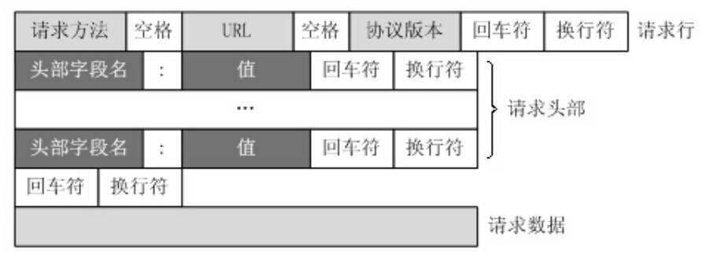
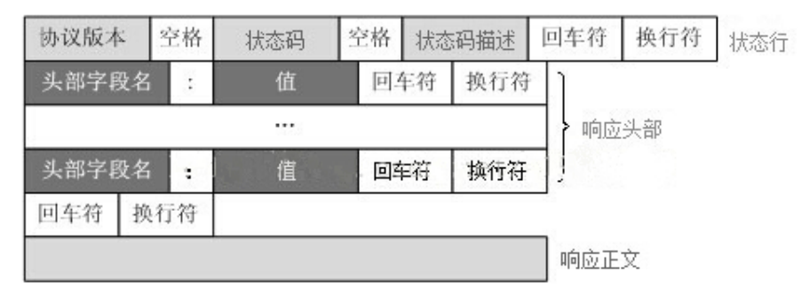
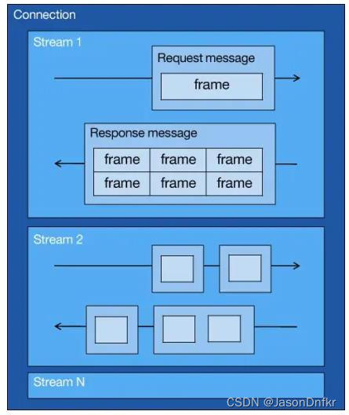
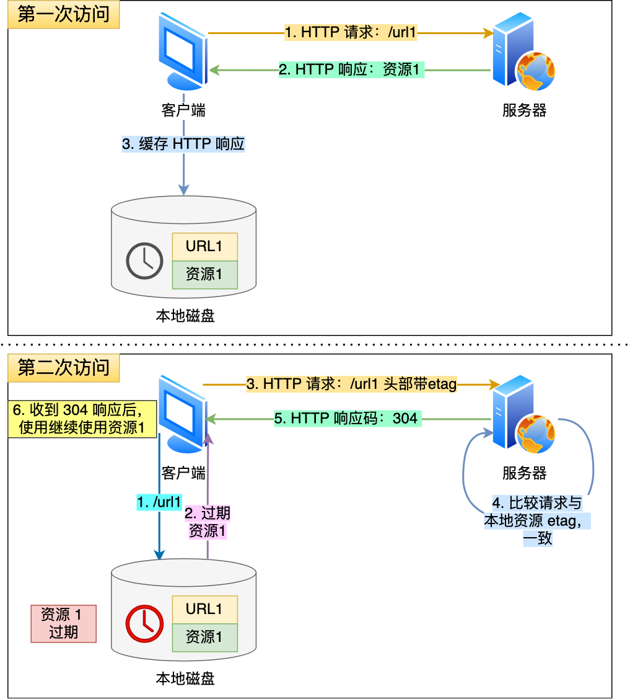
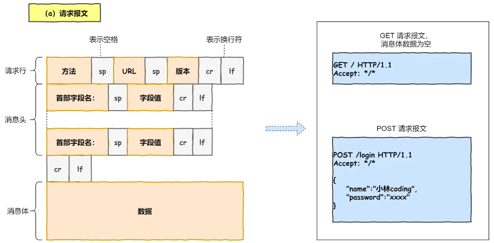
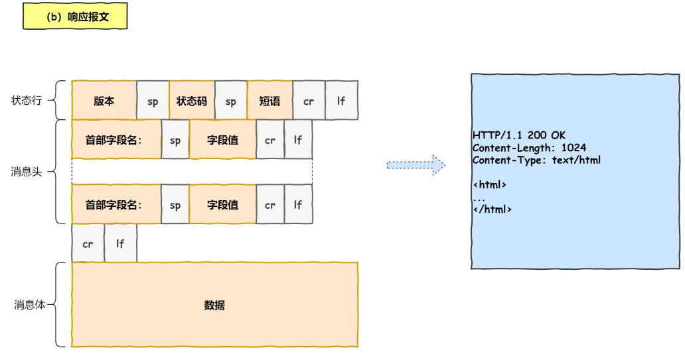

[TOC]

## - HTTP 报文格式

### 请求报文格式



```
GET / HTTP/1.1
Host: www.baidu.com
User-Agent: Mozilla/5.0 (Windows NT 10.0; Win64; x64; rv:86.0) Gecko/20100101 Firefox/86.0
Accept: text/html,application/xhtml+xml,application/xml;q=0.9,image/webp,/;q=0.8
Accept-Language: zh-CN,zh;q=0.8,zh-TW;q=0.7,zh-HK;q=0.5,en-US;q=0.3,en;q=0.2
Accept-Encoding: gzip, deflate, br
Connection: keep-alive
Cookie: BAIDUID=6729CB682DADC2CF738F533E35162D98:FG=1;
BIDUPSID=6729CB682DADC2CFE015A8099199557E; PSTM=1614320692; BD_UPN=13314752;
BDORZ=FFFB88E999055A3F8A630C64834BD6D0;
__yjs_duid=1_d05d52b14af4a339210722080a668ec21614320694782; BD_HOME=1;
H_PS_PSSID=33514_33257_33273_31660_33570_26350;
BA_HECTOR=8h2001alag0lag85nk1g3hcm60q
Upgrade-Insecure-Requests: 1
Cache-Control: max-age=0
```


### 响应报文格式



```
HTTP/1.1 200 OK
Bdpagetype: 1
Bdqid: 0xf3c9743300024ee4
Cache-Control: private
Connection: keep-alive
Content-Encoding: gzip
Content-Type: text/html;charset=utf-8
Date: Fri, 26 Feb 2021 08:44:35 GMT
Expires: Fri, 26 Feb 2021 08:44:35 GMT
Server: BWS/1.1
Set-Cookie: BDSVRTM=13; path=/
Set-Cookie: BD_HOME=1; path=/
Set-Cookie: H_PS_PSSID=33514_33257_33273_31660_33570_26350; path=/; domain=.baidu.com
Strict-Transport-Security: max-age=172800
Traceid: 1614329075128412289017566699583927635684
X-Ua-Compatible: IE=Edge,chrome=1
Transfer-Encoding: chunked
```


## - GET 与 POST

### GET 和 POST 的区别

 - GET 的语义是从服务器获取指定的资源。参数写在 URL 中，只允许 ASCII 字符 ，而且浏览器会对 URL 的长度有限制。
 - POST  的语义是根据请求负荷（报文body）对指定的资源做出处理。携带数据的位置一般是写在报文 body 中，body 中的数据可以是任意格式的数据，浏览器不会对 body 大小做限制。


### 安全和幂等

 - 「安全」是指请求方法不会「破坏」服务器上的资源。
 - 「幂等」，意思是多次执行相同的操作，结果都是「相同」的。

 从 RFC 规范定义的语义来看：
- GET 方法就是安全且幂等的，因为它是「只读」操作，无论操作多少次，服务器上的数据都是安全的，且每次的结果都是相同的。所以，可以对 GET 请求的数据做缓存，这个缓存可以做到浏览器本身上（彻底避免浏览器发请求），而且在浏览器中 GET 请求可以保存为书签。
- POST 因为是「新增或提交数据」的操作，一般会修改服务器上的资源，所以是不安全的，且多次提交数据就会创建多个资源，所以不是幂等的。所以，浏览器一般不会缓存 POST 请求，也不能把 POST 请求保存为书签。

但这些是 RFC 规范定义的语义分析的。实际开发中，可以变更。


## - HTTP 特性
### HTTP 1.0 
早期 HTTP/1.0 性能上的一个很大的问题，那就是每发起一个请求，都要新建一次 TCP 连接（三次握手），而且是串行请求，做了无谓的 TCP 连接建立和断开，增加了通信开销。
https://cdn.xiaolincoding.com/gh/xiaolincoder/ImageHost/%E8%AE%A1%E7%AE%97%E6%9C%BA%E7%BD%91%E7%BB%9C/HTTP/16-%E7%9F%AD%E8%BF%9E%E6%8E%A5%E4%B8%8E%E9%95%BF%E8%BF%9E%E6%8E%A5.png


### HTTP 1.1
**性能提升：**

 - **长连接：** HTTP/1.1 提出了长连接的通信方式，减少 TCP 连接重复建立和断开造成的额外开销。持久连接的特点是，只要任意一端没有明确提出断开连接，则保持 TCP 连接状态。如果某个 HTTP 长连接超过一定时间没有任何数据交互，服务端就会主动断开这个连接。
- **管道网络传输：** 在同一个 TCP 连接里面，客户端可以发起多个请求，只要第一个请求发出去了，不必等其回来，就可以发第二个请求出去，可以减少整体的响应时间。但是**服务器必须按照接收请求的顺序发送对这些管道化请求的响应。** 所以，HTTP/1.1 解决了请求的队头阻塞，但没有解决响应的队头阻塞。
- 队头阻塞是指，顺序发送的请求序列中的一个请求因为某种原因被阻塞时，在后面排队的所有请求也一同被阻塞了，会招致客户端一直请求不到数据。

	> 实际上 HTTP/1.1 管道化技术不是默认开启，而且浏览器基本都没有支持。

**缺点：**

 - 请求 / 响应头部（Header）未经压缩就发送，首部信息越多延迟越大。只能压缩 Body 的部分；
 - 发送冗长的首部。每次互相发送相同的首部造成的浪费较多；
 - 服务器是按请求的顺序响应的，如果服务器响应慢，会招致客户端一直请求不到数据，也就是队头阻塞； 
 - 请求只能从客户端开始，服务器只能被动响应。


### HTTP/2.0
**性能提升：**

- **头部压缩**：HTTP/2 会压缩头（Header）如果同时发出多个请求，他们的头是一样的或是相似的，那么，协议会消除重复的部分。
  - 这是 `HPACK` 算法：在客户端和服务器同时维护一张头信息表，所有字段都会存入这个表，生成一个索引号，以后就不发送同样字段了，只发送索引号，这样就提高速度了。
 - **二进制格式**：HTTP/2 采用二进制格式，头信息和数据体都是二进制，并且统称为帧（frame）：头信息帧（Headers Frame）和数据帧（Data Frame）。比如状态码 200 ，在 HTTP/1.1 是用 '2''0''0' 三个字符来表示，在 HTTP/2 对于状态码 200 的二进制编码是 10001000，只用了 1 字节就能表示。
 - **并发传输**：HTTP/2 引出了 Stream 概念，多个 Stream 复用在一条 TCP 连接。
 	- 1 个 TCP 连接包含多个 Stream，Stream 里可以包含 1 个或多个 Message，Message 对应 HTTP/1 中的请求或响应，由 HTTP 头部和包体构成。Message 里包含一条或者多个 Frame，Frame 是 HTTP/2 最小单位，以二进制压缩格式存放 HTTP/1 中的内容（头部和包体）。
 	- 针对不同的 HTTP 请求用独一无二的 Stream ID 来区分，接收端可以通过 Stream ID 有序组装成 HTTP 消息，不同 Stream 的帧是可以乱序发送的，因此可以并发不同的 Stream ，也就是 HTTP/2 可以并行交错地发送请求和响应。
 	- 客户端会根据相同的 Stream ID 有序组装成 HTTP 消息。
    
  - **服务器推送**：服务端可以主动向客户端发送消息。比如，客户端通过 HTTP/1.1 请求从服务器那获取到了 HTML 文件，而 HTML 可能还需要依赖 CSS 来渲染页面，这时客户端还要再发起获取 CSS 文件的请求，需要两次消息往返；在 HTTP/2 中，客户端在访问 HTML 时，服务器可以直接主动推送 CSS 文件，减少了消息传递的次数。

**缺陷：**

 - HTTP/2 通过 Stream 的并发能力，解决了 HTTP/1 队头阻塞的问题；但是 HTTP/2 存在  TCP 层的“队头阻塞”的问题。
 - HTTP/2 是基于 TCP 协议来传输数据的，TCP 是字节流协议，TCP 层必须保证收到的字节数据是完整且连续的，这样内核才会将缓冲区里的数据返回给 HTTP 应用，那么当「前 1 个字节数据」没有到达时，后收到的字节数据只能存放在内核缓冲区里，只有等到这 1 个字节数据到达时，HTTP/2 应用层才能从内核中拿到数据。


### HTTP/3
**性能优化：**

 - HTTP/3 底层采用基于 UDP 协议开发的 QUIC 应用层协议，有三个特点：
 	- **无队头阻塞：** QUIC 有类似 HTTP/2 Stream 的并发传输概念，可以在同一条连接上并发传输多个 Stream，Stream 可以认为就是一条 HTTP 请求。QUIC 有自己的一套机制可以保证传输的可靠性的。当某个流发生丢包时，只会阻塞这个流，其他流不会受到影响，因此不存在队头阻塞问题。
 	- **更快速的建立连接：** 对于 HTTP/1 和 HTTP/2 协议，TCP 和 TLS 是分层的，分别属于内核实现的传输层、openssl 库实现的表示层，因此它们难以合并在一起，需要分批次来握手，先 TCP 握手，再 TLS 握手。**HTTP/3 的 QUIC 协议不与 TLS 协议分层，QUIC 内部包含了 TLS，数据包内会携带 TLS  的记录。**
 	- **连接迁移：** 普通的 HTTP 协议基于 TCP 传输，需要保证四元组成立（源 IP + 端口，目的 IP + 端口）。那么当移动设备的网络从 4G 切换到 WIFI 时， IP 地址变化，就必须要断开连接，然后重新建立连接。而建立连接的过程包含 TCP 三次握手和 TLS 四次握手的时延，以及 TCP 慢启动的减速过程，给用户的感觉就是网络突然卡顿了一下，因此连接的迁移成本是很高的。
QUIC 协议通过连接 ID 来标记通信的两个端点，客户端和服务器可以各自选择一组 ID 来标记自己，因此即使移动设备的网络变化后，导致 IP 地址变化了，只要仍保有上下文信息（比如连接 ID、TLS 密钥等），就可以“无缝”地复用原连接，消除重连的成本，没有丝毫卡顿感，达到了连接迁移的功能。

所以， QUIC 是一个在 UDP 之上的伪 TCP + TLS + HTTP/2 的多路复用的协议。但是不太普及。


## HTTP 缓存技术
### 强制缓存
强缓存指的是只要浏览器判断缓存没有过期，则直接使用浏览器的本地缓存，决定是否使用缓存的主动性在于浏览器这边。
强缓存是利用两个 HTTP 响应头部（Response Header）字段实现的，用于表示资源在客户端缓存的有效期：
 - `Cache-Control`， 是一个相对时间； 
 - `Expires`，是一个绝对时间；
- 当浏览器第一次请求访问服务器资源时，服务器会在返回这个资源的同时，在 Response 头部加上 Cache-Control，Cache-Control 中设置了过期时间大小；
- 浏览器再次请求访问服务器中的该资源时，会先通过请求资源的时间与 Cache-Control 中设置的过期时间大小，来计算出该资源是否过期，如果没有，则使用该缓存，否则重新请求服务器；
- 服务器再次收到请求后，会再次更新 Response 头部的 Cache-Control。

### 协商缓存
状态码 304，服务端告诉浏览器可以使用本地缓存资源。



## - HTTPS
### HTTP 与 HTTPS 区别
 - HTTP 信息是明文传输，存在安全风险的问题。HTTPS 在 TCP 和 HTTP 网络层之间加入了 SSL/TLS 安全协议，使得报文能够加密传输。
 - HTTPS 在 TCP 三次握手之后，还需进行 SSL/TLS 的握手过程，才可进入加密报文传输。
 - HTTP 默认端口号是 80，HTTPS 默认端口号是 443。
 - HTTPS 协议需要向 CA（证书权威机构）申请数字证书，来保证服务器的身份可信。


### 两种加密方式

HTTPS 采用 对称加密 和 非对称加密 的「混合加密」通信。
 - 在通信建立前采用 非对称加密 的方式交换「会话秘钥」，后续就不再使用非对称加密。
 - 在通信过程中全部使用 对称加密 的「会话秘钥」的方式加密明文数据。
采用「混合加密」的方式的原因：
- 对称加密 只使用一个密钥，运算速度快，密钥必须保密，无法做到安全的密钥交换。
- 非对称加密 使用两个密钥：公钥和私钥，公钥可以任意分发而私钥保密，解决了密钥交换问题但速度慢。


### 防止数据冒充

- 使用摘要算法（哈希函数）来计算出内容的哈希值，可以确保内容不会被篡改。**但是并不能保证「内容 + 哈希值」不会被中间人替换，因为这里缺少对客户端收到的消息是否来源于服务端的证明。**
- 因此采用**非对称加密算法**解决，即：公钥 + 私钥。
  - **公钥加密，私钥解密：** 为保证内容传输的安全，被公钥加密的内容，其他人无法解密，只有持有私钥的人，才能解密出实际的内容；
  - **私钥加密，公钥解密：** 这个目的是为了保证消息不会被冒充，因为私钥是不可泄露的，如果公钥能正常解密出私钥加密的内容，就能证明这个消息是来源于持有私钥身份的人发送的。 


### 数字证书

- 数字证书解决了防止公钥被截获冒充，导致双方通信的时候产生中间人，用自己的公钥替换原本的公钥。**数字证书本质是公钥的数字签名。**
- 用第三方可信机构（证书颁布机构 CA）的私钥给公钥加密，实际上包括的内容有：证书的颁布机构、有效期、公钥、持有者(subject)等。将签名结果和这些信息放在一起，这就叫做「数字证书」。
- 浏览器客户端的本机必须安装 证书颁布机构 的 数字证书，也就是 CA 的公钥。当客户端请求服务器时，服务器会先返回自己的数字证书，然后客户端用 CA 的公钥对其解密，拿到服务器的公钥。然后用服务器的公钥对报文加密，解决冒充风险。


### HTTPS 如何建立连接

 - 首先，TCP 三次握手，建立通信；
 - 客户端向服务器索要并验证服务器的公钥；（SSL/TLS 建立过程）
 - 双方协商生产「会话秘钥」；（SSL/TLS 建立过程）
 - 双方采用「会话秘钥」进行加密通信。


### HTTPS 真的可靠吗
从其设计原理、协议上来说，是可靠的。如果在双方通信过程中，有中间人试图截获信息，给客户端返回自己的公钥证书，这个时候，客户端收到的证书是伪造的，通常能被浏览器识别出来（提示：此网站的安全证书存在问题，不是由受信任的证书颁发机构颁发）。这个时候用户就不要乱操作，比如继续访问。就不会存在不安全的问题。


### 抓包工具？
抓包工具能截取 HTTPS 数据，本质上是因为要在客户端安装 Fiddler 的证书。


#### 2. HTTP 状态码

`1xx` 类状态码属于**提示信息**，是协议处理中的一种中间状态，实际用到的比较少。

`2xx` 类状态码表示服务器**成功**处理了客户端的请求，也是我们最愿意看到的状态。

- 「**200 OK**」是最常见的成功状态码，表示一切正常。如果是非 `HEAD` 请求，服务器返回的响应头都会有 body 数据。
- 「**204 No Content**」也是常见的成功状态码，与 200 OK 基本相同，但响应头没有 body 数据。
- 「**206 Partial Content**」是应用于 HTTP 分块下载或断点续传，表示响应返回的 body 数据并不是资源的全部，而是其中的一部分，也是服务器处理成功的状态。

`3xx` 类状态码表示客户端请求的资源发生了变动，需要客户端用新的 URL 重新发送请求获取资源，也就是**重定向**。

- 「**301 Moved Permanently**」表示永久重定向，说明请求的资源已经不存在了，需改用新的 URL 再次访问。
- 「**302 Found**」表示临时重定向，说明请求的资源还在，但暂时需要用另一个 URL 来访问。

301 和 302 都会在响应头里使用字段 `Location`，指明后续要跳转的 URL，浏览器会自动重定向新的 URL。

- 「**304 Not Modified**」不具有跳转的含义，表示资源未修改，重定向已存在的缓冲文件，也称缓存重定向，也就是告诉客户端可以继续使用缓存资源，用于缓存控制。

`4xx` 类状态码表示客户端发送的**报文有误**，服务器无法处理，也就是错误码的含义。

- 「**400 Bad Request**」表示客户端请求的报文有错误，但只是个笼统的错误。
- 「**403 Forbidden**」表示服务器禁止访问资源，并不是客户端的请求出错。
- 「**404 Not Found**」表示请求的资源在服务器上不存在或未找到，所以无法提供给客户端。

`5xx` 类状态码表示客户端请求报文正确，但是**服务器处理时内部发生了错误**，属于服务器端的错误码。

- 「**500 Internal Server Error**」与 400 类型，是个笼统通用的错误码，服务器发生了什么错误，我们并不知道。
- 「**501 Not Implemented**」表示客户端请求的功能还不支持，类似“即将开业，敬请期待”的意思。
- 「**502 Bad Gateway**」通常是服务器作为网关或代理时返回的错误码，表示服务器自身工作正常，访问后端服务器发生了错误。
- 「**503 Service Unavailable**」表示服务器当前很忙，暂时无法响应客户端，类似“网络服务正忙，请稍后重试”的意思。


## - 键入网址到网页显示，发生了什么？

https://www.xiaolincoding.com/network/1_base/what_happen_url.html

① 浏览器解析 URL。
② 生成一个 HTTP 请求协议包，把协议包的发送委托给操作系统。
③ 操作系统在发送协议包之前先要获取服务器的 IP 地址。如果在本地的浏览器缓存、操作系统缓存或者 hosts 文件中存在对应的IP地址，就不需要再访问本地的 DNS 服务器了。如果不存在，访问本地的 DNS 服务器，由本地 DNS 服务器对进行递归访问，即按照层级向下访问，最后得到 IP 地址。
④ 得到 IP 地址后。进行 TCP 连接，三次握手。
⑤ 握手之后，把请求层层封装，通过网卡将数据发送到交换机。交换机会进行校验以及查找交换表转发，到达路由器。路由器把 MAC 层扒皮，查看目的 IP，然后根据路由表选择下一跳，再进行 MAC 层封装。重复这个过程，最后到达服务器。
⑥ 到达服务器后，会对数据包进行扒皮并且校验。使用 FCS 校验码校验二进制序列的正确性。在 MAC 层看目的 MAC 是不是自己，在网络层看目的 IP 是不是自己，同时知道上层协议是 TCP 还是 UDP 协议。在 TCP 中知道这是一个什么保文，请求保文、响应报文还是结束连接的报文。通过端口号知道这是交给那么应用进程的。
⑦ 应用进程知道你访问的是什么资源，那么就给客户端返回一个 HTTP 响应协议包，把资源封装在其中。通过同样的流程把数据返回给客户端。
⑧ 浏览器拿到数据后，对数据进行渲染，解码，变成了一个页面显示在浏览器上。


**1. URL 解析**

一条 URL 包含以下几个元素：

`http://` 表示访问数据的协议、`//` 后面的字符串是服务器的域名、`/path/to/file`  是请求的文件的路径名。

**2. 生成 http 报文**

根据 GET / POST 请求的类型，生成不同的 HTTP 报文。






**3. DNS 解析**

这一步需要查询服务器域名对应的 IP 地址。

主要经历：本地 DNS 服务器 -> 根域名服务器 -> 二级域名服务器->  ...

1. 客户端首先发出 DNS 请求给本地 DNS 服务器，查询 www.baidu.com 的 IP。
2. 本地域名服务器收到客户端的请求后，如果缓存能找到 www.baidu.com，则它直接返回 IP 地址。如果没有，本地 DNS 会查询根域名服务器 www.baidu.com 的IP。
3. 根 DNS 服务器收到来自本地 DNS 的请求后，发现后置是 .com，会像本地 DNS 服务器发送通知，告诉本地 DNS 服务器 .com 服务器（顶级域名服务器）的地址。
4. 本地 DNS 服务器向 .com 顶级域名服务器发起请求，.com 服务器返回 baidu.com （权威域名服务器）的地址。
5. 本地 DNS 服务器收到 baidu.com 权威域名服务器的地址后，向该服务器发送请求，查找 www.baidu.com 的地址。
6. 本地 DNS 得到 IP 地址，返回客户端，客户端和目标建立连接。


**4. 将 HTTP 报文委托给协议栈**

浏览器在此阶段作为应用程序，调用 socket 库，委托协议栈工作。协议栈具体做的事情概括来说有：将报文封装为 TCP 报文，封装为 IP 报文，进行分片，形成一个个网络数据包，加上 MAC 地址，形成一个或多个完整的以太网报文。

网卡驱动程序控制网卡硬件，网卡硬件负责完成实际收发动作。


**5. 网卡和驱动**

网卡驱动程序会将数据从内核缓冲区复制到网卡的缓冲区中（如果有零拷贝等技术，可能会更快），会在开头加上**报头和起始帧界符**，在末尾加上用于**检验错误的帧校验序列**。然后转为电信号发送。


**6. 交换机**

**交换机根据 MAC 地址表查找 MAC 地址，然后将信号发送到相应的端口**。

电信号到达交换机，将电信号转为数字信号，对末尾的 FCS 进行校验。交换机的端口不核对接收方的 MAC 地址，将接收到的所有数据包存放在缓冲区中。**交换机的端口不具有 MAC 地址。**

将包存入缓冲区后，接下来查询这个包的接收方 MAC 地址是否已经在 MAC 地址表中有记录。

交换机的 MAC 地址表主要包含两个信息：

- 接收设备的 MAC 地址，
- 该设备连接在交换机的哪个端口上。

如果地址表中找不到指定的 MAC 地址，这可能是因为具有该地址的设备还没有向交换机发送过包，或者这个设备的缓存过期了。这种情况下，**交换机会把该数据包发送给除了源端口之外的所有端口。只有接收者才回返回信息。**


**7. 路由器**

交换机会根据得到的端口号，将数据包发送到路由器。路由器是基于 IP 设计的，俗称三层网络设备，**路由器的各个端口都具有 MAC 地址和 IP 地址**。路由器会根据路由表，查找这个数据包需要发往的下一跳地址（通常是网关地址），然后修改数据包的 MAC 地址为下一跳的路由器的 MAC 地址。

在网络包传输的过程中，**源 IP 和目标 IP 始终是不会变的，一直变化的是 MAC 地址**，因为需要 MAC 地址在以太网内进行**两个设备**之间的包传输。

**因此，如果数据往以太网（或者说局域网以外的地方）发送，数据包在封装 MAC 报头时，根据 ARP 协议，通过 IP 查询到的 MAC 地址，很有可能是这个路由器的 MAC 地址。是通过路由器的子网掩码、网关、目的地址计算出来的。**


**8. 到达目的地址**

- 到达服务器后，会对数据包进行解包并校验。使用 FCS 校验码校验二进制序列的正确性；
- 在 MAC 层看目的 MAC 是不是自己，在网络层看目的 IP 是不是自己，同时知道上层协议是 TCP 还是 UDP 协议；
- 在 TCP 中知道这是一个什么保文，请求保文、响应报文还是结束连接的报文；通过端口号知道这是交给那么应用进程的；
- 应用进程知道访问的是什么资源，那么就给客户端返回一个 HTTP 响应协议包，把资源封装在其中。通过同样的流程把数据返回给客户端。


## - HTTP 和 TCP 长链接

在 HTTP/1.1 版本中，默认的连接都是长连接，通过请求头 Connection: keep-alive 字段进行指定。**长链接的本质是 TCP 协议中的保活机制。**

保活机制的工作原理：通过在服务器端设置一个保活定时器，当定时器开始工作后就定时的向网络通信的另一端发出保活探测的TCP报文，如果接收到了ACK报文，那么就证明对方存活，可以继续保有连接；否则就证明网络存在故障。

具体来说应该是 Linux 在内核层面支持的一个功能，相关参数如下：

`tcp_keepalive_time`，单位：秒，表示发送的探测报文之前的连接空闲时间，默认是 7200s。

`tcp_keepalive_intvl`，单位：秒，表示两次探测报文之间的间隔时间，默认是 75s

`tcp_keepalive_probes`，单位，秒，表示探测的次数，默认是 9

