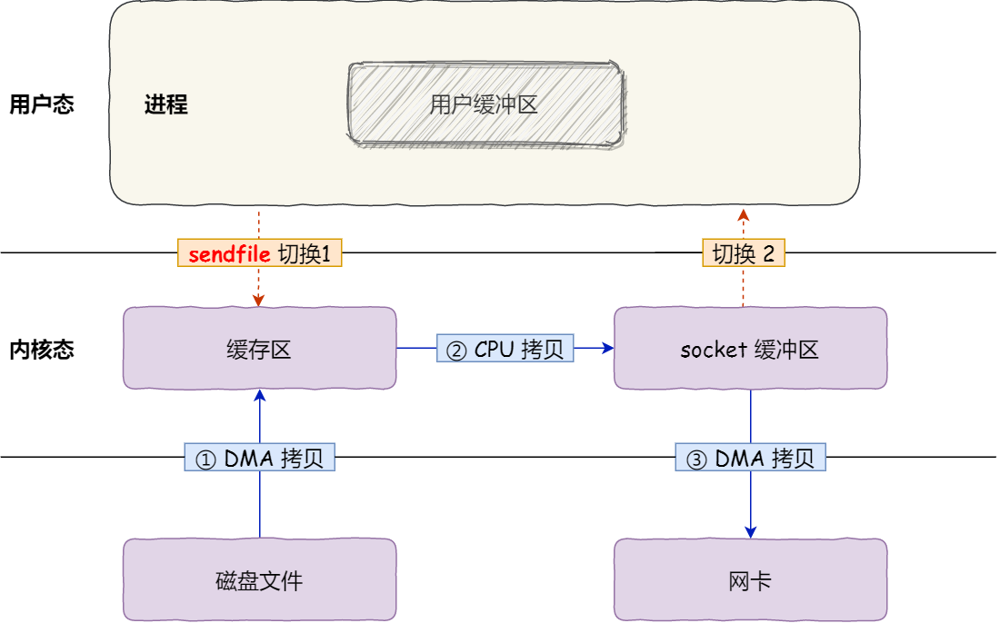

[TOC]


# 零、x86 体系结构

## A GDT相关

### 1. GDT表

**GDT表里存储了内存的分段信息。每个表项称为段描述符。段描述符记录了该段的地址、段大小、权限位等。** x86架构中，访问任何地址都需要遵循段地址+偏移，也就是段寄存器+IP寄存器。实模式下，可以通过段寄存器+偏移地址直接计算出实际访问的地址。在开启了保护模式后，段寄存器里储存的是段选择子，用于索引GDT表中的段描述符，因此，访问地址要经过GDT表来找到真正的段基址。

具体的标志位如下：

• 段基址，被分散到了三个部分，平坦模式下一般就是 0 

• 段界限与 G 位，段界限表示一个段的边界扩展最值，也就是表示一个段最大能有多大。G 表示单位， 0 表示 1B，1 表示 4KB。段界限这个数值和 G 这个单位两者一起才有意义，段界限共 20 位，故段 的最大值要么是 1M 要么是 4G。 

• P 位，Present，表示该段是否在内存中，若在 P 为 1，反之为 0 

• DPL，Descriptor Privilege Level，描述符特权级，0 最高，3 最低 

• S 位，为 0 表示系统段，为 1 表示代码段或者数据段。

• TYPE，段的类型，不同的段有不同的取值，比如标记它是系统调用门等。

### 2. 段选择子

15 ~ 3位是索引，2位是标识这是一个GDT还是LDT，1 ~ 0位是RPL，用于表示该段所指示的代码的特权级


## B 寄存器

### 1. 段寄存器

每个 CPU 有 6 个段寄存器，CS、DS、SS（栈段）、ES、FS、GS（附加数据段）。保护模式下，段寄存器里存放的是段选择子。

要访问一个内存段的时候，这个段的段选择子必须加载到某段寄存器，所以一个系统虽然可以定义上千 个段，但是当前使用的段最多就只有 6 个。

### 2. 控制寄存器

每个 CPU 有 5 个控制寄存器。

- CR0

  - PE 位，Protection Enable，置 1 表示保护模式，0 表示在实模式下

  - PG 位，Paging，置 1 表示使用分页机制，0 反之

- CR2，发生缺页异常的时候，CR2 里面就会存放引发缺页的那个地址 

- CR3，存放页表的物理地址

- CR4

  - PSE 位，Page Size Extensions，置 1 表示页面大小扩展为 4M，配合页目录项 PS 位使用


## C 页表


### 2. 页表标志位

- P，present，该页存在物理内存中，则为 1，反之为 0
- R/W，为 0 表示只可读，为 1 表示可读可写
- U/S，User/Supervisor，为 1 表示处于用户级，任意特权级别都能访问，为 0 表示处于 Supervisor 级别，只有 0、1、2 能够访问，用户级别不能访问。
- A，Accessed，意为访问位，CPU 访问过后该位置 1，可以利用该位记录某一内存页的使用频率(操作系统定期清零，统计一段时间变为 1 的次数)，如此可作为页面置换算法的依据。
- D，Dirty，脏位，CPU 对某个页面进行写操作后置 1，只对页表项有效，不会修改页目录的 D 位
- PS，PageSize，页目录项特有，为 0 表示一个页面大小 4KB，为 1 表示一个页面大小 4M

### 3. 开启分页机制需要涉及的步骤（或涉及的寄存器）

- 构建页表
- 加载页目录物理地址到 CR3 寄存器
- 设置 CR0 寄存器的 PG 位为 1 表示开启分页机制


## D ELF 文件格式

ELF 指的是 可执行可链接格式文件。链接器看它是链接视图，运行它是可执行视图。里面主要包含了：

ELF头、程序头表、.text、.rodata、.data、.bss、.symtab符号表（全局变量、函数名）、.init（包含可执行的指令，进程初始化代码的一部分，要在 main 函数之前执行）

### 1. ELF头

- elf 文件开头的魔数
- entry 可执行文件入口地址
- phoff 程序段头表相对elf的偏移地址
- phnum 程序段头表的条目数

### 2. 程序段头

- type 该程序段的类型，比如可装载段，会被加载到内存
- off 该程序段相对于elf文件起始的偏移地址
- vaddr 该段加载到内存时的虚拟地址，exec函数
- paddr 该段加载到内存时的物理地址，启动内核时加载elf文件用到
- filesz 该段实际在磁盘中的大小
- memsz 该段在内存中的大小 filesz ≤ memsz，因为bss


## E 启动流程

### 1. BIOS

启动的第一步便是运行 BIOS 程序，平常要运行某个程序时一般分为两步： 

1. 将程序加载到内存 
2. 使 cs : ip 指向程序入口地址。而 BIOS 作为开机运行的第一个程序，运行方式与普通程序稍稍有所不同。
   1. BIOS 程序不需要由谁加载，本身便固化在ROM只读存储器中
   2. 开机的一瞬间 cs:ip 便被初始化为0xf000 : 0xfff0。开机的时候处于实模式，其等效地址为 0xffff0，如上图所示此地址为BIOS的入口地址。
3. BIOS 程序做了以下事情：
   - POST 自检，检验主板，内存，各类外设
   - 对设备进行初始化
   - 建立中断表、构建 BIOS 数据区、加载中断服务程序
   - 权力交接给 MBR BIOS 最后一项工作便是加载启动盘最开始那个扇区里面的引导程序到 0x7c00，然后跳去执行

### 2. MBR

MBR 是 Main Boot Record 主引导记录，位于第一个扇区。结尾用俩个字节标记，0x55，0xAA

### 3. Bootloader

Bootloader，操作系统引导程序，它的主要作用就是将操作系统加载到内存里面。由于MBR中只有第一个扇区能存放引导代码，这段代码通常称为Boot。因此Boot代码需要使用BIOS中断，加载磁盘中其他扇区的loader的代码。 


## F Linux Kernel 的启动流程

- 初始化 CPU
- 内存相关：设置页表、开启 MMU、内核地址重定位、primary_switched     (设置栈？)
- 中断、定时、VFS、调度器
- 创建 kthreadd 线程
- 创建初始化内核线程，初始化各个驱动
- 挂载根文件系统
- 执行用户态 init 进程，该进程进入用户态后做后续初始化
- 进入 idle


启动后，实际上有三个进程在维持整个内核的运行：

1. idle 进程，由系统自动创建, 运行在内核态。如果内核在某种特殊情况下，没有任何进程正在执行，则会调度这个进程。该进程 pid = 0

2. init 进程，由 idle 通过 kernel_thread （类似于内核线程的 fork）创建，在内核空间完成初始化后, 加载 init 程序, 并切换到用户态

3. kthreadd 进程，由 idle 通过 kernel_thread 创建，并始终运行在内核空间，负责所有内核线程的调度和管理。它的任务就是管理和调度其他内核线程 kernel_thread，会循环执行一个 kthreadd 的函数，该函数的作用就是运行kthread_create_list 全局链表中维护的 kthread, 当调用 kernel_thread 创建的内核线程会被加入到此链表中，因此所有的内核线程都是直接或者间接的以kthreadd 为父进程。

   任何一个内核线程入口都是 kthread()

   通过 kthread_create() 创建的内核线程不会立刻运行．需要手工 wake up.

   通过 kthread_create() 创建的内核线程有可能不会执行相应线程函数 threadfn 而直接退出


## G 函数调用栈


# 一、内存管理

## A 虚拟内存方面

CPU在访问地址时，通常访问的都是虚拟地址，CPU 会通过一定的机制将虚拟地址映射为物理地址，访问内存。这个机制有**分段式的段地址 + 偏移**、和 **分页式的MMU映射**等。

### 1. 分段机制

分段机制通常把程序分为多个段，代码段、数据段、堆、栈等。地址由两部分组成：段选择子和偏移量。段选择子储存在GDT表中，GDT表里储存了该段的起始地址、段界限、权限位等。CPU 在访问地址时，按照段地址 + 偏移量的方式访问。

该项设计解决了程序**不需要关注自身具体物理内存地址**的问题，但存在**内存碎片**的问题。

### 2. 内存分页

分页机制把物理内存划分成一段段固定大小的空间，每个空间大小通常为 4KiB。CPU在访问地址时，通过页表来确定物理内存地址。页表包括页号和物理地址偏移。以二级页表为例，虚拟地址的高10位作为页目录表的索引，可以找到页目录表项指向的二级页表的物理地址；中间10位作为物理页的索引，可以找到物理页的物理地址。最后通过低12位访问真正的物理地址。

### 3. 为什么多级页表比一级页表省空间

**一级页表的情况：**假定页大小是4K，32位地址总线进程地址空间大小为(2^32)4G，这时候页表项有 4G / 4K = 1048576个，每个页表项为一个地址，占用4字节，1048576 * 4(B) /1024(M) = 4M，也就是说一个程序啥都不干，页表大小就得占用4M。如果一个进程的页表，只用到了0,1,1024三个页，剩下的1048573页表项是空的，这就造成了巨大的浪费。

**多级页表的情况：**多级页表的这种结构使得一级页表情况下的那个 4M 大页表变得可分割，拆卸开来，以树状结构储存在内存中。只有用到的页表才存于内存，反之则不需要放在内存中浪费空间。

### 4. 为什么要有虚拟内存

1. 内存保护：虚拟地址空间可以为每个进程提供一种隔离机制，使得每个进程只能访问自己分配的内存区域，从而实现内存保护。
2. 多任务处理：在多任务操作系统中，多个进程可以同时运行，每个进程都需要独立的地址空间，否则会导致进程之间的互相干扰和冲突。
3. 可移植性：由于不同的操作系统可能会使用不同的物理内存布局，因此通过虚拟地址空间，操作系统可以为每个进程提供相同的虚拟地址空间，使得进程的代码和数据可以在不同的操作系统上运行，而无需进行修改。

### 5. TLB

TLB 是 CPU 芯片里的一个 cache，储存了页表缓存。CPU 在寻址时，先访问 TLB，如果 TLB 内没有，再访问常规的页表。

### 6. Linux 内存布局

x86 Linux 系统中，内存低地址处是用户空间，高地址处是内核空间。

对于虚拟内存映射，Linux采用的是平坦模型，所有的段起始地址是一样的。段地址只用于来做权限控制和访问保护。

每一个进程的地址空间，分为用户空间和内核空间。用户空间地址从低往高，通常包含以下区域：代码段、只读数据段、数据段、BSS段。中间部分通常是堆区和文件映射方面的内容，高地址处是栈区。在Linux系统中，最高地址是内核空间的映射。

进程在用户态时，只能访问用户空间的内存；只有进入内核态后，才能访问内核空间的内存。

每个进程都有相同的内核空空间映射，关联了相同的物理内存区域。在进程切换到内核态后，可以方便地访问内核空间内存。

### 7. 操作系统 / malloc 如何分配内存？

#### 7.1 内存申请

malloc 是C语言的库函数，它有两种方式向操作系统申请堆内存：

- brk和sbrk系统调用：通常是小于128KiB时使用。系统不会直接通过 `brk` 或 `sbrk` 来分配堆内存，而是先通过 `sbrk` 扩展堆，将这部分空闲内存空间作为**缓冲池**，然后管理缓冲池中的内存。
  - malloc 使用**空闲链表**组织堆中的空闲区块。每个空闲区块都有一个相同的**首部**，称为“内存控制块” `mem_control_block`，其中记录了空闲区块的元信息，比如指向下一个分配块的指针、当前分配块的长度、或者当前区块是否已经被分配出去。这个首部对于程序是*不可见*的，`malloc` **返回的是紧跟在首部后面的地址，即可用空间的起始地址**。分配时会搜索空闲链表，根据**特定的匹配原则**，找到一个大于等于所需空间的空闲区块，然后将其分配，返回*这部分空间*的指针。如果空闲链表上无法搜索到符合要求的空闲块，则会进行碎片整理，将相邻的小空闲块合并成较大的内存块。如果还是空间不够，则向操作系统申请扩展堆内存。
  - 调用free函数时，它将用户释放的内存块连接到空闲链表上。


- mmap()系统调用：大于128KiB时使用。在堆区的：文件映射区分配一块内存。

只有当真正访问到这段虚拟地址空间时，OS才会触发缺页中断，然后操作系统建立虚拟内存和物理内存的映射关系。

#### 7.2 内存释放

- malloc 通过 **brk()** 方式申请的内存，free 释放内存的时候，**并不会把内存归还给操作系统，而是缓存在 malloc 的内存池中，待下次使用**；
- malloc 通过 **mmap()** 方式申请的内存，free 释放内存的时候，**会把内存归还给操作系统，内存得到真正的释放**。

#### 7.3 内存分配，malloc(1) 时，到底分配了多少

malloc 通过 brk() 系统调用在堆空间申请内存的时候，由于堆空间是连续的，所以直接预分配更大的内存来作为内存池，当内存释放的时候，就缓存在内存池中。

等下次在申请内存的时候，就直接从内存池取出对应的内存块就行了，而且可能这个内存块的虚拟地址与物理地址的映射关系还存在，这样不仅减少了系统调用的次数，也减少了缺页中断的次数，这将大大降低 CPU 的消耗。

频繁通过 mmap 分配的内存话，不仅每次都会发生运行态的切换，还会发生缺页中断（在第一次访问虚拟地址后），这样会导致 CPU 消耗较大。

### 8. 缺页中断和页面置换算法、写时复制

#### 缺页中断

CPU访问地址时，发现这段虚拟内存对应的物理映射不存在，则会造成缺页中断。一般原因是虚拟内存刚刚分配，还没有实际使用；或者数据尚未在内存里。

发生缺页中断时，如果当前内存中并没有空闲的页面，操作系统就必须在内存选择一个页面将其移出内存，以便为即将调入的页面让出空间。用来选择淘汰哪一页的规则叫做页面置换算法。

#### 页面置换算法

- **FIFO（先进先出页面置换算法）**: 总是淘汰最先进入内存的页面，即选择在内存中驻留时间最久的页面进行淘汰。
- **LRU（最近未使用页面置换算法）**：LRU（Least Currently Used）算法赋予每个页面一个访问字段，用来记录一个页面自上次被访问以来所经历的时间 T，当须淘汰一个页面时，选择现有页面中其 T 值最大的，即最近最久未使用的页面予以淘汰。
- **LFU（最少使用页面排序算法）**: LFU（Least Frequently Used）算法会让系统维护一个按最近一次访问时间排序的页面链表，链表首节点是最近刚刚使用过的页面，链表尾节点是最久未使用的页面。访问内存时，找到相应页面，并把它移到链表之首。缺页时，置换链表尾节点的页面。也就是说内存内使用越频繁的页面，被保留的时间也相对越长。

#### 写时复制
fork()之后，kernel把父进程中所有的内存页的权限都设为read-only，然后子进程的地址空间指向父进程。当父子进程都只读内存时，相安无事。当其中某个进程写内存时，CPU硬件检测到内存页是read-only的，于是触发页异常中断（page-fault），陷入kernel的中断程序中，kernel就会把触发的异常的页复制一份，于是父子进程各自持有独立的一份。

优点：

COW技术可减少分配和复制大量资源时带来的瞬间延时。
COW技术可减少不必要的资源分配。比如fork进程时，并不是所有的页面都需要复制，父进程的代码段和只读数据段都不被允许修改，所以无需复制。

缺点

如果在fork()之后，父子进程都还需要继续进行写操作，那么会产生大量的分页错误(页异常中断page-fault)，这样就得不偿失。

### 9. swap

如果申请物理内存大小超过了空闲物理内存大小，就要看操作系统有没有开启 Swap 机制：

- 如果没有开启 Swap 机制，程序就会直接 OOM；
- 如果有开启 Swap 机制，程序可以正常运行。

当系统的物理内存不够用的时候，就需要将物理内存中的一部分空间释放出来，以供当前运行的程序使用。那些被释放的空间可能来自一些很长时间没有什么操作的程序，这些被释放的空间会被临时保存到磁盘，等到那些程序要运行时，再从磁盘中恢复保存的数据到内存中。

另外，当内存使用存在压力的时候，会开始触发内存回收行为，会把这些不常访问的内存先写到磁盘中，然后释放这些内存，给其他更需要的进程使用。再次访问这些内存时，重新从磁盘读入内存就可以了。

这种，将内存数据换出磁盘，又从磁盘中恢复数据到内存的过程，就是 Swap 机制负责的。

### 10. DMA 与 零拷贝

直接内存存取技术（ Direct Memory Access），提供在外设和内存之间的高速数据传输。CPU 发出 I/O 请求后，传输动作由`DMA控制器`来完成，可以直接读写内核指定的内存区域，无需CPU直接控制传输，也就是说，无需中断处理方式那样保留现场和恢复现场过程。

什么是 DMA 技术？简单理解就是，**在进行 I/O 设备和内存的数据传输的时候，数据搬运的工作全部交给 DMA 控制器，而 CPU 不再参与任何与数据搬运相关的事情，这样 CPU 就可以去处理别的事务**。


在没有 DMA 技术前，I/O 的过程是这样的：

- CPU 发出对应的指令给磁盘控制器，然后返回；
- 磁盘控制器收到指令后，于是就开始准备数据，会把数据放入到磁盘控制器的内部缓冲区中，然后产生一个**中断**；
- CPU 收到中断信号后，停下手头的工作，接着把磁盘控制器的缓冲区的数据一次一个字节地读进自己的寄存器，然后再把寄存器里的数据写入到内存，而在数据传输的期间 CPU 是无法执行其他任务的。
- 这个过程要两次数据拷贝，1：从磁盘缓冲到内核缓冲区，从内核缓冲区到用户态地址。


有了 DMA 技术之后，访问方式如下：

**CPU 不再参与「将数据从磁盘控制器缓冲区搬运到内核空间」的工作，这部分工作全程由 DMA 完成**。但是 CPU 在这个过程中也是必不可少的，因为传输什么数据，从哪里传输到哪里，都需要 CPU 来告诉 DMA 控制器。


如果要以零拷贝的方式进行传输，可以用 `mmap` + `write`  或者 `sendfile`

- `mmap` + `write`  的方式，如下图：


- `mmap()` 系统调用函数会直接把内核缓冲区里的数据「**映射**」到用户空间，这样，操作系统内核与用户空间就不需要再进行任何的数据拷贝操作。
- 这种方式可以减少一次数据复制。


**sendfile 函数：**

```c
#include <sys/socket.h>
ssize_t sendfile(int out_fd, int in_fd, off_t *offset, size_t count);
```

该系统调用，可以直接把内核缓冲区里的数据拷贝到 socket 缓冲区里，不再拷贝到用户态。**减少一次上下文切换的开销。**



如果网卡支持 SG-DMA 技术，则可以直接绕过 socket 缓冲区，直接拷贝至网卡。


### 11. 磁盘在等待 IO 时，CPU 在干什么

- 进程调用库函数向内核发起读文件请求（切换到内核态）；

- 在 Page Cache（它位于内存和文件之间缓冲区，文件IO操作实际上只和page cache交互，不直接和内存交互。） 中查询数据是否存在。

- 如果页缓存命中，那么直接返回文件内容；如果页缓存缺失，那么产生一个页缺失异常，需要从磁盘读取数据。

- CPU向磁盘发送数据读取指令。

- 然后，发送完指令后，CPU会转去执行其它任务（为了提高效率），磁盘则会将逻辑块号转换成对应的盘片、磁道、扇区组成的三元组，从而定位到了数据所在的扇区。之后磁盘会采用DMA（直接存储器访问技术，其不需要CPU干预）传送数据到CPU指定的主存地址。

- 最后，磁盘传送完毕后，会直接发送一个中断信号给CPU芯片的一个外部引脚，把CPU“召唤”回来重新执行先前未完成的任务。
  

# 二、进程管理

## A 进程通信方式 （IPC）

#### 1. 管道

管道分为有名管道和无名管道。

无名管道通常是系统调用 pipe，通常用于父子进程间通信。它在内核中创建缓存，可以用文件系统的读写接口操作。pipe创建两个文件描述符，分别代表读端和写端。每次数据的读写只能是单向的。

有名管道是一个文件，与无名管道功能类似，可以跨进程传输数据。

由于半双工的特点，管道不适合进程间频繁地交换数据。

#### 2. 消息队列

**消息队列是保存在内核中的消息链表**，在发送数据时，会分成一个一个独立的数据单元（结构）。消息的发送方和接收方要约定好消息体的数据类型（结构），所以每个消息体都是固定大小的存储块，不像管道是无格式的字节流数据。如果进程从消息队列中读取了消息体，内核就会把这个消息体删除。

消息队列生命周期随内核，如果没有释放消息队列或者没有关闭操作系统，消息队列会一直存在。

**消息队列不适合比较大数据的传输**，因为在内核中每个消息体都有一个最大长度的限制，同时所有队列所包含的全部消息体的总长度也是有上限。

**消息队列通信过程中，存在用户态与内核态之间的数据拷贝开销**，因为进程写入数据到内核中的消息队列时，会发生从用户态拷贝数据到内核态的过程，同理另一进程读取内核中的消息数据时，会发生从内核态拷贝数据到用户态的过程。

#### 3. 共享内存

共享内存是将一块内核内存区域映射到多个进程的虚拟地址空间中，从而实现多个进程之间的数据共享。通信效率最高。**但是多个进程写同一个共享内存可能会出现同步问题，这时候需要信号量。**

#### 4. 信号量

信号量是一个整型的计数器，主要用于实现进程间的互斥与同步，而不是用于缓存进程间通信的数据。

信号量表示资源的数量，控制信号量的方式有两种原子操作：

- 一个是 **P 操作**，这个操作会把信号量减去 1，相减后如果信号量 < 0，则表明资源已被占用，进程需阻塞等待；相减后如果信号量 >= 0，则表明还有资源可使用，进程可正常继续执行。
- 另一个是 **V 操作**，这个操作会把信号量加上 1，相加后如果信号量 <= 0，则表明当前有阻塞中的进程，于是会将该进程唤醒运行；相加后如果信号量 > 0，则表明当前没有阻塞中的进程；

P 操作是用在进入共享资源之前，V 操作是用在离开共享资源之后，这两个操作是必须成对出现的。

#### 5. 信号

信号是进程间通信机制中**唯一的异步通信机制**。

当一个进程A向另一个进程B发送信号后，内核接收到信号，并将其放在B的信号队列当中。当B再次陷入内核态时，会检查信号队列，并根据相应的信号调取相应的信号处理函数。

Linux 对每种信号都规定了默认操作，例如，SIGTERM，SIGINT等。

#### 6. socket 

用于跨网络不同进程之间的通信。通常是C函数调用socket()。

- 服务端和客户端初始化 `socket`，得到文件描述符；
- 服务端调用 `bind`，将绑定在 IP 地址和端口;
- 服务端调用 `listen`，进行监听；
- 服务端调用 `accept`，等待客户端连接；
- 客户端调用 `connect`，向服务器端的地址和端口发起连接请求；
- 服务端 `accept` 返回用于传输的 `socket` 的文件描述符；
- 客户端调用 `write` 写入数据；服务端调用 `read` 读取数据；
- 客户端断开连接时，会调用 `close`，那么服务端 `read` 读取数据的时候，就会读取到了 `EOF`，待处理完数据后，服务端调用 `close`，表示连接关闭。

这里需要注意的是，服务端调用 `accept` 时，连接成功了会返回一个已完成连接的 socket，后续用来传输数据。

所以，监听的 socket 和真正用来传送数据的 socket，是「**两个**」 socket，一个叫作**监听 socket**，一个叫作**已完成连接 socket**。

成功连接建立之后，双方开始通过 read 和 write 函数来读写数据，就像往一个文件流里面写东西一样。


## B 进程同步方式

1. 互斥锁：使用互斥锁（mutex）可以确保一次只有一个线程访问共享资源。当一个线程需要访问共享资源时，它必须先获得互斥锁。如果另一个线程已经获得了互斥锁，则需要等待该线程释放互斥锁才能继续执行。

2. 信号量：信号量（semaphore）是一种计数器，用于控制同时访问共享资源的线程数。当一个线程需要访问共享资源时，它必须先获取一个信号量。如果当前信号量的值大于0，则该线程可以访问共享资源，并将信号量减1。如果当前信号量的值为0，则该线程必须等待另一个线程释放信号量。

3. 条件变量：条件变量（condition variable）用于在线程之间进行通信。当一个线程需要等待某个条件满足时，它会进行等待。另一个线程在满足条件后，可以发送一个信号给等待的线程，使其继续执行。

   条件变量使用 `pthread_cond_wait(&cond, &mutex)` 来阻塞需要等待条件的线程。线程走到这个代码时，会释放 mutex，然后阻塞。当阻塞解除后，会自动给 mutex 上锁。

   > 比如有 5 个消费者线程，都在 cond_wait，他们这时候不应该持有锁。因为他们需要生产者发送 broadcast 信息，来让他们解除阻塞。但，生产者想要发送完 broadcast 信息，需要先拿到互斥锁，然后执行生产，然后释放互斥锁，再 broadcast。因此 cond_wait 时，不应该持有锁，不然会和生产者发生锁的竞争导致死锁。
   >
   > cond_wait 阻塞解除后，会自动上锁。


## C 进程调度算法

- **先到先服务(FCFS)调度算法** : 从就绪队列中选择一个最先进入该队列的进程为之分配资源，使它立即执行并一直执行到完成或发生某事件而被阻塞放弃占用 CPU 时再重新调度。
- **短作业优先(SJF)的调度算法** : SJF算法会根据进程的估计运行时间进行调度，把预计运行时间最短的进程先执行。这种算法可以减少长作业的等待时间，但如果新来的进程的估计运行时间更短，就会导致之前进入等待队列的进程等待更长时间。
- **时间片轮转调度算法** : 时间片轮转调度算法是一种循环调度算法，每个进程被分配一个固定的时间片来运行。当时间片用完后，进程就被放回队列尾部，CPU分配给下一个进程。这种算法可以确保每个进程都能够在合理的时间内获得CPU时间，而不会被长作业占用。但是，如果时间片太短，进程的切换开销就会变得很大。
- **优先级调度** ： 在优先级调度算法中，每个进程都有一个优先级，根据优先级高低决定CPU的分配。在该算法中，可以为不同的进程分配不同的优先级，以便更好地控制各个进程的优先级。但是，该算法容易导致优先级较低的进程饥饿。
- **多级反馈队列调度算法** ：多级反馈队列调度算法是结合了前面几种算法的优点，以便更好地满足不同场景下的需求。该算法把进程按照优先级分为多个队列，每个队列的时间片大小不同。优先级高的队列的时间片较短，而优先级低的队列的时间片较长。如果一个进程在当前队列中运行时间超过了时间片大小，它就会被移到更低优先级的队列中，直到最后一个队列。这种算法可以在保证短作业优先的同时，避免长作业的饥饿。


## C1 Linux 线程调度算法、pthread_create 参数

Linux系统的三种调度策略： 　　

一、SCHED_OTHER：分时调度策略（Linux线程默认的调度策略）。　　

二、SCHED_FIFO：实时调度策略，先到先服务。该策略简单的说就是一旦线程占用CPU则一直运行，一直运行直到有更高优先级任务到达或自己放弃。　　

三、SCHED_RR：实时调度策略，时间片轮转。给每个线程增加了一个时间片限制，当时间片用完后，系统将把该线程置于队列末尾。放在队列尾保证了所有具有相同优先级的RR任务的调度公平。


pthread_create(pthread_t*, attr, func, arg);

第二个参数：属性对象主要包括是否绑定、是否分离、堆栈地址、堆栈大小、优先级。默认的属性为非绑定、非分离、缺省的堆栈、与父进程同样级别的优先级。


## D 线程、进程生命周期

**线程生命周期：**

1. 创建阶段：线程在创建时，需要为其分配资源（如栈空间），并执行一些初始化操作。通常情况下，线程的创建由主线程或其他已存在的线程发起，通过调用相关的函数（如 pthread_create()）来创建新线程。
2. 就绪阶段：创建好的线程处于就绪状态，等待系统调度程序分配CPU资源，使其进入运行状态。在就绪状态下，线程可以随时被调度运行。
3. 运行阶段：当系统调度程序分配到CPU资源时，线程进入运行状态，开始执行相关的任务。线程在运行状态下，会不断地占用CPU资源，直到执行完任务或被抢占。
4. 阻塞阶段：当线程需要等待某些事件（如 IO 操作、信号量等）完成时，会进入阻塞状态，释放占用的 CPU 资源，等待事件完成后再次进入就绪状态。阻塞状态下的线程不会被调度执行。
5. 销毁阶段：线程在完成任务后，需要释放占用的资源，并通过调用相关的函数（如 pthread_exit()）来结束自己的生命周期。此外，线程也可能在运行过程中因为各种原因（如异常、信号等）被强制终止，此时也需要释放占用的资源并结束生命周期。


**进程生命周期：**

1. 创建阶段：进程在创建时，需要为其分配资源（如内存空间、文件描述符等），并执行一些初始化操作。通常情况下，进程的创建由操作系统的内核发起，通过调用相关的系统调用（如 fork()）来创建新进程。
2. 就绪阶段：创建好的进程处于就绪状态，等待系统调度程序分配 CPU 资源，使其进入运行状态。在就绪状态下，进程可以随时被调度运行。
3. 运行阶段：当系统调度程序分配到 CPU 资源时，进程进入运行状态，开始执行相关的任务。进程在运行状态下，会不断地占用 CPU 资源，直到执行完任务或被抢占。
4. 阻塞阶段：当进程需要等待某些事件（如 IO 操作、信号量等）完成时，会进入阻塞状态，释放占用的 CPU 资源，等待事件完成后再次进入就绪状态。阻塞状态下的进程不会被调度执行。
5. 终止阶段：当进程完成任务或出现错误等情况时，需要释放占用的资源，并通过调用相关的系统调用（如 exit()）来结束自己的生命周期。此外，进程也可能在运行过程中因为各种原因（如异常、信号等）被强制终止，此时也需要释放占用的资源并结束生命周期。


## E 进程、线程、协程

### 进程与线程的区别
- 资源占用：进程是独立的执行单位，拥有独立的内存空间和系统资源：文件描述符、虚拟地址空间（页表）、独立的代码段、数据段、栈等。线程是进程内的实体，共享进程内的资源：每个线程有自己的程序计数器、栈空间和私有数据。 **主要区别就是，进程的资源是完全隔离的，线程在执行过程中，持有不同的栈、寄存器。**
- 调度与切换代价：进程切换需要保存和恢复的状态较多，开销较大；而线程的切换相对较轻量，只需要保存和恢复栈和寄存器的状态。
- 独立性：进程拥有独立的地址空间，一个进程奔溃后，不会对其他进程产生影响。而线程共享进程的资源，一个线程的错误可能导致整个进程的崩溃。
- 通信与同步：都需要使用操作系统提供的进程间同步机制：如管道、共享内存、消息队列等。


### 协程
- 协程是一种用户态的，不被操作系统内核所管理，完全由用户控制的，比线程更加轻量级的存在。
- 协程拥有自己的寄存器上下文和栈。协程调度切换时，将寄存器上下文和栈保存到线程的堆区，在切回来的时候，恢复先前保存的寄存器上下文和栈，直接操作栈则基本没有内核切换的开销，可以不加锁的访问全局变量，所以协程的上下文切换非常快。
- **重点：** 协程不只是用户态线程而已，它还是协作式的，需要多个 task 主动互相协作，主动让出控制流才能实现并发，如果有 task 纯 cpu 操作，一直 run，其实就会一直占着线程，go在这方面做了抢占式的调度，所以其实goroutine is not coroutine；另外，协程这种实现方式也方便了异步编程，底层通过io多路复用+重写tcpstream的方式（新的实现可能会采用操作系统新的真异步IO API），让一个task在被io阻塞的时候，让出控制，切到其他任务，等数据就绪了再唤醒task继续处理，用同步的方式写了异步代码。

作者：waruto
链接：https://www.nowcoder.com/discuss/527565630594105344?sourceSSR=search
来源：牛客网

## F 死锁相关

### 1. 死锁

死锁是指两个或多个进程在互相等待对方释放资源的情况下，陷入无限等待的状态，从而导致系统无法继续运行。产生死锁的原因通常是资源竞争和资源分配不当，可以通过以下四个条件来描述：

1. 互斥条件：至少有一个资源是独占性的，即在一段时间内只能被一个进程使用。
2. 请求和保持条件：一个进程正在持有至少一个资源，并请求获取其他进程持有的资源。
3. 不可剥夺条件：在没有被进程显式释放之前，进程所获得的资源不能被其他进程剥夺。
4. 环路等待条件：存在一个进程资源的循环等待链，每个进程都在等待其他进程释放资源。


### 2. 写代码时容易造成死锁的情况

- 在循环中加锁了，忘记解锁
- 函数退出的时候没有解锁
- 在 A 线程中，加了锁，调用了 B 线程，B 线程也使用了这个锁
- 在平时的实践中，感觉主要还是对代码的执行流不太明确导致的加锁混乱


在使用多线程编程的时候，如何避免死锁呢？

- 避免多次锁定, 多检查

- 对共享资源访问完毕之后, 一定要解锁，或者在加锁的使用 trylock
- 条件变量，cond_wait 执行后如果要提前退出，记得释放锁
- 如果程序中有多把锁, 可以控制对锁的访问顺序(顺序访问共享资源，但在有些情况下是做不到的)，另外也可以在对其他互斥锁做加锁操作之前，先释放当前线程拥有的互斥锁。

- 项目程序中可以引入一些专门用于死锁检测的模块


### 3. 解决死锁

1. 破坏互斥条件：尽量减少资源的独占性，例如使用共享资源代替独占资源，或使用软件锁代替硬件锁。
2. 破坏请求和保持条件：当一个进程无法获得所有需要的资源时，可以释放它已经获得的资源，等待重新获取所有资源之后再继续执行。
3. 破坏不可剥夺条件：当某个进程持有的资源被其他进程请求时，可以强制该进程释放这些资源，以避免进程之间的资源循环等待。
4. 破坏环路等待条件：通过对进程申请资源的顺序进行规定，避免进程之间形成等待环路。

从实践上来说，我觉得主要还是编码上要注意顺序和细节处理。比如关注在 if else 的流程中，是否存在函数提前返回的情况，要注意释放锁。

### 4. 互斥锁与自旋锁

- **互斥锁**加锁失败后，线程会**释放 CPU**，给其他线程；
- **自旋锁**加锁失败后，线程会**忙等待**，直到它拿到锁；

互斥锁是一种「独占锁」，比如当线程 A 加锁成功后，此时互斥锁已经被线程 A 独占了，只要线程 A 没有释放手中的锁，线程 B 加锁就会失败，于是就会释放 CPU 让给其他线程，**既然线程 B 释放掉了 CPU，自然线程 B 加锁的代码就会被阻塞**。

**对于互斥锁加锁失败而阻塞的现象，是由操作系统内核实现的**。当加锁失败时，内核会将线程置为「睡眠」状态，等到锁被释放后，内核会在合适的时机唤醒线程，当这个线程成功获取到锁后，于是就可以继续执行。


自旋锁是通过 CPU 提供的 `CAS` 函数（*Compare And Swap*），在「用户态」完成加锁和解锁操作，不会主动产生线程上下文切换，所以相比互斥锁来说，会快一些，开销也小一些。

一般加锁的过程，包含两个步骤：

- 第一步，查看锁的状态，如果锁是空闲的，则执行第二步；
- 第二步，将锁设置为当前线程持有；

CAS 函数就把这两个步骤合并成一条硬件级指令，形成**原子指令**，这样就保证了这两个步骤是不可分割的，要么一次性执行完两个步骤，要么两个步骤都不执行。

使用自旋锁的时候，当发生多线程竞争锁的情况，加锁失败的线程会「忙等待」，直到它拿到锁。


### 5. 读写锁

由「读锁」和「写锁」两部分构成，如果只读取共享资源用「读锁」加锁，如果要修改共享资源则用「写锁」加锁。

`pthread_rwlock_t rwlock;`

所以，**读写锁适用于能明确区分读操作和写操作的场景**。

读写锁大致记录了以下信息：

- 锁的状态: 锁定/打开
- 锁定的是什么操作: 读操作/写操作，使用读写锁锁定了读操作，需要先解锁才能去锁定写操作，反之亦然。
- 持有锁的线程

读写锁的工作机制：

- 「写锁」没有被线程持有时，多个线程能够并发地持有读锁
- 「写锁」被线程持有后，读线程的获取读锁的操作会被阻塞，而且其他写线程的获取写锁的操作也会被阻塞。

也就是说，如果已经被写锁锁定，那么读和写都不可以被访问了。
如果已经被读锁锁定，那么读操作可以继续访问，不会被锁，但是写操作不可以被访问

### 6. 乐观锁与悲观锁

互斥锁、自旋锁、读写锁，都是属于悲观锁。

悲观的意思是，它认为**多线程同时修改共享资源的概率比较高，于是很容易出现冲突，所以访问共享资源前，先要上锁**。

乐观的意思是，它假定冲突的概率很低，它的工作方式是：**先修改完共享资源，再验证这段时间内有没有发生冲突，如果没有其他线程在修改资源，那么操作完成，如果发现有其他线程已经修改过这个资源，就放弃本次操作。**

例子：

版本号/时间戳：在数据库系统中，可以使用版本号或时间戳来实现乐观并发控制。每个记录都会包含一个版本号或时间戳，当需要修改记录时，会先检查版本号或时间戳是否匹配，如果匹配则执行更新操作，否则认为其他事务已经修改了该记录。

### 7. 银行家算法

银行家算法是针对多个进程共享有限资源而设计的。每个进程在开始执行之前必须向系统申请所需资源，系统根据当前资源情况判断是否可以分配资源给该进程。如果分配资源后不会导致死锁，则分配成功，否则该进程必须等待。当进程执行完毕后，系统会回收该进程所占用的资源。

银行家算法通过记录每个进程的最大资源需求量、已分配资源量和尚需资源量，以及系统当前可用资源量，来判断是否可以分配资源。在判断是否可以分配资源时，系统会模拟分配资源和回收资源的情况，并检查是否会导致死锁。如果不会导致死锁，则分配资源，否则等待其他进程释放资源。

银行家算法可以有效避免死锁问题，但需要事先知道每个进程的资源需求量，而且需要保证资源数量不变。如果资源数量变化或者进程的资源需求量发生变化，就需要重新进行资源分配。


### 8. 生产者和消费者模型

```c
#include <stdio.h>
#include <stdlib.h>
#include <pthread.h>
#include <unistd.h>
#include <stdint.h>

#define CONSUMER_NUM 3
#define PRODUCER_NUM 5
#define MAXN         25

pthread_mutex_t mutex;
pthread_cond_t cond;

struct list {
    struct list* next;
    uint32_t val;
};

int size;

struct list* head;


void* consumer() {
    while (1) {
        pthread_mutex_lock(&mutex);

        while (head == NULL) {
            pthread_cond_wait(&cond, &mutex);
        }

        struct list* node = head;
        
        printf("[Consumer %d] -- node. now: %d\n", head->val, size);
        head = head->next;
        size--;
        free(node);
        
        pthread_mutex_unlock(&mutex);

        sleep(rand() % 3);
    }

    return NULL;
}

void* producer() {
    while (1) {
        pthread_mutex_lock(&mutex);

        if (size == MAXN) {
            pthread_mutex_unlock(&mutex);
            sleep(1);
            continue;
        }

        struct list* new_node = (struct list*)malloc(sizeof(struct list));
        new_node->val = pthread_self() % 100;
        new_node->next = head;
        head = new_node;
        size++;
        printf("[Producer %d] ++ node. now: %d\n", head->val, size);

        pthread_mutex_unlock(&mutex);
        pthread_cond_broadcast(&cond);

        sleep(rand() % 3);
    }

    return NULL;
}

int main() {
    pthread_mutex_init(&mutex, NULL);
    pthread_cond_init(&cond, NULL);

    pthread_t consumer_thread[CONSUMER_NUM];
    pthread_t producer_thread[PRODUCER_NUM];

    for (int i = 0; i < CONSUMER_NUM; i++) {
        pthread_create(consumer_thread + i, NULL, consumer, NULL);
    }


    for (int i = 0; i < PRODUCER_NUM; i++) {
        pthread_create(producer_thread + i, NULL, producer, NULL);
    }

    for (int i = 0; i < CONSUMER_NUM; i++) {
        pthread_join(consumer_thread[i], NULL);
    }

    for (int i = 0; i < PRODUCER_NUM; i++) {
        pthread_join(producer_thread[i], NULL);
    }

    pthread_cond_destroy(&cond);
    pthread_mutex_destroy(&mutex);

    return 0;
}
```


## G Linux 下进程的结构

### 1. 进程描述符

进程描述符保存了与进程相关的一切信息，其数据类型为 task_struct，Linux 用双向链表和类似 HashMap 的散列表来保存所有的进程描述符，前者用于调度按照进程优先级快速选择一个可执行的进程，后者用于按照进程 pid 或者 tgid 快速查找一个进程或者进程组，给其发送信号等操作。

- state 字段：有六种状态
  - **TASK_RUNNING** 表示进程要么正在执行，要么准备执行，等待cpu时间片的调度
  - **TASK_INTERRUPTIBLE** 表示进程被挂起（睡眠），直到某个条件成立触发CPU中断或者发送信号唤醒该进程，将其状态改成TASK_RUNNING，比如某个TASK_RUNNING的进程需要读取文件，发起系统调用从用户态进入内核态，内核将其状态改成TASK_INTERRUPTIBLE，然后调用磁盘驱动程序读取文件，CPU执行其他任务；待磁盘读取文件完毕，磁盘发送CPU中断信号，CPU将读取的文件内容传给进程，进程由内核态切换到用户态，处理文件内容。一般情况下，进程列表中的绝大多数进程都处于TASK_INTERRUPTIBLE状态，除非机器的负载很高
  - **TASK_UNINTERRUPTIBLE**，与TASK_INTERRUPTIBLE类似，区别是不能被外部信号唤醒，只能通过CPU中断唤醒。该状态总是非常短暂的，通过ps命令基本上不可能捕捉，主要用于避免内核某些处理过程被中断，如进程与设备交互的过程，中断会造成设备陷入不可控的状态。
  - **TASK_STOPPED**，表示进程的执行已停止，向进程发送一个SIGSTOP，SIGTSTP，SIGTTIN，SIGTTOU信号，它就会因响应该信号而进入TASK_STOPPED状态，向进程发送一个向进程SIGCONT信号，可以让其恢复到TASK_RUNNING状态。
  - **TASK_TRACED**，表示进程的执行已停止，等待跟踪它的进程对它进行操作，比如在gdb中对被跟踪的进程下一个断点，进程在断点处停下来的时候就处于TASK_TRACED状态。处于TASK_TRACED状态的进程不能响应SIGCONT信号而被唤醒，只能等到调试进程通过ptrace系统调用执行PTRACE_CONT、PTRACE_DETACH等操作或调试进程退出，被调试的进程才能恢复TASK_RUNNING状态。
  - **EXIT_ZOMBIE**，表示进程已终止，正等待其父进程执行wait类系统调用收集关于它的一些统计信息如退出码，内核此时无法回收该进程的进程描述符。如果父进程未执行wait类系统调用并退出了，子进程会转交给上一级的父进程，直到最终的init进程，由上一级父进程执行wait类系统调用。
  - **EXIT_DEAD**，表示进程已终止，父进程已经执行wait类系统调用，进程即将被内核删除，该状态非常短暂。
- pid 和 tgid 字段：进程和进程组
- stack 字段：？？这个不确定不要说  储存了当前进程 thread_info 的地址，？？？
- mm：标识用户空间的内存描述符
- thread：该字段是一个指针变量，数据结构为thread_struct，用于进程切换时保存除通用寄存器以外的寄存器的内容，用于恢复进程执行上下文使用，跟CPU架构强相关。通用寄存器的内容保存在内核堆栈中。


## H 现代 Linux 的进程切换、创建与终止

### 1. 进程切换

早期Linux以硬件方式切换进程：x86架构下，每个进程有一个TSS（task state segment）任务状态段，用来存放硬件上下文，还有一个特殊的寄存器TR（Task Register），指向当前进程的TSS。当TR更改，指向新进程的TSS时，将会触发硬件保存cpu所有寄存器的值到当前进程的TSS中，然后从新进程的TSS中读出所有寄存器值，加载到cpu对应的寄存器中。整个过程中cpu寄存器的保存、加载，无需软件参与。该方式由如下缺点：

- 每个进程都需要一个TSS，全局段描述符表（GDT）支持的分段数量有限，从而限制了进程的数量；
- 部分寄存器值并不会更改，更新全部寄存器效率低，而且全部更新无法校验装入寄存器的内容，有安全风险
- 不能兼容其他CPU架构，代码可移植性差

后面Linux改成用一组mov指令来逐一把寄存器的内容保存到进程描述中的theard字段中，即软件切换。因为x86架构下必须给TR提供一个TSS，Linux为每个CPU都创建了一个TSS，让TR永远指向该TSS，即对CPU而言，永远只有一个进程在运行，从而规避了硬件切换方式，TSS对应的描述符为tss_sruct。Linux只用到了TSS中的esp0和iomap字段，esp0是内核态栈指针，iomap是IO许可权位图，每次用户态进程访问I/O端口时会根据iomap检查进程是否有访问指定端口的权利。软件切换的大致流程如下：

1、当A进程切换至B进程时，A进程从用户态进入内核态，内核从tss_sruct->x86_tss.sp0读取内核栈顶地址，把ESP寄存器的用户栈顶地址保存到内核栈，重置ESP寄存器为内核栈顶地址，接着利用汇编指令保存寄存器的内容至内核栈和thread字段中；

2、A进程的硬件上下文保存完毕后，内核从B进程的thread.sp读取内核栈顶地址并重置ESP寄存器，重置TSS段中的tss_sruct->x86_tss.sp0字段，即内核栈顶地址，将内核栈和thread字段中的寄存器内容逐一恢复至对应的寄存器

3、B进程的硬件上下文恢复后，执行必要的内核操作后，从内核态切换至用户态，内核弹出内核栈中的用户栈顶地址并重置ESP寄存器，即切换至用户栈，恢复用户态代码执行。注意此时内核栈中的内容都已弹出，所以内核栈是空的，所以从用户态切换到内核态时内核栈总是空的。

进程切换的核心逻辑通过switch_to(prev, next, last)宏实现，注意这是一个宏，不是函数，它的参数prev, next, last不是值拷贝，而是它的调用者context_switch()的局部变量，当内核堆栈切换时取值会跟着改变。


### 2. 进程创建

创建进程有三个函数，fork()，vfork()和clone()

- fork创建的子进程地址空间与父进程独立，但是指向相同的物理页框，当父子进程任何一方想要修改其中的数据则将为子进程单独分配一个页框，并将对应的父进程的页复制到子进程新分配的页框中，即写时复制技术
  - 内核确保**子进程先于父进程被调度执行**，从而避免父进程先执行修改数据造成不必要的页复制。
- vfork()创建的子进程共享父进程的地址空间，但是不共享打开文件表，信号处理程序表，根目录等其他进程资源，并且为了防止父进程重写子进程需要的数据，内核会阻塞父进程的执行，直到子进程创建的过程执行完成。
- Linux中fork()和vfork()函数都是通过clone()函数实现的，区别在于传递的参数不同而已。Linux中的轻量级进程就是通常的线程，通过clone()函数创建，子进程与父进程共享一切进程资源。clone()函数通过do_fork()函数实现，do_fork()通过copy_process()函数完成进程描述符及其所需要的其他数据结构的创建，必要时从父进程拷贝对应数据结构的内容，并利用父进程的内核栈完成子进程内核栈的初始化。


### 3. 进程终止

终止进程需要调用exit()函数，核心函数是do_exit()，该函数会回收目标进程的进程描述符，打开文件表等所有资源，并从内核数据结构中如进程链表删除对目标进程的引用。终止一个进程组调用exit_group()，核心函数是do_group_exit()，该函数向进程组的其他进程发送SIGKILL信号并调用do_exit() 杀死所有的线程。


## I 内核线程

- 专门执行内核函数的进程称为内核线程，如kswapd进程执行内存回收，pdflush刷新缓冲区中的脏数据到磁盘中。
- 有一个特殊的内核线程，进程0，又称idle进程，swapper进程，进程0是所有进程的祖先，是Linux内核初始化阶段创建的第一个进程。
- 进程1是进程0创建的第一个普通进程，又称init进程，在系统关闭之前，该进程一直存活，用于创建和监控在操作系统外层执行的所有进程的活动。

## J 僵尸进程和孤儿进程

**孤儿进程：**

一个父进程退出，而它的一个或多个子进程还在运行，那么那些子进程将成为孤儿进程。孤儿进程将被init进程(进程号为1)所收养，并由init进程对它们完成状态收集工作。

子进程死亡需要父进程来处理，那么意味着正常的进程应该是子进程先于父进程死亡。当父进程先于子进程死亡时，子进程死亡时没父进程处理，这个死亡的子进程就是孤儿进程。

但孤儿进程与僵尸进程不同的是，由于父进程已经死亡，系统会帮助父进程回收处理孤儿进程。所以孤儿进程实际上是不占用资源的，因为它终究是被系统回收了。不会像僵尸进程那样占用ID,损害运行系统。

**僵尸进程：**
僵尸进程：一个进程使用fork创建子进程，如果子进程退出，而父进程并没有调用wait()或waitpid()获取子进程的状态信息，那么子进程的进程描述符仍然保存在系统中。


# 三 文件系统

## A 系统调用

### A 关于文件系统读写的系统调用

1. **open()：** 这是用于打开文件的主要系统调用。它接受文件名和标志作为参数，返回一个文件描述符，之后可以使用该文件描述符执行读取和写入操作。
2. **close()：** 用于关闭文件描述符，释放文件资源。在读写文件后，应该使用该调用来关闭文件。
3. **read()：** 用于从文件中读取数据到缓冲区。它需要文件描述符、缓冲区和要读取的字节数作为参数。
4. **write()：** 用于将数据从缓冲区写入文件。它需要文件描述符、要写入的数据的缓冲区和要写入的字节数作为参数。
5. **lseek()：** 用于在文件中移动文件指针位置。这对于随机访问文件非常有用。
6. **fcntl()：** 可以用于执行各种文件操作，如文件锁定、修改文件属性等。
7. **pread() 和 pwrite()：** 这些函数类似于read()和write()，但允许在不更改文件指针位置的情况下执行读取和写入操作。
8. **mmap()：** 允许将文件映射到内存中，从而可以直接在内存中访问文件内容。
9. **dup() 和 dup2()：** 用于复制文件描述符，这在需要在不同部分使用相同文件描述符的情况下非常有用。
10. **sync() 和 fsync()：** 用于将数据从内存缓冲区刷新到磁盘，确保数据持久化。
11. **truncate() 和 ftruncate()：** 用于截断文件大小。
12. **stat() 和 fstat()：** 用于获取文件的元数据信息，如文件大小、权限等。


# 其他：操作系统原理

### 1. Linux下，main函数的前后执行流程？

操作系统在创建进程时，会将一段前置代码放入main前，这段代码需要初始化运行环境，初始化全局变量、堆、寄存器等，并将main的参数放入用户栈里。然后才会调用main函数，执行程序主体部分。执行完毕后，代码接收main的返回值，进行清理工作，全局变量析构，销毁堆，调用exit结束进程。

### 2. 中断是什么、软中断、硬中断

**硬中断：**是外部设备对CPU的中断，比如磁盘，网卡，键盘，时钟等。每个设备或设备集都有它自己的IRQ（中断请求）。基于IRQ，CPU可以将相应的请求分发到对应的硬件驱动上（分发程序）。

**软中断：**软中断通常是由正在运行的进程触发的。这种中断是一种需要内核为正在运行的进程去做一些事情（通常为I/O）的请求。

软中断实现原理：有一个**单独的内核进程**，不断轮询一组**标志位**，如果哪个标志位有值了，那去这个标志位对应的**软中断向量表数组**的相应位置，找到软中断处理函数，然后跳过去。

当某个函数场景下，需要调用软中断时，它会把某个标志位置1。当内核进程轮询到这个标志位为1，则执行。

### 3. 软连接和硬链接

**硬链接**和原文件之间共用同一个inode号，即允许一个文件拥有多个有效路径名。删除单个硬链接不会影响其他的文件。

**软链接**又名符号链接，有不同的inode号，类似于windows的快捷方式。删除源文件后，软链接的指向会失效。

### 4. 常见Linux命令

查看程序是否运行：`ps -ef | grep xxxx`

查看cpu占用情况：`top`

查看文件头10行：`head -n 10 example.txt`

查看末尾10行：`tail -n 10 example.txt`

查看TCP连接：`netstat -apn`

查看进程：`ps aux | grep xxx`


linux命令：

- 文件和目录操作：ls, cd, mkdir, rm, cp, mv, tar等。
- 用户和权限管理：useradd, userdel, passwd, chmod, chown等。
- 网络和系统配置：ifconfig, ping, route, netstat, ps, top, service等。
- 文本处理和搜索：cat, head, tail, grep, awk, sed等。
- 软件包管理：yum, apt-get等。
- 编辑器：vi, vim等。

至于sed和awk，它们都是文本处理工具，在Linux系统中使用较为广泛。其中，sed是一种流编辑器，可以在文件中进行查找、替换和删除等操作。而awk则是一种强大的文本处理工具，具有高级的文本分析和处理能力。

### 

是的，sort命令可以按照文件中某一列的值进行排序。sort命令默认以空格作为分隔符，可以通过选项-t指定其他分隔符。

假设我们有一个名为file.txt的文件，它包含如下内容：

John 25 Alice 30 Bob 22 Tom 28

如果我们想按照第二列的数值进行排序，可以使用如下命令：

```text
sort -k2n file.txt
```

其中，-k2表示按照第二列进行排序，-n表示按照数值排序（默认为字典序），输出结果如下：

Bob 22 John 25 Tom 28 Alice 30

如果我们想按照第二列的数值进行逆序排序，则可以使用如下命令：

```text
sort -k2nr file.txt
```

其中，-r表示逆序排序，输出结果如下：

Alice 30 Tom 28 John 25 Bob 22


### 5. 常见目录

**常见目录说明：**

- **/bin：** 存放二进制可执行文件(ls、cat、mkdir 等)，常用命令一般都在这里；
- **/etc：** 存放系统管理和配置文件；
- **/home：** 存放所有用户文件的根目录，是用户主目录的基点，比如用户 user 的主目录就是/home/user，可以用~user 表示；
- **/usr ：** 用于存放系统应用程序；
- **/opt：** 额外安装的可选应用程序包所放置的位置。一般情况下，我们可以把 tomcat 等都安装到这里；
- **/proc：** 虚拟文件系统目录，是系统内存的映射。可直接访问这个目录来获取系统信息；
- **/root：** 超级用户（系统管理员）的主目录（特权阶级^o^）；
- **/sbin:** 存放二进制可执行文件，只有 root 才能访问。这里存放的是系统管理员使用的系统级别的管理命令和程序。如 ifconfig 等；
- **/dev：** 用于存放设备文件；
- **/mnt：** 系统管理员安装临时文件系统的安装点，系统提供这个目录是让用户临时挂载其他的文件系统；
- **/boot：** 存放用于系统引导时使用的各种文件；
- **/lib ：** 存放着和系统运行相关的库文件 ；
- **/tmp：** 用于存放各种临时文件，是公用的临时文件存储点；
- **/var：** 用于存放运行时需要改变数据的文件，也是某些大文件的溢出区，比方说各种服务的日志文件（系统启动日志等。）等；
- **/lost+found：** 这个目录平时是空的，系统非正常关机而留下“无家可归”的文件（windows 下叫什么.chk）就在这里。


### 6. Linux 系统中，VSS、RSS、PSS、USS

VSS : Virtual Set Size 虚拟耗用内存（包含共享库占用的内存）,即单个进程全部可访问的地址空间，其大小可能包括还尚未在内存中驻留的部分。对于确定单个进程实际内存使用大小，VSS用处不大。
RSS : Resident Set Size 实际使用物理内存（包含共享库占用的内存）,即单个进程实际占用的内存大小，RSS不太准确的地方在于它包括该进程所使用共享库全部内存大小。对于一个共享库，可能被多个进程使用，实际该共享库只会被装入内存一次。
PSS : Proportional Set Size 实际使用的物理内存（比例分配共享库占用的内存）PSS相对于RSS计算共享库内存大小是按比例的。N个进程共享，该库对PSS大小的贡献只有1/N。
USS : Unique Set Size 进程独自占用的物理内存（不包含共享库占用的内存）即单个进程私有的内存大小，即该进程独占的内存部分。USS揭示了运行一个特定进程在的真实内存增量大小。如果进程终止，USS就是实际被返还给系统的内存大小。


### 7. 静态链接与重定位

使用 gcc -c main.c 可以生成单独的目标文件 (*.o)。使用 `readelf -参数 main.o` 可以以 ELF 格式读取文件的信息。

#### 段头表信息
`readelf -S main.o` 查看段头信息（Section Header）。段头表信息记录了代码段(.text)、数据段(.data)、bss、符号表(.symtab) 等信息。
每个信息为一行，主要的字段有：
- Addr：地址。目标文件里面的地址都为0，因为这不是最终的可执行文件。
- Off：各个段的偏移，也就是在本文件中的地址。
- Size：各个段的大小。


#### 符号表信息
`readelf -s main.o` 查看符号表（Symbol Tab）。
符号表的关键字段有：

- Size：该符号的内容的长度。
- Type：OBJECT、FUNC 等，说明这是一个数据 / 函数等。
- Bind：LOCAL、GLOBAL 等，说明这是不是一个全局可见的符号。
- NDX：这个代码在哪个段。比如 1 代码段、2 数据段。

#### 重定位表信息
`objdump -r main.o` 查看重定位表。
该表意为，该目标文件中，有哪些符号需要在链接的时候进行地址重定位。比如一个目标文件中，它的代码如果涉及到函数调用、或者 extern 关键字标明的变量时，它们的执行地址或者跳转地址都暂时设置为0。需要借助重定位表，在链接的时候定位到这些 0 的位置，进行相应的替换。

重定位表中，会指明每个符号是绝对地址还是相对地址。
- 绝对地址：直接将符号的地址，写入需要替换的位置即可。
- 相对地址：需要将符号的地址和需要替换的位置进行一定的计算，将偏移量写入。

#### 链接生成可执行文件
可执行文件 main 由 多个目标文件链接而成。
- 链接器第一遍扫描所有的目标文件，把所有相同类型的段进行合并，安排到相应的虚拟地址；并且会把各个目标文件的符号，都拼接在符号表中。
- 链接器第二遍扫描所有的目标文件，检查哪些目标文件中的符号需要进行重定位。

