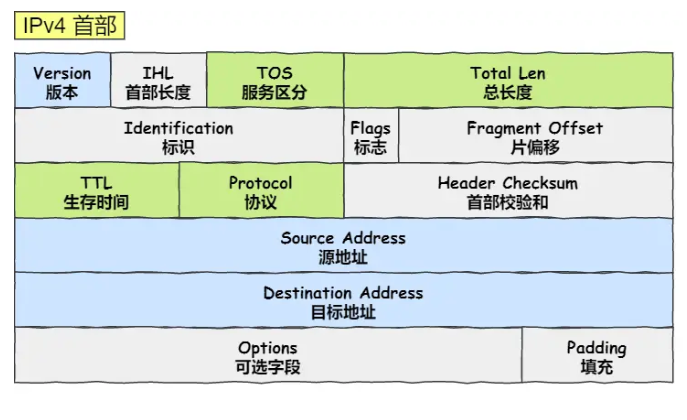

[TOC]

## TCP/IP 握手挥手

### TCP 报文格式

### UDP 报文格式

### 三次握手

第一次握手（SYN）：客户端向服务器发送一个SYN包（seq)，告诉服务器它想要建立连接，并且客户端随机选择一个初始序列号。客户端变为SYN_SENT状态。

第二次握手（SYN+ACK）：服务器收到客户端的SYN包后，会向客户端回复一个SYN+ACK包，这俩syn不是同一个 ack = seq+1 seq新的，表示确认客户端的请求，并且告诉客户端服务器的初始序列号。接收方变为SYN_RECEIVED状态。

第三次握手（ACK）：客户端收到服务器的SYN+ACK包后，会向服务器发送一个ACK ack=新的seq + 1（确认）包，表示确认服务器的回复，此时TCP连接建立成功。双方变为 ESTABLISHED

如果有任何一方没有收到对方的确认信息，那么它将会重新发送请求 RST 报文，直到连接建立成功或者达到最大重试次数为止。

### 为什么要三次？

主要原因是三次握手才可以阻止重复历史连接的初始化。接收端要通过发送端第三次的ACK报文，来确认对方是有发送能力的，同时也要确认序号的同步。

### 四次挥手

第一次挥手（FIN seq = x）：客户端发送一个 FIN 报文给服务器，表示客户端已经没有数据要发送了，但仍然可以接收服务器发来的数据。客户端变为 FIN_WAIT_1

第二次挥手（ACK ack = x+ 1 ）：服务器收到客户端的 FIN 报文后，会回复一个 ACK 报文给客户端，表示服务器已经收到了客户端的 FIN 报文。服务端变为CLOSE_WAIT，客户端变为FIN_WAIT_2

第三次挥手（FIN seq = y）：服务器发送一个 FIN 报文给客户端，表示服务器已经没有数据要发送了，并且已经完成了所有的数据发送任务。服务端变为LAST_ACK

第四次挥手（ACK ack = y + 1）：客户端收到服务器的 FIN 报文后，会回复一个 ACK 报文给服务器，表示客户端已经收到了服务器的 FIN 报文。客户端变为TIME_WAIT，此时，如果客户端等待 **2MSL** 后依然没有收到回复，就证明服务端已正常关闭，随后，客户端也可以关闭连接了。

### 为什么挥手需要四次？

- 关闭连接时，客户端向服务端发送 `FIN` 时，仅仅表示客户端不再发送数据了但是还能接收数据。
- 服务端收到客户端的 `FIN` 报文时，先回一个 `ACK` 应答报文，而服务端可能还有数据需要处理和发送，等服务端不再发送数据时，才发送 `FIN` 报文给客户端来表示同意现在关闭连接。

从上面过程可知，服务端通常需要等待完成数据的发送和处理，所以服务端的 `ACK` 和 `FIN` 一般都会分开发送，因此是需要四次挥手。

### MSS 字段

**1. MSS**

MSS（Maximum Segment Size，最大报文长度），是TCP协议定义的一个选项，MSS选项用于在TCP连接建立时，收发双方协商通信时每一个报文段所能承载的最大数据长度。在以太网环境下，MSS=MTU-20字节TCP报头-20字节IP报头，MSS值一般就是1500-20-20=1460字节。

**2. MSS的确定**

MSS值只会出现在SYN报文中，即SYN=1时，才会有MSS字段值。

1）首先客户端会发送一个SYN请求报文，这个SYN报文的“选项”字段中会有MSS值（MSS = MUT - IP首部长度 - TCP首部长度）。该MSS值是为了告知对方最大的发送数据大小。

2）当服务器端收到SYN报文后，会向请求端返回SYN+ACK（同步确认报文）报文，其中的“选项”字段也会有MSS值。

3）通信双方选择SYN和SYN+ACK报文中最小的MSS最为此次TCP连接的MSS，从而达到通信双发协商MSS的效果。

结论: 在第二次握手后就可以确定TCP中最大传输报文（MSS）大小。

**3. 确定MSS作用**
在tcp交互之前避免分片的产生。

**4. MTU**
MTU 最大传输单元（Maximum Transmission Unit，MTU）用来通知对方所能接受数据服务单元的最大尺寸，说明发送方能够接受的有效载荷大小。

利用ifconfig命令可以查看当前mtu的大小。

**5. MTU和MSS的区分**
最大报文段长度（MSS）与最大传输单元（Maximum Transmission Unit, MTU）均是协议用来定义最大长度的。

MTU应用于OSI模型的第二层数据链接层，并无具体针对的协议。MTU限制了数据链接层上可以传输的数据包的大小，也因此限制了上层（网络层）的数据包大小。例如，如果已知某局域网的MTU为1500字节，则在网络层的因特网协议（Internet Protocol, IP）里，最大的数据包大小为1500字节（包含IP协议头）。

MSS针对的是OSI模型里第四层传输层的TCP协议。因为MSS应用的协议在数据链接层的上层，MSS会受到MTU的限制。

## TCP 稳定与流量

### TCP 如何保证传输的可靠性？

**超时重传** : 当发送方发送数据之后，它启动一个定时器，等待目的端确认收到这个报文段。接收端实体对已成功收到的包发回一个相应的确认信息（ACK）。如果发送端在一定时间（RTT往返时间）内未收到确认消息，那么对应的数据包就被假设为已丢失并进行重传。

**流量控制** : TCP 连接的每一方都有固定大小的缓冲空间，TCP 的接收端只允许发送端发送接收端缓冲区能接纳的数据。当接收方来不及处理发送方的数据，能提示发送方降低发送的速率，防止包丢失。TCP 使用的流量控制协议是可变大小的滑动窗口协议（TCP 利用滑动窗口实现流量控制）。

**拥塞控制** : 通过一系列的拥塞控制算法来监测网络拥塞情况，如果检测到网络拥塞，会减少发送的数据量以降低网络负荷。

**序列号**：TCP 为了保证不发生丢包，就给每个包一个序列号，有了序列号能够将接收到的数据根据序列号排序，还去掉重复序列号的数据就可以实现数据包去重。

**校验和** : TCP 将保持它首部和数据的检验和。如果收到段的检验和有差错，TCP 将丢弃这个报文段和不确认收到此报文段。

**基于数据块传输** ：应用数据被分割成 TCP 认为最适合发送的数据块，再传输给网络层，数据块被称为报文段或段。

### TCP 的拥塞控制？

拥塞控制就是为了防止过多的数据注入到网络中，这样就可以使网络中的路由器或链路不致过载。拥塞控制所要做的都有一个前提，就是网络能够承受现有的网络负荷。拥塞控制是一个全局性的过程，涉及到所有的主机，所有的路由器，以及与降低网络传输性能有关的所有因素。

为了进行拥塞控制，TCP 发送方要维持一个 **拥塞窗口(cwnd)** 的状态变量。拥塞控制窗口的大小取决于网络的拥塞程度，并且动态变化。发送方让自己的发送窗口取为拥塞窗口和接收方的接受窗口中较小的一个。

TCP 的拥塞控制涉及到的算法有：**慢启动、拥塞避免、拥塞发生、快速恢复**。

**慢启动：** TCP 在刚建立连接完成后，一点一点的提高发送数据包的数量。慢启动的算法规则：**当发送方每收到一个 ACK，拥塞窗口 cwnd 的大小就会加 1。相当于每次发送的窗口大小*2，发包的个数呈指数级增长。**

**拥塞避免：** 当拥塞窗口 `cwnd` 「超过」慢启动门限 `ssthresh` 就会进入拥塞避免算法。每当收到一个 ACK 时，cwnd 增加 1/cwnd。即，拥塞窗口 cwnd 变成了线性增长。

**拥塞发生：**当网络出现拥塞，会出现：超时重传或快速重传。

若发送方没有接收到ACK报文，说明发生了「超时重传」，则就会使用拥塞发生算法。

这个时候，ssthresh 和 cwnd 的值会发生变化：

- `ssthresh` 设为 `cwnd/2`，
- `cwnd` 重置为 `1` （是恢复为 cwnd 初始化值，我这里假定 cwnd 初始化值 1）

若发送方收到了三个重复的ACK，说明发生了丢包，会触发「快速重传」。

TCP 认为这种情况不严重，因为大部分没丢，只丢了一小部分，则 `ssthresh` 和 `cwnd` 变化如下：

- `cwnd = cwnd/2` ，也就是设置为原来的一半;
- `ssthresh = cwnd`;

**快速恢复：**

快速重传和快速恢复算法一般同时使用，快速恢复算法是认为，你还能收到 3 个重复 ACK 说明网络也不那么糟糕，所以没有必要像超时重传那么强烈。

- 拥塞窗口 `cwnd = ssthresh + 3` （ 3 的意思是确认有 3 个数据包被收到了）；
- 重传丢失的数据包；
- 如果再收到重复的 ACK，那么 cwnd 增加 1；
- 如果收到新数据的 ACK 后，把 cwnd 设置为第一步中的 ssthresh 的值，原因是该 ACK 确认了新的数据，说明从 duplicated ACK 时的数据都已收到，该恢复过程已经结束，可以回到恢复之前的状态了，也即再次进入拥塞避免状态；

### 滑动窗口是怎么滑的

滑动窗口机制允许发送方在没有收到确认的情况下发送多个数据包，并根据接收方的反馈动态地调整发送速率。窗口大小由TCP报文中的window字段指定，接收方可以一次发送多个报文，或确认多个报文。

接收到确认报文后，会根据ACK值将窗口的已确认指针进行调整，也会相应地调整确认报文的指针位置。

**TCP 发送窗口可以划分成四个部分** ：

1. 已经发送并且确认的TCP段（已经发送并确认）；
2. 已经发送但是没有确认的TCP段（已经发送未确认）；
3. 未发送但是接收方准备接收的TCP段（可以发送）；
4. 未发送并且接收方也并未准备接受的TCP段（不可发送）。

**TCP 接收窗口可以划分成三个部分** ：

1. 已经接收并且已经确认的 TCP 段（已经接收并确认）；
2. 等待接收且允许发送方发送 TCP 段（可以接收未确认）；
3. 不可接收且不允许发送方发送TCP段（不可接收）。

## TCP UDP 区别

### 主要区别

1. **是否面向连接** ：UDP 在传送数据之前不需要先建立连接。而 TCP 提供面向连接的服务，在传送数据之前必须先建立连接，数据传送结束后要释放连接。
2. **是否是可靠传输**：远地主机在收到 UDP 报文后，不需要给出任何确认，并且不保证数据不丢失，不保证是否顺序到达。TCP 提供可靠的传输服务，TCP 在传递数据之前，会有三次握手来建立连接，而且在数据传递时，有确认、窗口、重传、拥塞控制机制。通过 TCP 连接传输的数据，无差错、不丢失、不重复、并且按序到达。
3. **是否有状态** ：这个和上面的“是否可靠传输”相对应。TCP 传输是有状态的，这个有状态说的是 TCP 会去记录自己发送消息的状态比如消息是否发送了、是否被接收了等等。为此 ，TCP 需要维持复杂的连接状态表。而 UDP 是无状态服务，简单来说就是不管发出去之后的事情了。
4. **传输效率** ：由于使用 TCP 进行传输的时候多了连接、确认、重传等机制，所以 TCP 的传输效率要比 UDP 低很多。
5. **传输形式** ： TCP 是面向字节流的，UDP 是面向报文的。
6. **首部开销** ：TCP 首部开销（20 ～ 60 字节）比 UDP 首部开销（8 字节）要大。
7. **是否提供广播或多播服务** ：TCP 只支持点对点通信，UDP 支持一对一、一对多、多对一、多对多；

### 如何选择

- **UDP 一般用于即时通信**，比如： 语音、 视频 、直播等等。这些场景对传输数据的准确性要求不是特别高，比如你看视频即使少个一两帧，实际给人的感觉区别也不大。
- **TCP 用于对传输准确性要求特别高的场景**，比如文件传输、发送和接收邮件、远程登录等等。

## TCP、UDP的上层协议

**运行于 TCP 协议之上的协议** ：

1. **HTTP 协议** ：超文本传输协议主要是为 Web 浏览器与 Web 服务器之间的通信而设计的。
2. **HTTPS 协议** ：更安全的超文本传输协，身披 SSL 外衣的 HTTP 协议
3. **FTP 协议**：文件传输协议 FTP，提供文件传输服务。使用 FTP 传输文件的好处是可以屏蔽操作系统和文件存储方式。
4. **SMTP 协议**：简单邮件传输协议，用来发送电子邮件。
5. **POP3/IMAP 协议**： POP3 和 IMAP 两者都是负责邮件接收的协议。
6. **Telnet 协议**：远程登陆协议，通过一个终端登陆到其他服务器。被一种称为 SSH 的非常安全的协议所取代。
7. **SSH 协议** : SSH是目前较可靠，专为远程登录会话和其他网络服务提供安全性的协议。利用 SSH 协议可以有效防止远程管理过程中的信息泄露问题。SSH 建立在可靠的传输协议 TCP 之上。

**运行于 UDP 协议之上的协议** ：

1. **DHCP 协议**：动态主机配置协议，动态配置 IP 地址
2. **DNS** ： **域名系统将人类可读的域名 (例如，www.baidu.com) 转换为机器可读的 IP 地址 (例如，220.181.38.148)。** 实际上 DNS 同时支持 UDP 和 TCP 协议。

### UDP 如何实现可靠传输

传输层无法保证数据的可靠传输，只能通过应用层来实现了。实现的方式可以参照tcp可靠性传输的方式，只是实现不在传输层，实现转移到了应用层。
实现确认机制、重传机制、窗口确认机制。
需要实现如下功能：
发送：包的分片、包确认、包的重发
接收：包的调序、包的序号确认

### TCP/IP 细节

#### 1. 大量time_wait和close_wait对应什么状态？

大量time_wait说明主动断开了很多连接。

- 第一个场景：HTTP 没有使用长连接
- 第二个场景：HTTP 长连接超时
- 第三个场景：HTTP 长连接的请求数量达到上限

解决方案：

设置 tcp_tw_reuse，TCP time_wait状态下连接复用

或者设定强制关闭time_wait状态下的连接

close_wait是被动关闭方的状态。通常是代码写的有问题，**或者服务端socket忙于读写**。close函数没有正常被调用。

## OSI 和 TCP/IP 网络分层模型

### OSI 七层模型是什么？每一层的作用是什么？

OSI 七层模型 是国际标准化组织提出一个网络分层模型，从上到下：

- **应用层**（为计算机用户提供服务，它包括各种协议，如HTTP、FTP、SMTP等）
- **表示层**（数据处理（编解码、加密解密、压缩解压缩）
- **会话层**（建立、维护和终止会话，以确保在应用程序之间建立良好的通信）
- **传输层**（传输层负责端到端的数据传输，将数据从应用程序层传输到网络层）
- **网络层**（路由和寻址（决定数据在网络的游走路径））
- **数据链路层（**封装成帧**，**透明传输**，**差错检测 将网络层交下来的 IP 数据报组装成帧，错误检测和纠正）
- **物理层**（透明地传送比特流传输）

### 为什么不用OSI？

由于TCP/IP模型设计简洁，实现效率高，OSI 的层次划分不太合理，有些功能在多个层次中重复出现。

### TCP/IP 四层模型是什么？每一层的作用是什么？

TCP/IP 四层模型 是目前被广泛采用的一种模型

- **应用层**（应用+表示+会话，它为应用程序提供数据交换服务。常见的应用层协议包括HTTP、DHCP、DNS、FTP、Telnet、SMTP等，它们使用不同的端口号进行通信。应用层协议通常是用户和应用程序之间的协议，用于规定数据交换的格式和内容）
- **传输层**（传输层是负责在端到端通信中提供数据传输的层。TCP、UDP）
- **网络层**（网络层是负责数据包的传输和路由的层。该层的主要作用是决定数据包如何在网络上寻址和转发，IP、ARP、NAT、ICMP、RIP）
- **网络接口层**（数据链路+ 物理 将网络层交下来的 IP 数据报组装成帧，错误检测和纠正、透明地传送比特流传输 差错检测、CSMA/CD、MAC协议）组成

### 为什么网络要分层？

网络分层的主要原因是为了简化网络的设计和管理，以及提高网络的可靠性和性能。

通过将网络分为不同的层次，每个层次的功能和责任变得更加清晰明确。每个层次只需要关注特定的任务，而不必考虑整个网络的运作细节。这样，设计和管理网络就变得更加容易。

另外，网络分层还可以提高网络的可靠性和性能。不同层次之间的接口标准化，使得各个厂商的设备可以互相兼容，也使得网络组件的替换和升级更加容易。而且，通过将功能分解到不同的层次，可以更加有效地利用网络资源，提高网络的性能和效率。

## HTTP

### 从输入 URL 到页面展示，发生了什么？

1. URL解析

请求的域名，请求的文件等。生成 http 请求报文

2. DNS解析

查找该域名对应的ip地址。浏览器缓存，操作系统缓存，本地hosts缓存，访问DNS服务器（根域名服务器(.)、顶级域名服务器(.com)...）

3. 建立TCP连接。
4. 发送HTTP请求：一旦连接建立，浏览器将通过发送HTTP请求向服务器请求资源。该请求通常包括HTTP方法（例如GET或POST），请求头（例如浏览器类型和支持的语言），以及URL的路径和查询参数。
5. 请求封装成数据包，经历各种协议发送。
6. 服务端接收到数据包，解析http请求，回送http响应报文。*服务器处理请求并返回响应：一旦服务器接收到请求，它将处理请求并返回一个HTTP响应。该响应通常包括状态码（例如200表示成功或404表示未找到所请求的资源）、响应头（例如服务器类型和数据类型）、以及响应正文（例如HTML页面）。*
7. 客户端解析，浏览器渲染页面

### GET 和 POST

**GET：**GET 的语义是从服务器获取指定的资源。请求的参数一般写在 URL 中。URL 规定只能支持 ASCII，所以 GET 请求的参数只允许 ASCII 字符。GET 一般作为资源的访问，所以通常可以被浏览器缓存。

**POST：**POST 的语义是根据请求负荷（报文body）对指定的资源做出处理。POST 请求携带数据的位置一般是写在报文 body 中，body 中的数据可以是任意格式的数据，只要客户端与服务端协商好即可，而且浏览器不会对 body 大小做限制。POST 请求多要修改服务器中的资源，所以浏览器一般不缓存。

### HTTP 和 HTTPS

- **端口号** ：HTTP 默认是 80，HTTPS 默认是 443。
- **URL 前缀** ：HTTP 的 URL 前缀是 `http://`，HTTPS 的 URL 前缀是 `https://`。
- **安全性和资源消耗** ： HTTP 协议运行在 TCP 之上，所有传输的内容都是明文，客户端和服务器端都无法验证对方的身份。HTTPS 是运行在 SSL/TLS 之上的 HTTP 协议，SSL/TLS 运行在 TCP 之上。所有传输的内容都经过加密**，加密采用对称加密，但对称加密的密钥用服务器方的证书进行了非对称加密。**所以说，HTTP 安全性没有 HTTPS 高，但是 HTTPS 比 HTTP 耗费更多服务器资源。

### 浏览器缓存

**强制缓存：**只要浏览器判断缓存没有过期，则直接使用浏览器的本地缓存，决定是否使用缓存的主动性在于浏览器这边。

**协商缓存：**浏览器先访问本地的缓存，然后发一个HTTP请求，头部带上etag，服务器比较请求与本地资源的etag，若一致，则返回304，表示允许使用。

### HTTP 1.0 和 HTTP 1.1 有什么区别？

**连接方式** : HTTP 1.0 为短连接，HTTP 1.1 支持长连接。

**状态响应码** : HTTP/1.1中新加入了大量的状态码，光是错误响应状态码就新增了24种。比如说，`100 (Continue)`——在请求大资源前的预热请求，`206 (Partial Content)`——范围请求的标识码，`409 (Conflict)`——请求与当前资源的规定冲突，`410 (Gone)`——资源已被永久转移，而且没有任何已知的转发地址。

**缓存处理** : 在 HTTP1.0 中主要使用 header 里的 If-Modified-Since,Expires 来做为缓存判断的标准，HTTP1.1 则引入了更多的缓存控制策略例如 Entity tag，If-Unmodified-Since, If-Match, If-None-Match 等更多可供选择的缓存头来控制缓存策略。

**带宽优化及网络连接的使用** :HTTP1.0 中，存在一些浪费带宽的现象，例如客户端只是需要某个对象的一部分，而服务器却将整个对象送过来了，并且不支持断点续传功能，HTTP1.1 则在请求头引入了 range 头域，它允许只请求资源的某个部分，即返回码是 206（Partial Content），这样就方便了开发者自由的选择以便于充分利用带宽和连接。

### HTTP/1.1

HTTP/1.1 采用了长连接的方式，即可在同一个 TCP 连接里面，客户端可以发起多个请求，只要第一个请求发出去了，不必等其回来，就可以发第二个请求出去，可以减少整体的响应时间。

但是**服务器必须按照接收请求的顺序发送对这些管道化请求的响应**。如果服务端在处理 A 请求时耗时比较长，那么后续的请求的处理都会被阻塞住，这称为「队头堵塞」。

### HTTP/2

1. HTTP/2会**压缩头**（Header）如果你同时发出多个请求，他们的头是一样的或是相似的，那么，协议会帮你**消除重复的部分**。
2. 二进制格式。不再采用纯文本格式，比如以前的HTTP/1.1，状态码200，以前会储存三个ASCII码，现在直接一个字节就搞定了。
3. 并发传输。不再会存在HTTP/1.1中的队头阻塞问题。
4. 服务端可以主动向客户端发送数据。比如，客户端通过 HTTP/1.1 请求从服务器那获取到了 HTML 文件，而 HTML 可能还需要依赖 CSS 来渲染页面，这时客户端还要再发起获取 CSS 文件的请求。在 HTTP/2 中，客户端在访问 HTML 时，服务器可以直接主动推送 CSS 文件，减少了消息传递的次数。

**HTTP/2存在的缺点，是TCP层面连接固有的。比如丢包，内核不会读走丢包后的缓冲区里面的内容，直到申请重传或接收到了为止。**

## ARP

## 5 ARP

**ARP 协议在协议栈中的位置？** 网络层。

**ARP 协议解决了什么问题，地位如何？** ARP 协议，全称 **地址解析协议**，它解决的是网络层地址和链路层地址之间的转换问题。因为一个 IP 数据报在物理上传输的过程中，总是需要知道下一跳（物理上的下一个目的地）该去往何处，但 IP 地址属于逻辑地址，而 MAC 地址才是物理地址，ARP 协议解决了 IP 地址转 MAC 地址的一些问题。

**ARP 工作原理？** 只希望大家记住几个关键词：**ARP高速缓存、广播问询、单播响应**。

MAC 地址的长度为 6 字节（48 比特），MAC 地址有一个特殊地址：FF-FF-FF-FF-FF-FF（全 1 地址），该地址表示广播地址。

### ARP 协议工作原理

ARP 协议工作时有一个大前提，那就是ARP高速缓存

在一个局域网内，每个网络设备都自己维护了一个ARP高速缓存，ARP高速缓存记录了某些其他网络设备的 IP 地址-MAC 地址映射关系，该映射关系以 `<IP, MAC, TTL>` 三元组的形式存储。其中，TTL 为该映射关系的生存周期，典型值为 20 分钟，超过该时间，该条目将被丢弃。

ARP 的工作原理将分两种场景讨论：

1. **同一局域网内的 MAC 寻址**；
2. **从一个局域网到另一个局域网中的网络设备的寻址**。

#### 同一局域网内的 MAC 寻址

1. 当主机A需要向主机B发送数据时，首先检查自己的ARP高速缓存（ARP Cache）中是否已经有了主机B的MAC地址。如果有，直接将数据帧发送给主机B。
2. 如果主机A的ARP高速缓存中没有主机B的MAC地址，则主机A会发送一个ARP请求广播，请求网络中的所有主机都回复自己的MAC地址。该请求中包含主机A的IP地址和MAC地址。
3. 网络中所有收到ARP请求的主机都会检查请求中的IP地址是否与自己的IP地址匹配。如果匹配，则该主机将回复一个ARP响应，其中包含自己的MAC地址。
4. 主机A收到ARP响应后，将会更新自己的ARP高速缓存，并将主机B的MAC地址存储到缓存中。此后，主机A就可以直接向主机B发送数据了。
5. ARP高速缓存中的映射信息是有生存周期的，典型值为 20 分钟。

#### 不同局域网内的 MAC 寻址

路由器的多个接口都各自维护一个ARP高速缓存，而非一个路由器只维护一个 ARP高速缓存。

1. 主机 A 查询ARP高速缓存，期望寻找到目标路由器的本子网接口的 MAC 地址。目标路由器指的是，根据目的主机 B 的 IP 地址，分析出 B 所在的子网，能够把报文转发到 B 所在子网的那个路由器。
2. 主机 A 未能找到目标路由器的本子网接口的 MAC 地址，将采用 ARP 协议，问询到该 MAC 地址，由于目标接口与主机 A 在同一个子网内，该过程与同一局域网内的 MAC 寻址相同。
3. 主机 A 获取到目标接口的 MAC 地址，先构造 IP 数据报，其中源 IP 是 A 的 IP 地址，目的 IP 地址是 B 的 IP 地址，再构造链路层帧，其中源 MAC 地址是 A 的 MAC 地址，目的 MAC 地址是**本子网内与路由器连接的接口的 MAC 地址**。主机 A 将把这个链路层帧，以单播的方式，发送给目标接口。
4. 目标接口接收到了主机 A 发过来的链路层帧，解析，根据目的 IP 地址，查询转发表，将该 IP 数据报转发到与主机 B 所在子网相连的接口上。
5. 路由器接口查询 ARP高速缓存，期望寻找到主机 B 的 MAC 地址。
6. 路由器接口如未能找到主机 B 的 MAC 地址，将采用 ARP 协议，广播问询，单播响应，获取到主机 B 的 MAC 地址。
7. 路由器接口将对 IP 数据报重新封装成链路层帧，目标 MAC 地址为主机 B 的 MAC 地址，单播发送，直到目的地。

## IP

### ICMP

### socket 通信

- 服务端和客户端初始化 `socket`，得到文件描述符；
- 服务端调用 `bind`，将绑定在 IP 地址和端口;
- 服务端调用 `listen`，进行监听；
- 服务端调用 `accept`，等待客户端连接；
- 客户端调用 `connect`，向服务器端的地址和端口发起连接请求；
- 服务端 `accept` 返回用于传输的 `socket` 的文件描述符；
- 客户端调用 `write` 写入数据；服务端调用 `read` 读取数据；
- 客户端断开连接时，会调用 `close`，那么服务端 `read` 读取数据的时候，就会读取到了 `EOF`，待处理完数据后，服务端调用 `close`，表示连接关闭。

这里需要注意的是，服务端调用 `accept` 时，连接成功了会返回一个已完成连接的 socket，后续用来传输数据。

所以，监听的 socket 和真正用来传送数据的 socket，是「**两个**」 socket，一个叫作**监听 socket**，一个叫作**已完成连接 socket**。

成功连接建立之后，双方开始通过 read 和 write 函数来读写数据，就像往一个文件流里面写东西一样。
