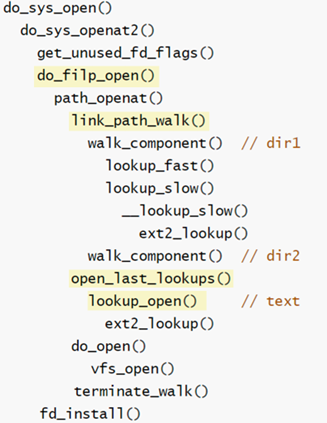

[TOC]


## 1 数据结构

### 1.1 文件系统 VFS 层相关数据结构

#### struct file

- `struct file` 是内存中对打开文件的描述，用于关联内存中的 `inode` 和 `path` 结构。
- **它还记录了文件的偏移** `loff_t f_pos`。
- 对于一个文件，inode对象唯一，**一个文件可以被多个进程打开，其 file 对象可以有多个。**

```c
struct file {
	fmode_t			f_mode; 
	atomic_long_t		f_count;

	loff_t			f_pos;
	unsigned int		f_flags;

	struct path		f_path;
	struct inode		*f_inode;	/* cached value */
	const struct file_operations	*f_op;

	struct address_space	*f_mapping;
};
```


##### fd 和 file 和 进程 的关系？

回答：每个进程都有一个打开文件表，内核可以直接获取当前进程的信息，调用这个表。这个表实际上是一个由 `struct file*`  构成的指针数组。文件描述符 fd 就是从这个数组里取出下标索引，作为返回值。


#### struct path

- `struct path` 结构表示文件的路径，通常是从字符串路径解析之后，在内存中的结构。

```c
struct path {
	struct vfsmount *mnt;
	struct dentry *dentry;
};
```


#### struct dentry

- `struct dentry` 是目录项缓存，用于将缓存的路径和 inode 结合，**以便能够通过目录路径字符串快速找到 inode。**
- 在路径查找的过程中，每查询到一个目录，就会建立一次 dentry 到 inode 的缓存。
- dentry 以树状的结构相连：所有的 dentry 用 d_parent 和 d_child 连接起来，形成树状结构。

```c
struct dentry {
	struct hlist_bl_node d_hash;	/* lookup hash list */
	struct dentry *d_parent;	/* parent directory */
	struct qstr d_name;
	struct inode *d_inode;		/* Where the name belongs to - NULL is
					 * negative */
	unsigned char d_iname[DNAME_INLINE_LEN];	/* small names */
}
```


#### struct inode

- 包含了内核在操作文件或目录时需要的全部元数据（文件访问权限、属主、组、大小、生成时间、访问时间、最后修改时间等信息）
- inode 结构中的静态信息取自物理设备上的文件系统，**由文件系统指定的函数填写**，它只存在于内存中，可以通过 inode 缓存访问

```c
// <linux/fs.h>
struct inode
{
    /* 相关权限位控制 */
    umode_t i_mode;
    unsigned short i_opflags;
    kuid_t i_uid;
    kgid_t i_gid;
    unsigned int i_flags;

    const struct inode_operations *i_op; // 方法集合
    struct super_block *i_sb; 		     // 自己指向的文件系统超级块
    struct address_space *i_mapping;	 // 该inode的文件内存缓存

    unsigned long i_ino;	// inode号
  	
    dev_t i_rdev;
    loff_t i_size;
    struct timespec i_atime;
    struct timespec i_mtime;
    struct timespec i_ctime;
    
    /* （好像不是）用于定位磁盘块位置的信息 */
    unsigned short i_bytes;
    unsigned int i_blkbits;
    blkcnt_t i_blocks;
};
```

```c
struct inode_operations
{
    struct dentry *(*lookup)(struct inode *, struct dentry *, unsigned int);

    // 创建文件，由create和open系统调用调用
    int (*create)(struct inode *, struct dentry *, umode_t, bool);
    int (*link)(struct dentry *, struct inode *, struct dentry *);
    int (*unlink)(struct inode *, struct dentry *);
    int (*symlink)(struct inode *, struct dentry *, const char *);
    int (*mkdir)(struct inode *, struct dentry *, umode_t);
    int (*rmdir)(struct inode *, struct dentry *);
    int (*mknod)(struct inode *, struct dentry *, umode_t, dev_t);
    int (*rename)(struct inode *, struct dentry *,
                  struct inode *, struct dentry *);
    int (*setattr)(struct dentry *, struct iattr *);
    int (*getattr)(struct vfsmount *mnt, struct dentry *, struct kstat *);
    int (*setxattr)(struct dentry *, const char *, const void *, 
} ____cacheline_aligned;
```


#### struct super_block

- super_block 是文件系统的元数据集合，用于存储特定文件系统的信息
- 通常对应于存放在磁盘特定扇区中的文件系统超级块，挂载时会自动读取文件系统中对应的超级块，加载到内存


## 2 read 流程

### 2.0 文件系统分层

#### 2.0.1 各层介绍

- VFS 层：该层屏蔽了下层的具体操作，为上层提供统一的接口，如 vfs_read、vfs_write 等。vfs_read，vfs_write 通过调用下层实际文件系统的接口来实现相应的功能。

  > - 假设想要写个内核文件系统，那么只需要按照 Linux 预设的一些 API 接口，实现起来就行了

- page cache层：该层缓存了从块设备中获取的数据。引入该层的目的是避免频繁的块设备访问，如果在page cache中已经缓存了I/O请求的数据，则可以将数据直接返回，无需访问块设备。

- 文件系统层：该层针对每一类文件系统都有相应的操作和实现，针对 VFS 层实现了各自的接口，包含了具体文件系统的处理逻辑。

- 通用块设备层：接收上层的I/O请求，并最终发出I/O请求。该层向上层屏蔽了下层设备的特性。

- I/O调度层: 接收通用块层发出的 IO 请求，缓存请求并试图合并相邻的请求（如果这两个请求的数据在磁盘上是相邻的）。并根据设置好的调度算法，回调驱动层提供的请求处理函数，以处理具体的 IO 请求。

- SCSI 块设备驱动层：从上层取出请求，根据参数，操作具体的设备。

- 块设备：真正的物理设备。


### 2.1 流程概述

1. 要读一个文件，首先通过 `read` 用户态系统调用接口，进入内核态（发生上下文切换）。

2. 用户进程转到内核态运行，进入 VFS 层：

   - 首先会根据 fd 文件描述符读取出 `struct file` 结构，进行权限方面的检查

   - 获取当前文件读取位置的**偏移(`offset`)**

     > 涉及函数：`ksys_read()` -> `vfs_read()`

3. 在 VFS 层中调用文件系统的接口函数，并判断目前发起的请求是 Direct IO 还是 Buffer IO。如果是 Buffer IO，**内核会首先查看读取文件对应的页的页缓存 (page cache) 中是否有文件片段的映射数据，如果有，则从页中根据偏移等信息，读取出数据，并复制至用户空间指向的地址中，然后直接返回**。

   > 涉及函数：`f_op->read_iter()` -> `generic_file_read_iter()` -> `filemap_read()`

   - 这个过程会避免一次磁盘IO
   - 同时，内核会根据预读算法，**从磁盘中异步预读若干文件数据到页缓存 (page cache) 中。这是文件顺序读取高性能的关键所在。**

4. 如果请求的数据不在页缓存 (page cache) 中，则进入**文件系统层，**调用块设备驱动程序触发磁盘 IO。内核会视情况，根据预读算法，同步预读若干文件数据。请求的文件数据和预读的文件数据一起填充到页缓存 (page cache) 中。

5. 在块设备驱动层完成实际上的物理磁盘 IO。在这一过程中，每一次物理上页面连续的请求，会被整合成一个 bio 请求，并根据一定的调度机制，将多个 bio 请求合并，下发至设备驱动。支持，读取完成。


### 2.2 read 详细流程

- 先走用户态系统调用接口，根据系统调用号，找到对应的内核态系统调用

- `ksys_read`：根据 fd 查找进程打开文件的实例，读取偏移。实际上，就是读取 struct file 结构

- `vfs_read`：

  - 验证权限，对文件的模式及用户 buf 进行检测，校验用户读取的区域是否有效。

  - 判断当前文件系统是否实现了对应的 read 接口。如果该 fs 有自己对应的方法，就调用，否则就调用 VFS 默认的读写方法；**其实到这里就会将磁盘数据依据用户给定的参数返回到用户空间的内存里了，不过其实际的执行流程内容很多，继续讨论；**

  - > 这里涉及到  `f_op->read()` 和 `f_op->read_iter()`，后者可以读取多个片段。**大多数文件系统都是实现了read_iter，然后会进入** `new_sync_read`

  

- `new_sync_read`：将参数 `char* buf`，`size len` 封装成两个控制读写的结构体(vec)，命名为 `struct kiocb` 和 `struct iov_iter `。

  - `struct kiocb` 封装了 `struct file *`，用于控制内核的读写流程（当前I/O的状态）。内核的每一次读写都会对应一个 `kiocb`。

  - `struct iov_iter` 是一个迭代器结构，封装了 buf 和 len。**这个迭代器用于记录所有需要读取的片段信息，因为内核有系统调用 （readv、writev） 支持读写多个非连续缓冲区。**

  - 这两个封装的结构，简单来说，用于内核态到用户态的数据拷贝。

  - ```c
    struct iov_iter {
        size_t count;	// 需要读写的总长度
        union {
            const struct iovec *iov; // 指向一个数组，代表所有片段信息
            const struct kvec *kvec;
            const struct bio_vec *bvec;
            struct pipe_inode_info *pipe;
        };
        unsigned long nr_segs; // iov的数组长度
        };
    };
    ```

 

- `file->f_op->read_iter(kio, iter);` -> `generic_file_read_iter`：封装完成之后，会调用一个通用的读文件接口，**在此处判断是直接读写 Direct IO 还是缓存读写 Buffer IO**。该函数有两个执行路径，如果是以O_DIRECT方式打开文件，则读操作跳过page cache，直接发动块设备IO请求，读取磁盘；否则尝试从page cache中获取所需的数据

 

- 讨论 Buffer IO 的情况：这里开始涉及到了 page cache 层，调用 `filemap_read`，该函数逻辑是，如果所需数据存在于 page cache 中，并且数据不是脏的，则从 page cache 中直接获取数据返回；如果数据在 page cache 中不存在，或者数据是脏的，则 page cache 会引发读磁盘的操作。并且会有一定的预读机制来提高 cache 的命中率，减少磁盘访问的次数。读磁盘具体来说，是：

  - 先尝试找到对应的 page，如果不存在，则创建，将文件内容读取到 page 中， 然后再拷贝到对应的 `iov` 结构里（封装了 buf 和 len 的结构体）。**这一段的机制十分复杂，涉及到预读等流程**。

  - 预读的流程，还不太了解 // TODO

    

### 2.3 内核如何从磁盘上读取数据

#### 2.3.1 总体逻辑

- 一个文件在磁盘上的分布，通过文件系统的数据结构进行有规律的组织。它可能连续分布在磁盘上的，也可能不连续。可以通过文件的 inode 号，对应到文件系统上该文件的编号，然后根据文件系统的数据结构组织，找到文件的位置。
- **块设备**每次读取都必须以 `sector` 扇区（物理上叫扇区，内核视角通常描述为块） 512B 为单位，因此可以计算出读取该文件，涉及到哪些 sector，和这些 sector 的位置。在内核中，与磁盘上的 sector 对应的数据结构是 `buffer_head`。 
  - 关键函数：`get_block` 会创建一些 `buffer_head` 结构体，通过文件的 inode 号，查找到文件具体所在的 `sector`，建立映射。
  - `buffer_head` 结构中有一个重要的成员 `b_data`，是一个指针，指向了文件的 offset 在 bh 缓存中的偏移。这个指针最终确定了读取文件的位置。
- **内核**每次读取都必须以 page 为单位，也就是 4KB。因此，一个页包括很多个 sector，因此对于 page cache 而言，每个 4KB 的 page 都会保存一系列连续的 buffer_head（或者说对应的 sector），内核需要以页为单位，读取出文件涉及到的每一个 sector。因此，page 与 buffer_head 在数据结构上也相关联。buffer_head 定位的缓存，在 page cache 里构成了连续的内存空间。
- `bio` 数据结构描述硬盘里面的位置与 page cache 的页的对应关系。bio 结构中，有一个 `bio_vec` 迭代器，指向一张表，描述一次请求中对应的 page。
- bio 将多个的页面作为一次请求提交。在内核从磁盘读取数据映射到 page cache 的过程中，会尝试做以下内容：
  - 如果磁盘上物理块连续，则只需要提交一个 bio 结构即可；
  - 如果磁盘上物理块部分连续，则将连续的部分合并成一个 bio，其余离散的部分每一页都分别构造一个 bio；
  - 如果都不连续，比如文件分散在4个离散的页里，则构造4个 bio。


#### 2.3.2 bio 提交、request

- 使用 `submit_bio` 函数，对 `bio` 进行提交操作，把 `bio` 封装成对应磁盘请求的 `request` 结构。
- 从机制上来说，内核会将多个 `request` 请求，按照一定的算法（如电梯调度算法）等添加到一个队列中。
- 当 I/O 请求到达一定限制时，内核会将多个 `request` 请求进行排序，最后向驱动层发送读请求。
- 再往下就是设备驱动层了，涉及到 scsi，ufs，不太了解


## 3 怎么刷盘

分两种情况：

- writeback 数据回刷方式，write 调用 + sync 调用；
- Direct IO 直接读写方式

对于 Buffer IO，VFS 到文件系统的读写，只是将数据从物理硬盘中取出，在内存中进行修改。需要有一个回刷机制，将缓存落盘。

触发数据回刷的方式如下：

- 经过特定时间后（30s？不确定）
- 脏页的数量超过了一定值
- 调用了 sync

内核有一个线程会自动挑选块设备对应的一些脏文件，把文件对应的 page 刷写到磁盘。落盘的执行，需要回调文件系统提供的 `write_page` 等接口。由于之前“从物理硬盘读取块，组成页，存入 page cache” 这一过程中，已经通过 buffer_head 等手段，确定了 page 对应磁盘的物理位置，因此可以直接方便地写入。


## 4 open 流程



| **function**          | **功能**                                                     |
| --------------------- | ------------------------------------------------------------ |
| get_unused_fd_flags() | 获取一个新的可用的文件描述符                                 |
| do_flip_open()        | 解析给定的文件路径名，关联至file结构体中；创建nameidata对象，用于路径遍历时保存其状态。(在路径查找的过程中，可能会跨越多个文件系统，因此在查找过程中，需要更新struct nameidate类型的变量中的root参数) |
| path_openat()         | 为 struct  file 申请内存空间，设置遍历路径的初始状态         |
| link_path_walk()      | 解析文件路径名，用于将目录名转换为一个目录项dentry           |
| walk_component()      | 对当前的路径进行搜索操作                                     |
| open_last_lookups()   | 分析最后的路径分量，如果为空则会创建                         |
| lookup_open()         | 1. 从dentry的dhash中查找文件，若查找成功，则更新path变量，返回  2. 若从dentry的dhash中没有查找到文件，则调用dentry的lookup接口，查找dentry的子dentry是否存在符合条件的子dentry若查找成功，更新path变量，返回成功;  3. 若查找失败，则调用vfs_create接口创建文件，更新path变量，返回 |


## 5 mount 流程

- 在用户空间由 `mount` 系统调用接口来挂载文件系统，该函数的函数原型	

```c
int mount(const char *dev_name, const char *dir_name, const char *fstype, unsigned long flags, const void *data);
```

​	需要指定设备名，目录路径，文件系统名等。

- 首先要走用户态系统调用接口，将这些字符串参数拷贝至内核空间中。

- 然后会根据路径解析出 struct path 结构、struct dentry 结构。

  > `struct path` 结构表示文件的路径，通常是从字符串路径解析之后，在内存中的结构。
  >
  > `struct dentry` 是目录项缓存，用于将缓存的路径和 inode 结合，**以便能够通过目录路径字符串快速找到 inode。**
  >
  > 在路径查找的过程中，每查询到一个目录，就会建立一次 dentry 到 inode 的缓存。以树形结构存在，关联父子 dentry 结构。

- 根据文件系统字符串参数，查找在内核中的文件系统对象链表里，注册的文件系统对象，主要查找的是 `struct file_system_type` 这个结构体。

  `struct file_system_type` 描述一个文件系统类，与之对应的是一个文件系统驱动模块，其中主要信息包括该文件系统名称，最重要的是包含文件系统自身的 mount 函数的实现，该函数中会对文件系统的 superblock 进行初始化。

  文件系统驱动模块加载时对该结构初始化，并调用 register_filesystem() 将其加入全局文件系统类链中。

- 然后会对挂载的参数进行解析，随后，调用一个叫 `get_tree` 的接口函数，用于去读取文件系统的超级块信息并创建一个超级块对象，然后执行具体的挂载方法。

- 然后会执行 `do_new_mount_fc`，关联挂载点和超级块，以便于用户可通过路径来访问所挂载的文件系统。


## 6 总结

1. IO 栈：**VFS - 文件系统 - 块层 - SCSI 驱动层**；
2. VFS 负责通用的文件抽象语义，管理并切换文件系统；
3. 文件系统负责抽象出“文件的概念”，**维护“文件”数据到块层的位置映射**，怎么摆放数据，怎么抽象文件都是文件系统说了算；
4. 块层对底层硬件设备做一层统一的抽象，最重要的是做一些 **IO 调度的策略**。比如，尽可能收集批量 IO 聚合下发，让 IO 尽可能的顺序，合并 IO 请求减少 IO 次数等等；
5. SCSI 层则是负责最后对硬件磁盘的对接，驱动层，**本质就是个翻译器**；
6. 文件的 buffer write 要实现 .write_begin，.write_page 等接口，**前者用于分配 page 并绑定块层物理空间，后者用户异步回刷的时候调用**（注意，非常规的优化在回刷的时候才去绑定物理空间）；
7. 文件系统 .write_begin 调用分配物理位置的时候依赖于 **get_block** 的实现，物理位置分配好之后，page 会对应到特定的 buffer head 结构，buffer head 结构则对应到具体的块设备位置；
8. **direct IO 直接在用户路径上刷数据到磁盘，不走 page cache 的逻辑，**但并不是所有文件系统都会实现它；


## xv6 文件系统 读取流程

从 `sys_read` 系统调用进入到读取 `inode` 文件的函数 `readi`，该函数主要功能为，查找该文件对应的 sector 在内存中是否有缓存，如果有，则直接从缓存中读取数据；如果没有缓存，则新建一块缓存，根据块号 (sector号) 从硬盘里读取信息，建立映射，然后从缓存中读取数据。

在读取的过程中 (`readi`)，具体有以下步骤：

1. 根据读取的文件偏移 offset，计算出起始的块号 bn。计算方式和具体的文件系统有关，在 xv6 中，是类 ext2 的文件系统，**可以根据文件的逻辑块号计算出物理块号的起始地址。**

   > 逻辑块号：按 块 把文件需要读取的长度分割，当前是第几块？比如给定的 offset 是 1224B，块大小是 1024B，则当前处于第 1 块（从 0 开始计数，bn = 1224 % 1024）

2. 拿到物理块号后，找到磁盘上对应的块的物理数据，调用磁盘驱动，读取至缓存块队列中。

3. 将缓存中的数据，根据 offset 复制到用户空间的地址中。

4. 重复以上执行流，直到完整地读取完文件数据。

