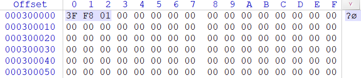
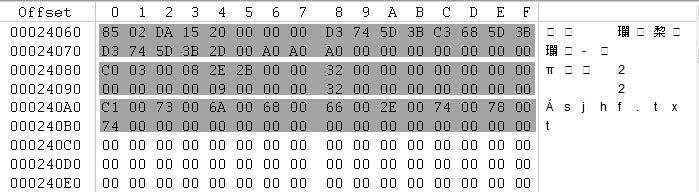

## 1. exFat 结构分布

**Main Boot Region**

| Main Boot Sector | Main Extended Boot Sectors | Main OEM Parameters | Main Reserved | Main Boot Checksum |
| ---------------- | -------------------------- | ------------------- | ------------- | ------------------ |

**Backup Boot Region**

| Backup Boot Sector | Backup Extended Boot Sectors | Backup OEM Parameters | Backup Reserved | Backup Boot Checksum |
| ------------------ | ---------------------------- | --------------------- | --------------- | -------------------- |

**FAT Region**

| FAT Alignment | First FAT | Second FAT |
| ------------- | --------- | ---------- |

**Data Region**

| Cluster Heap Alignment | Cluster Heap | Excess Space |
| ---------------------- | ------------ | ------------ |

## 2. Boot Sector

#### 2.1 JumpBoot 字段

JumpBoot 字段应包含个人计算机常用 CPU 的跳转指令，当执行该指令时，CPU 将“跳转”到 BootCode 字段中的引导程序代码。

该字段的有效值为 (低位字节到高位字节的顺序) EBh 76h 90h。

#### 2.2 FileSystemName 字段

FileSystemName 字段应包含卷中文件系统的名称。

此字段的有效值为 ASCII 字符“EXFAT”，其中包含三个尾随空格。

#### 2.3 MustBeZero 字段

MustBeZero 字段应直接对应于 FAT12/16/32 卷上紧密的 BIOS 参数块消耗的字节范围。

**此字段的有效值为 0，这有助于防止 FAT12/16/32 实现错误地装载 exFAT 卷**。

#### 2.4 PartitionOffset 字段

PartitionOffset 字段应描述托管给定 exFAT 卷的分区的媒体相对扇区偏移量。 此字段有助于在个人计算机上使用扩展 INT 13h 从卷进行启动绑带。

此字段的所有可能值都有效;但是，值 0 表示实现应忽略此字段。

#### 2.5 VolumeLength 字段

VolumeLength 字段应描述给定 exFAT 卷的大小（以扇区为单位）。

此字段的有效值范围应为：

- 至少 2$^{20}$/ 2$^{BytesPerSectorShift}$，这可确保最小卷不低于 1MB

- 最多为 2$^{64}$- 1，即此字段可以描述的最大值。

  但是，如果“多余的空间”子区域的大小为 0，则此字段的最大值为 

  ClusterHeapOffset + (2$^{32}$- 11) * 2$^{SectorsPerClusterShift}$。

#### 2.6 FatOffset 字段

FatOffset 字段应描述第一个 FAT 的卷相对扇区偏移量。该字段使实现能够将第一个 FAT 对齐到底层存储介质的特征。

此字段的有效值范围应为：

- 至少 24 个，占主启动和备份启动区域消耗的扇区
- 最多 ClusterHeapOffset - (FatLength * NumberOfFats) ，它占群集堆消耗的扇区

#### 2.7 FatLength 字段

FatLength 字段（以扇区为单位）应描述每个 FAT 表的长度， (卷最多可包含两个 FAT) 。

此字段的有效值范围应为：

- 至少 (ClusterCount + 2) * 2${^2}$/ 2$^{BytesPerSectorShift}$向上舍入到最接近的整数，这可确保每个 FAT 有足够的空间来描述群集堆中的所有群集
- 最多 (ClusterHeapOffset - FatOffset) /NumberOfFats 向下舍入为最接近的整数，这可确保 FAT 存在于群集堆之前

此字段可能包含超出其下限 (的值，如上文所述，) 使第二个 FAT（如果存在）也与基础存储媒体的特征保持一致。 超出 FAT 本身所需的空间的内容（如果有）是未定义的。

#### 2.8 ClusterHeapOffset 字段

ClusterHeapOffset 字段应描述群集堆相对于卷的扇区偏移量。 此字段使实现能够将群集堆与基础存储媒体的特征保持一致。

此字段的有效值范围应为：

- 至少 FatOffset + FatLength * NumberOfFats，以考虑前面所有区域消耗的扇区
- 最多 232- 1 或 VolumeLength - (ClusterCount * 2个 SectorsPerClusterShift) ，以计算较少者为准

#### 2.9 ClusterCount 字段

“ClusterCount”字段应描述群集堆包含的群集数。

此字段的有效值应为以下值中的较小值：

- (VolumeLength - ClusterHeapOffset) /2个扇区PerClusterShift向下舍入为最接近的整数，这恰好是群集堆开头和卷末尾之间可以容纳的群集数
- 232- 11，这是 FAT 可以描述的最大群集数

ClusterCount 字段的值确定 FAT 的最小大小。 为了避免非常大的 FAT，实现可以通过 SectorsPerClusterShift 字段) 增加群集大小 (来控制群集堆中的群集数。 此规范建议群集堆中不超过2 24-2 个群集。 但是，实现应能够处理群集堆中最多包含 232-11 个群集的卷。

#### 2.10 FirstClusterOfRootDirectory 字段

FirstClusterOfRootDirectory 字段应包含根目录的第一个群集的群集索引。 实现应尽一切努力将根目录的第一个群集置于分配位图和 Up-case Table 使用群集之后的第一个非错误群集中。

此字段的有效值范围应为：

- 至少 2，群集堆中第一个群集的索引
- 最多为 ClusterCount + 1，是群集堆中最后一个群集的索引

#### 2.11 VolumeSerialNumber 字段

VolumeSerialNumber 字段应包含唯一的序列号。 这可帮助实现区分不同的 exFAT 卷。 实现应通过组合设置 exFAT 卷格式的日期和时间来生成序列号。 用于组合日期和时间以形成序列号的机制特定于实现。

此字段的所有可能值都有效。

#### 2.12 FileSystemRevision 字段

FileSystemRevision 字段应描述给定卷上 exFAT 结构的主要和次要修订号。

高阶字节是主要修订号，低序字节是次要修订号。 例如，如果高阶字节包含值 01h，而低阶字节包含值 05h，则 FileSystemRevision 字段描述修订号 1.05。 同样，如果高阶字节包含值 0Ah，而低阶字节包含值 0Fh，则 FileSystemRevision 字段描述修订号 10.15。

此字段的有效值范围应为：

- 对于低阶字节，至少为 0，对于高阶字节，至少为 1
- 低阶字节最多为 99，高阶字节最多为 99

此规范描述的 exFAT 的修订号为 1.00。 此规范的实现应装载任何主要修订版编号为 1 的 exFAT 卷，并且不得装载具有任何其他主要修订号的任何 exFAT 卷。 实现应遵循次要修订号，不得执行操作或创建未在给定次要修订号的相应规范中描述的任何文件系统结构。

#### 2.13 VolumeFlags 字段

VolumeFlags 字段应包含指示 exFAT 卷上各种文件系统结构状态的标志 (请参阅 [表 5](https://learn.microsoft.com/zh-cn/windows/win32/fileio/exfat-specification#table-5-volumeflags-field-structure)) 。

在计算其各自的主启动或备份启动区域校验和时，实现不应包括此字段。 引用备份启动扇区时，实现应将此字段视为过时。

**表 5 VolumeFlags 字段结构**

| **字段名称** | **Offset****(位)** | **大小****(位)** | **注释**                                                     |
| :----------- | :----------------- | :--------------- | :----------------------------------------------------------- |
| ActiveFat    | 0                  | 1                | 此字段是必需的， [第 3.1.13.1 节](https://learn.microsoft.com/zh-cn/windows/win32/fileio/exfat-specification#31131-activefat-field) 定义其内容。 |
| VolumeDirty  | 1                  | 1                | 此字段是必需的， [第 3.1.13.2 节](https://learn.microsoft.com/zh-cn/windows/win32/fileio/exfat-specification#31132-volumedirty-field) 定义其内容。 |
| MediaFailure | 2                  | 1                | 此字段是必需的， [第 3.1.13.3 节](https://learn.microsoft.com/zh-cn/windows/win32/fileio/exfat-specification#31133-mediafailure-field) 定义其内容。 |
| ClearToZero  | 3                  | 1                | 此字段是必需的， [第 3.1.13.4 节](https://learn.microsoft.com/zh-cn/windows/win32/fileio/exfat-specification#31134-cleartozero-field) 定义了其内容。 |
| 保留         | 4                  | 12               | 此字段是必需的，其内容是保留的。                             |

##### 2.13.1 ActiveFat 字段

ActiveFat 字段应描述哪些 FAT 和分配位图 (处于活动状态，实现应使用) ，如下所示：

- 0，这意味着第一个 FAT 和第一个分配位图处于活动状态
- 1，这意味着第二个 FAT 和第二分配位图处于活动状态，并且仅当 NumberOfFats 字段包含值 2 时，才可能

实现应将非活动 FAT 和分配位图视为过时。 只有 TexFAT 感知实现才能切换活动 FAT 和分配位图 (请参阅 [第 7.1 节](https://learn.microsoft.com/zh-cn/windows/win32/fileio/exfat-specification#71-allocation-bitmap-directory-entry)) 。

##### 2.13.2 VolumeDirty 字段

VolumeDirty 字段应描述卷是否脏，如下所示：

- 0，这意味着卷可能处于一致状态
- 1，这意味着卷可能处于不一致状态

实现在遇到无法解决的文件系统元数据不一致时，应将此字段的值设置为 1。 如果装载卷时此字段的值为 1，则只有解决文件系统元数据不一致问题的实现才能将此字段的值清除为 0。 在确保文件系统处于一致状态后，此类实现应仅将此字段的值清除为 0。

如果装载卷时此字段的值为 0，则实现应在更新文件系统元数据之前将此字段设置为 1，然后将此字段清除为 0，这与 [第 8.1 节](https://learn.microsoft.com/zh-cn/windows/win32/fileio/exfat-specification#81-recommended-write-ordering)中所述的建议写入顺序类似。

##### 2.13.3 MediaFailure 字段

MediaFailure 字段应描述实现是否发现了媒体故障，如下所示：

- 0，这意味着托管媒体未报告故障，或者 FAT 中已将任何已知故障记录为“错误”群集
- 1，这意味着托管媒体已报告失败 (即读取或写入操作失败)

在以下情况下，实现应将此字段设置为 1：

1. 托管媒体尝试访问卷中的任何区域失败
2. 实现已用尽访问重试算法（如果有）

如果在装载卷时，此字段的值为 1，则用于扫描整个卷中的媒体故障，并将所有故障记录为 FAT (中“错误”群集的实现) 可能会将此字段的值清除为 0。

##### 2.13.4 ClearToZero 字段

ClearToZero 字段在此规范中没有重大意义。

此字段的有效值为：

- 0，没有任何特定含义
- 1，这意味着在修改任何文件系统结构、目录或文件之前，实现应将此字段清除为 0

#### 2.14 BytesPerSectorShift 字段

BytesPerSectorShift 字段应描述每个扇区的字节数，表示为日志2 (N) ，其中 N 是每个扇区的字节数。 例如，对于每个扇区 512 个字节，此字段的值为 9。

此字段的有效值范围应为：

- 至少 9 个 (扇区大小 512 字节) ，这是 exFAT 卷可能最小的扇区
- ) 最多 12 个 (扇区大小为 4096 字节，这是个人计算机中常见的 CPU 的内存页大小

#### 2.15 SectorsPerClusterShift 字段

“SectorsPerClusterShift”字段应将每个群集的扇区描述为日志2 (N) ，其中 N 是每个群集的扇区数。 例如，对于每个群集 8 个扇区，此字段的值为 3。

此字段的有效值范围应为：

- 每个群集) 至少 0 个 (1 个扇区，这是可能的最小群集
- 最多 25 - BytesPerSectorShift，计算结果为 32MB 的群集大小

#### 2.16 NumberOfFats 字段

NumberOfFats 字段应描述卷包含的 FAT 数和分配位图数。

此字段的有效值范围应为：

- 1，指示卷仅包含第一个 FAT 和第一个分配位图
- 2，指示卷包含第一个 FAT、第二个 FAT、第一个分配位图和第二个分配位图;此值仅对 TexFAT 卷有效

#### 2.17 驱动器选择字段

DriveSelect 字段应包含扩展的 INT 13h 驱动器号，这有助于在个人计算机上使用扩展的 INT 13h 从此卷启动。

此字段的所有可能值都有效。 以前基于 FAT 的文件系统中的类似字段通常包含值 80 小时。

#### 2.18 PercentInUse 字段

PercentInUse 字段应描述分配的群集堆中群集的百分比。

此字段的有效值范围应为：

- 介于 0 和 100（含）之间，这是群集堆中已分配的群集的百分比，向下舍入为最接近的整数
- 完全 FFh，指示群集堆中已分配群集的百分比不可用

实现应更改此字段的值，以反映群集堆中群集分配的更改，或者应将其更改为 FFh。

在计算其各自的主启动或备份启动区域校验和时，实现不应包括此字段。 引用备份启动扇区时，实现应将此字段视为过时。

#### 2.19 BootCode 字段

BootCode 字段应包含启动打包指令。 实现可能会用启动计算机系统所需的 CPU 指令填充此字段。 不提供启动打包指令的实现应将此字段中的每个字节初始化为 F4h， (个人计算机中常见的 CPU 的停止指令，) 作为其格式操作的一部分。

#### 2.20 BootSignature 字段

BootSignature 字段应描述给定扇区的意图是否为 Boot 扇区。

此字段的有效值为 AA55h。 此字段中的任何其他值都会使其各自的启动扇区失效。 实现应先验证此字段的内容，然后再根据其各自 Boot 扇区中的其他任何字段。

## 2. 结构总览

exFat文件系统由 DBR 及保留扇区、FAT、簇位图文件、大写字符文件、用户数据区五个部分组成，其结构如图所示。

这些结构是在分区被格式化时创建出来的，它们的含义如下：

**①DBR及其保留扇区。**DBR的全称为DOS Boot Record，含义是DOS引导记录，也称为操作系统引导记录。在DBR之后往往有一些保留扇区，其中12号扇区为DBR的备份。

**②FAT。**FAT的全称为File Allocation Table，含义是文件分配表。

> exFat一般只有一份FAT，而不像FAT文件系统那样有两个FAT表：FAT1和FAT2。

**③簇位图文件。**簇位图文件是exFat文件系统中的一个元文件，类似于NTFS文件系统中的元文件$BitMap，用来管理分区中簇的使用情况。

**④大写字符文件。**是exFat文件系统中的第二个元文件，类似于NTFS文件系统中的元文件$UpCase，Unicode字母表中每一个字符在这个文件中都有一个对应的条目，用于比较、排序、计算Hash值等方面。

> 该文件大小固定为5836字节。

## 3. DBR 分析

DBR 开始于 exFat 文件系统的第一个扇区，计算机启动时首先由 BIOS 读入主引导盘 MBR 的内容，以确定各个逻辑驱动器及其起始地址，然后调入活动分区的 DBR ，将控制权交给 DBR ，由 DBR 来引导操作系统。

Exfat 文件系统的 DBR 由 6 部分组成，分别为跳转指令、OEM 代号、保留区、BPB 参数、引导程序和结束标志。图是一个完整的 exFat 文件系统的 DBR。

**1．跳转指令**

跳转指令本身占用两个字节，它将程序执行流程跳转到引导程序处。例如，当前DBR中的“EB 76”，就是代表汇编语言的“JMP 76”。需要注意该指令本身占用两个字节，计算跳转目标地址时以该指令的下一字节为基准，所以实际执行的下一条指令应该位于78H。紧接着跳转指令的是一条空指令NOP（90H）。

**2．OEM代号**

这部分占8字节，其内容由创建该文件系统的OEM厂商具体安排。例如，微软的Windows Vista系统将此处设置为文件系统类型“exFat”。

**3．保留区**

从DBR的0BH～3FH处是原来的FAT文件系统BPB所占用的空间，exFat文件系统不使用这些字节。

**4．BPB（BIOS Parameter Block，BIOS参数块）**

exFat的BPB从第DBR的40BH偏移处开始，占用56字节，记录了有关该文件系统的重要信息，其中各个参数的含义见表4-97。

表4-97　exFat的BPB参数

打开WinHex的模板管理器，选择外置写的exFat的DBR模板，如图4-520所示。

图4-520　选择exFat的DBR模板

双击模板后就可以查看exFat的DBR信息了，如图4-521所示。

图4-521　exFat的DBR模板

下面对这些参数作详细分析。

​	（1）0x40～0x47：隐藏扇区数

隐藏扇区数是指本分区之前使用的扇区数，该值与分区表中所描述的该分区的起始扇区号一致：对于主磁盘分区来讲，是MBR到该分区DBR之间的扇区数；对于扩展分区中的逻辑驱动器来讲，是其EBR到该分区DBR之间的扇区数。

​	（2）0x48～0x4F：扇区总数

扇区总数是指分区的总扇区数，由8字节组成，也就是64位，所以能管理的最大分区为264×512＝273Byte＝8ZB。微软官方网站提供的信息称：exFat理论上最大可以支持64ZB的分区，但从这里只能算出8ZB。

​	（3）0x50～0x53：FAT起始扇区号

该值为相对于文件系统起始号扇区而言，也就是从DBR到FAT表之间的扇区数。

​	（4）0x54～0x57：FAT扇区数

是指FAT表包含的扇区数，exFat文件系统只有一份FAT表。

​	（5）0x58～0x5B：首簇起始扇区号

该值用来描述文件系统中的第1个簇的起始扇区号。与传统FAT文件系统一样，exFat文件系统的第一个簇也是2号簇，通常2号簇分配给簇位图文件使用，因此，该值也就是簇位图文件的起始扇区号。

​	（6）0x5C～0x5F：分区内的总簇数

分区内的总簇数是指从分区内第一个簇算起，到分区末尾所包含的簇的总数。

​	（7）0x60～0x63：根目录首簇号

分区在格式化为exFat文件系统时，格式化程序会在数据区中指派一个簇作为exFat的根目录区的开始，并把该簇号记录在BPB中。通常分区中的第一个簇被分配给簇位图文件使用，簇位图文件之后是大写字符文件，大写字符文件的下一个簇就根目录的起始位置了。

​	（8）0x64～0x67：卷序列号

卷序列号是格式化程序在创建文件系统时生成的一组4字节的随机数值。

​	（9）0x6C～0x6C：每扇区字节数描述

这个字节用来描述每扇区包含的字节数，描述方法为，假设此处值为N，则每扇区大小字节数为2N。例如，本例中该值为“09”，即每扇区大小字节数为29＝512。

​	（10）0x6C～0x6C：每簇扇区数描述

这个字节用来描述每簇包含的扇区数，描述方法为，假设此处值为N，则每簇扇区数为2N。例如，本例中该值为“06”，即每簇扇区数为26＝64。

exFat文件系统能够支持从512B～32MB的簇大小。

**5．引导程序**

exFat的DBR引导程序占用390字节（78H～1FDH）。这部分字节对于exFat来说也是很重要的，如果这些数据被破坏，文件系统将无法使用。

**6．结束标志**

exFat的DBR结束标志与FAT的DBR结束标志一样，也是“55 AA”。

在exFat的DBR之后还有很多保留扇区，其中12号扇区为DBR的备份，如果DBR遭到破坏，可以用其备份DBR进行修复。

## 4. exFat 文件系统的 FAT 表分析

### [FAT](https://www.dgxue.com/huifu/tag/fat/)表的作用及结构特点

FAT（File Allocation Table）即文件分配表，对于[exFat](https://www.dgxue.com/huifu/tag/exfat/)文件系统来讲也是很重要的一个组成部分，其主要作用及结构特点如下：

① exFat文件系统一般只有一份FAT，它们由格式化程序在对分区进行格式化时创建。

② FAT表跟在DBR之后，其具体地址由DBR的BPB参数中偏移量为50H～53H的4字节描述。

③ FAT表是由FAT表项构成的，我们把FAT表项简称为FAT项，exFat的每个FAT项由4字节构成，也就是32位的表项。

④ 每个FAT项都有一个固定的编号，这个编号从0开始，也就是说，第一个FAT项是0号FAT项，第二个FAT项是1号FAT项，以此类推。

⑤ FAT表的前两个FAT项有专门的用途，0号FAT项通常用来存放分区所在的介质类型，比如硬盘的介质类型为“F8”，那么硬盘上分区的FAT表第一个FAT项就以“F8”开始；1号FAT项一般都是4字节的“FF”。

⑥ 分区的数据区中每一个簇都会映射到FAT表中的唯一一个FAT项。因为0号FAT项和1号FAT项有特殊用途，无法与数据区中的簇形成映射，只能从2号FAT项开始于数据区中的第一个簇映射，所以数据区中的第一个簇也就编号为2号簇，这也是没有0号簇和1号簇的原因，然后3号簇与3号FAT项映射，4号簇与4号FAT项映射，以此类推，直到数据区中的最后一个簇。

⑦ 分区格式化后，分区的两个元文件及用户文件都以簇为单位存放在数据区中，一个文件至少占用一个簇。当一个文件占用多个簇时，这些簇的簇号可能是连续的，也可能是不连续的。如果文件存放的簇不连续，这些簇的簇号就以簇链的形式登记在FAT表中；而如果文件存放在连续的簇中，FAT表则不登记这些连续的簇链。

⑧ 综合上面的说明可以看出，exFat文件系统FAT表的功能主要是记录不连续存储的文件的簇链，所以在FAT中看到数值为0的FAT项，并不能说明该FAT项对应的簇是可用簇。

### FAT表的实际应用

要分析FAT表，就需要找到FAT表，下面模拟一下操作系统定位FAT表的方法。这里以图4-519中的DBR所在分区为例，定位FAT表的步骤如下：

① 系统通过该分区的分区表信息，定位到其DBR扇区。

② 读取DBR的BPB，主要读取“FAT表起始扇区号”这个参数，它在DBR的50H～54H偏移处，当前值为2048（具体参数可以查看图4-521中的DBR模板）。

③ 读取到“FAT表起始扇区号”这个参数的值为2048之后，跳转到该分区的2048号扇区，这里就是FAT表的开始。

下面就跳转到2048号扇区，具体分析这个扇区的数据结构。

该分区是刚格式化的一个分区，把分区格式化为exFat文件系统时，格式化程序会把分配给FAT表的第一个扇区清零，然后写入0号FAT项和1号FAT项，另外还会写入簇位图文件、大写字符文件及根目录所占簇对应的FAT项，其内容如图所示。

图4-522　exFat文件系统的FAT表

可以看出每个FAT项占用4字节：其中0号FAT项描述介质类型，其首字节为“F8”，表示介质类型为硬盘；1号FAT项写入4个“FF”；从2号FAT项开始对应2号簇，3号FAT项对应3号簇，一直到最后一个簇。目前2、3、4三个FAT项中都是结束标志，说明簇位图文件、大写字符文件、根目录各占一个簇。

> 除了这5个FAT项以外，其他FAT项都是0，但这并不能说这些FAT项对应的簇就是空簇。

> 本机实例：
>
> 
>
> 2、3号簇是簇位图文件
>
> 4号是大写字符文件
>
> 5号是根目录文件

## 5. 簇位图分析

exFat 文件系统的FAT表之后就是数据区了，但数据区并不一定紧跟在 FAT 表之后，FAT 表后面可能还会有一些保留扇区，每个分区不一样，这要看实际情况。数据区的开始位置在 DBR 的 BPB 中有描述，“首簇起始扇区号”起始就是数据区的开始。数据区中第一个簇就是2号簇，2号簇一般都分配给簇位图文件使用。

簇位图文件是在分区格式化时创建的，该文件不允许用户访问和修改。

还是以图4-519中的DBR所在分区为例，**从偏移58H～5BH处可以看到“首簇起始扇区号”是4096**，跳转到4096扇区，内容如图4-523所示。

图4-523　首簇起始扇区

该扇区中只有一个字节“07H”，这就是簇位图文件的内容。

簇位图文件是ExFAT文件系统中的一个元文件，类似于NTFS文件系统中的元文件$BitMap，它的作用是用来管理分区中簇的使用情况。簇位图文件中的每一个位，映射到数据区中的每一个簇。如果某个簇分配给了文件，该簇在簇位图文件中对应的位就会被填入“1”，表示该簇已经占用；如果没用使用的空簇，它们在簇位图文件中对应的位就是“0”。

图4-523中簇位图文件的内容为“07H”，换算成二进制等于“00000111”，这8位就对应数据区的8个簇，也就是2号簇到9号簇这八个簇。从“00000111”这个数值中能够很明确地看出2、3、4这三个簇是被使用的，其他五个簇未被使用。而2、3、4这三个簇正是被簇位图文件、大写字符文件、根目录所占用的。

> 本机情况：
>
> 
>
> 0x3f = 0b00111111
>
> 0xf8 = 0b11111000
>
> 0x01= 0b00000001

有关簇位图文件的开始位置和大小在其目录项中有记录，目录项结构将会在4.7.7节中介绍。

## 6. 大写字符文件分析

大写字符文件是 exFat 文件系统中的第二个元文件，类似于NTFS文件系统中的元文件$UpCase。Unicode字母表中每一个字符在这个文件中都有一个对应的条目，用于比较、排序、计算Hash值等方面。

大写字符文件是在分区格式化时创建的，该文件不允许用户访问和修改。

簇位图文件结束后的下一个簇一般就分配给大写字符文件使用。在图4-519的DBR所在分区中，簇位图文件只占用一个簇，当前分区每簇8个扇区，所以从簇位图文件的开始位置往后跳转8个扇区就到了大写字符文件的开始位置了，也就是3号簇的开始，其内容如图4-524所示。

图4-524　大写字符文件

图4-524是大写字符文件第一个扇区的前半部分，从图中可以看到其内容都是Unicode字母表中的字符，每一个字符占用两个字节。

大写字符文件的大小固定为5836字节。

## 7. 目录项分析

### [目录项](https://www.dgxue.com/huifu/tag/目录项/)的作用及结构特点

目录项对于[ExFAT](https://www.dgxue.com/huifu/tag/exfat/)文件系统来讲是非常重要的组成部分，其主要作用及结构特点如下：

①分区中的每个文件和文件夹（也称为目录）都被分配多个大小为32字节的目录项，用以描述文件或文件夹的属性、大小、起始簇号和时间、日期等信息，当然还会把文件名或目录名也记录在目录项中。

②在ExFAT文件系统中，目录也被视为特殊类型的文件，所以每个目录也与文件一样有目录项。

③在ExFAT文件系统下，分区根目录下的文件及文件夹的目录项存放在根目录区中，分区子目录下的文件及文件夹的目录项存放在数据区相应的簇中。

④ExFAT文件系统目录项的第一个字节用来描述目录项的类型，剩下的31字节用来记录文件的相关信息。

⑤根据目录项的作用和结构特点，可以把目录项分为四种类型：

- 卷标目录项；
- 簇位图文件的目录项；
- 大写字符文件的目录项；
- 用户文件的目录项。

### 卷标目录项

卷标就是一个分区的名字，可以在格式化分区时创建，也可以随时修改。ExFAT文件系统把卷标当作文件，用文件目录项进行管理。系统为卷标建一个目录项，放在根目录区中。

卷标的目录项占用32字节，其中第一个字节是特征值，用来描述类型。卷标目录项的特征值为“83H”，如果没有卷标或者将卷标删除，该特征值为“03H”。

卷标的长度理论上为11字符，但实际上可以达到15字符。

当前有一个卷标为“ExFAT--Recovery”的ExFAT分区“G”，其卷标长度是15字符，如图4-525所示。

图4-525　卷标为“ExFAT--Recovery”的分区“G”

其卷标所在目录项如图4-526所示。

图4-526　卷标的目录项

卷标目录项中各字节的含义见表4-98。

表4-98　ExFAT卷标目录项的含义

| 字节偏移 | 字段长度（字节） | 内容及含义                                |
| -------- | ---------------- | ----------------------------------------- |
| 0x00     | 1                | 目录项的类型（卷标目录项的特征值为“83H”） |
| 0x01     | 1                | 卷标字符数                                |
| 0x02     | 22               | 卷标                                      |
| 0x18     | 8                | 保留（也可用）                            |

下面用WinHex模板（该模板需自己制作）查看卷标目录项的结构，如图4-527所示。

图4-527　卷标目录项的模板

卷标的目录项有如下特点：

①对于ExFAT格式的分区，卷标的字符数理论上要求在11个之内，但最多可以达到15个。卷标使用Unicode码字符。

②卷标的目录项中不记录起始簇号和大小。

③卷标的目录项中不记录时间戳。

### 簇位图文件的目录项

ExFAT文件系统格式化时会创建一个簇位图文件，并为其建一个目录项，放在根目录区中。

簇位图文件的目录项占用32字节，其中第一个字节是特征值，用来描述类型。簇位图文件目录项的特征值为“81H”。

ExFAT分区“G”的簇位图文件所在目录项如图4-528所示。

图4-528　簇位图文件的目录项

簇位图文件目录项中各字节的含义见表4-99。

表4-99　ExFAT簇位图文件目录项的含义

| 字节偏移 | 字段长度（字节） | 内容及含义                                      |
| -------- | ---------------- | ----------------------------------------------- |
| 0x00     | 1                | 目录项的类型（簇位图文件目录项的特征值为“81H”） |
| 0x01     | 1                | 保留                                            |
| 0x02     | 18               | 保留                                            |
| 0x14     | 4                | 起始簇号                                        |
| 0x18     | 8                | 文件大小                                        |

下面用WinHex模板（该模板需自己制作）查看簇位图文件目录项的结构，如图4-529所示。

图4-529　簇位图文件目录项的模板

簇位图文件的目录项有如下特点：

①对于ExFAT格式的分区，簇位图文件起始簇号一般都为2。

②簇位图文件的目录项中不记录时间戳。

### 大写字符文件的目录项

ExFAT文件系统格式化时会创建一个大写字符文件文件，并为其建一个目录项，放在根目录区中。

大写字符文件的目录项占用32字节，其中第一个字节是特征值，用来描述类型。大写字符文件目录项的特征值为“82H”。

ExFAT分区“G”的大写字符文件所在目录项如图4-530所示。

图4-530　大写字符文件的目录项

大写字符文件目录项中各字节的含义见表4-100。

表4-100　ExFAT大写字符文件目录项的含义

| 字节偏移 | 字段长度（字节） | 内容及含义                                        |
| -------- | ---------------- | ------------------------------------------------- |
| 0x00     | 1                | 目录项的类型（大写字符文件目录项的特征值为“82H”） |
| 0x01     | 3                | 保留                                              |
| 0x08     | 14               | 保留                                              |
| 0x14     | 4                | 起始簇号                                          |
| 0x18     | 8                | 文件大小                                          |

下面用WinHex模板（该模板需自己制作）查看大写字符文件目录项的结构，如图4-531所示。

图4-531　大写字符文件目录项的模板

大写字符文件的目录项有如下特点：

①对于ExFAT格式的分区，大写字符文件的目录项一般都跟在簇位图文件的目录项之后。

②大写字符文件的目录项中不记录时间戳。

### 用户文件的目录项

ExFAT文件系统中每个用户文件至少有三个目录项，这三个目录项被称为三个属性：第一个目录项称为“属性1”，目录项首字节的特征值为“85H”；第二个目录项称为“属性2”，目录项首字节的特征值为“C0H”；第三个目录项称为“属性3”，目录项首字节的特征值为“C1H”。

#### “属性1”目录项

“属性1”目录项用来记录该目录项的附属目录项数、校验和、文件属性、时间戳等信息。用户文件的“属性1”目录项如图4-532所示。

图4-532　用户文件的“属性1”的目录项

用户文件的“属性1”目录项中各字节的含义见表4-101。

表4-101　用户文件的“属性1”目录项的含义

| 字节偏移 | 字段长度（字节） | 内容及含义                                   |
| -------- | ---------------- | -------------------------------------------- |
| 0x00     | 1                | 目录项的类型（“属性1”目录项的特征值为“85H”） |
| 0x01     | 1                | 附属目录项数                                 |
| 0x02     | 2                | 校验和                                       |
| 0x04     | 4                | 文件属性                                     |
| 0x08     | 4                | 文件创建时间                                 |
| 0x0C     | 4                | 文件最后修改时间                             |
| 0x10     | 4                | 文件最后访问时间                             |
| 0x14     | 1                | 文件创建时间精确至10ms                       |
| 0x15     | 3                | 保留                                         |
| 0x18     | 8                | 保留                                         |

下面用WinHex模板（该模板需自己制作）查看“属性1”目录项的结构，如图4-533所示。

图4-533　“属性1”目录项的模板

对其中的参数作进一步的解释：

①0x00～0x00：类型。该参数为目录项类型的特征值，“属性1”目录项的特征值为“85H”。

②0x01～0x01：附属目录项数。该参数指除此目录项外，该文件还有几个目录项，当前值为2，说明这个文件除了“属性1”目录项外，后面还有两个目录项，起始就是“属性2”目录项和“属性3”目录项。

③0x02～0x03：校验和。该参数是校验算法算出来的目录项的校验和。

④0x04～0x07：文件属性。该参数描述文件的常规属性，属性具体含义见表4-102。

表4-102　属性具体含义

| 二进制值 | 属性含义 | 二进制值 | 属性含义 |
| -------- | -------- | -------- | -------- |
| 00000000 | 读/写    | 00001000 | 卷标     |
| 00000001 | 只读     | 00010000 | 子目录   |
| 00000010 | 隐藏     | 00100000 | 存档     |
| 00000100 | 系统     |          |          |

⑤0x08～0x0B：文件创建时间。该参数是文件的具体创建时间，格式为32位的DOS时间，包括年、月、日、时、分、秒，具体表示方法与FAT文件系统一样，这里就不再重复讲述。

⑥0x0C～0x0F：文件最后修改时间。该参数是文件最后一次修改时的具体时间，格式为32位的DOS时间，包括年、月、日、时、分、秒，具体表示方法跟FAT文件系统一样，这里就不再重复讲述。

⑦0x10～0x13：文件最后访问时间。该参数是文件最后一次访问时的具体时间，格式为32位的DOS时间，包括年、月、日，也包含时、分、秒，这一点跟FAT不一样，FAT中改时间只有年、月、日，没有时、分、秒。

⑧0x14～0x14：文件创建时间，精确至10ms。该参数是文件的具体创建时间精确到10ms的数值。

#### “属性2”目录项

“属性2”目录项用来记录文件是否有碎片、文件名的字符数、文件名的Hash值、文件的起始簇号及大小等信息。

用户文件的“属性2”目录项如图4-534所示。

图4-534　用户文件的“属性2”的目录项

用户文件的“属性2”目录项中各字节的含义见表4-103。

表4-103　用户文件的“属性2”目录项的含义

| 字节偏移 | 字段长度（字节） | 内容及含义                                   |
| -------- | ---------------- | -------------------------------------------- |
| 0x00     | 1                | 目录项的类型（“属性1”目录项的特征值为“C0H”） |
| 0x01     | 1                | 文件碎片标志                                 |
| 0x02     | 1                | 保留                                         |
| 0x03     | 1                | 文件名字符数N                                |
| 0x04     | 2                | 文件名Hash值                                 |
| 0x06     | 2                | 保留                                         |
| 0x08     | 8                | 文件大小1                                    |
| 0x10     | 4                | 保留                                         |
| 0x14     | 4                | 起始簇号                                     |
| 0x18     | 8                | 文件大小2                                    |

下面用WinHex模板（该模板需自己制作）查看“属性2”目录项的结构，如图4-535所示。

图4-535　“属性2”目录项的模板

对其中的参数做进一步的解释。

①0x00～0x00：类型。该参数为目录项类型的特征值，“属性2”目录项的特征值为“C0H”。

②0x01～0x01：文件碎片标志。该参数能够反映出文件是否连续存放。如果是连续存放没有碎片，该标志为03H；如果不是连续存放，文件有碎片，该标志就为01H。

③0x03～0x03：文件名字符数。该参数用来说明文件名的长度，ExFAT文件系统的文件名用Unicode码表示，每个字符占用两个字节。

④0x04～0x05：文件名Hash值。该参数是根据相应算法算出的文件名的校验值，当文件名发生改变时，Hash值也会发生改变，但当文件移动时，该值并不改变。

⑤0x08～0x0F：文件大小1。该参数是文件的总字节数，用64位记录文件大小。

⑥0x14～0x17：起始簇号。该参数描述文件的起始簇号，用32位记录簇的地址。

⑦0x18～0x1F：文件大小2。该参数也是文件的总字节数，是为NTFS文件系统的压缩属性准备的，一般情况下与“文件大小1”的数值保持一致。

#### “属性3”目录项

“属性3”目录项用来具体记录文件的名称。如果文件名很长，“属性3”可以包含多个目录项，每个目录项称为一个片段，从上至下依次记录文件名的每一个字符，记录的方向刚好跟FAT文件系统中长文件名目录项从下至上的顺序相反。

用户文件的“属性3”目录项如图4-536所示。

图4-536　用户文件的“属性3”的目录项

用户文件的“属性3”目录项中各字节的含义见表4-104。

表4-104　用户文件的“属性3”目录项的含义

| 字节偏移 | 字段长度（字节） | 内容及含义                                   |
| -------- | ---------------- | -------------------------------------------- |
| 0x00     | 1                | 目录项的类型（“属性1”目录项的特征值为“C1H”） |
| 0x01     | 1                | 保留                                         |
| 0x02     | 2N               | 文件名                                       |

下面用WinHex模板（该模板需自己制作）查看“属性3”目录项的结构，如图4-537所示。

图4-537　“属性3”目录项的模板

因为该文件名很短，所以只有一个片段。

下面再看另外一个文件，文件名为“shu-ju-hui-fu-ji-shu-shen-du-jie-mi.txt”，其目录项如图4-538所示。

图4-538　“shu-ju-hui-fu-ji-shu-shen-du-jie-mi.txt”的目录项

从图4-538中可以看到该文件有5个目录项，一个“属性1”目录项、一个“属性2”目录项、三个“属性3”目录项，其模板如图4-539所示。

图4-539　“shu-ju-hui-fu-ji-shu-shen-du-jie-mi.txt”的目录项模板

## 8. 根目录与子目录的管理

### 根目录的管理

[ExFAT](https://www.dgxue.com/huifu/tag/exfat/)文件系统对于根目录下文件的管理，统一在数据区中的根目录区为这些文件创建目录项，并由簇位图文件为用户文件的内容分配簇存放数据。而根目录区的首簇由格式化程序指派，并把指派的簇号记录在DBR的BPB中。如果根目录下文件数目过多，这些文件的目录项在根目录区的首簇存放不下，簇位图文件就会为根目录分配新的簇来存放根目录下文件及文件夹的目录项，并在FAT表中记录簇链。

具体看一个例子。目前在G盘根目录下有一个文件“ExFAT.txt”，我们看ExFAT文件系统如何管理这个文件。

第1步　定位DBR。

通过分区表定位到G盘的开始位置在63号扇区，这个扇区就是G盘的DBR扇区。

第2步　定位根目录首簇。

访问DBR扇区的BPB，BPB的参数如图4-540所示。

图4-540　DBR扇区的BPB模板

通过“首簇起始扇区号”、“根目录首簇号”和“每簇扇区数N”三个参数的值便可计算出根目录首簇的开始扇区。具体算法：首簇起始扇区号＋（根目录首簇号-2）×每簇扇区数。以图4-540中的数值为例，计算结果为4224，所以根目录开始于4224扇区。

第3步　定位目录项。

找到根目录首簇后，通过文件名定位到目标文件的目录项，该文件有三个目录项，其目录项如图4-541中的阴影部分所示。

图4-541　目标文件的3个目录项

该目录项的模板如图4-542所示。

图4-542　目录项的模板

从模板中可以看到文件开始簇号为5，文件大小为37字节。

第4步　定位FAT。

因为文件开始于5号簇，我们可以看看5号簇对应的5号FAT项内的数据。通过DBR的BPB参数“FAT起始扇区号”定位FAT的开始扇区，并跳转过去，找到5号FAT项，其数值如图4-543所示。

图4-543　FAT表所在扇区

图4-453中阴影部分就是FAT表的5号FAT项，数值为“00 00 00 00”，但这并不能说明5号簇是个空簇，因为ExFAT对连续存放的文件并不记录簇链。

第5步　定位簇位图文件。

簇位图文件是ExFAT文件系统中真正管理簇的分配和使用情况的文件，我们去看看这个文件。该文件一般都存放在数据区第一个簇中，也就是2号簇，可以根据BPB参数的“首簇起始扇区号”定位到该文件的第一个扇区，目前在4096，跳转到该扇区，如图4-544所示。

图4-544　簇位图文件

该文件目前只有一个字节“0F”，换算为二进制等于“00001111”，也就说明2、3、4、5这四个簇是使用的，其中2、3、4簇分别被簇位图文件、大写字符文件和根目录占用，5号簇就是被“ExFAT.txt”文件所占的。

第6步　定位数据区。

确定了文件存放在数据区的5号簇，最后就该去5号簇查看数据了。因为数据区中的簇从2开始编号，所以5号簇所对应的扇区号计算方法如下：

首簇起始扇区号＋（5-2）×每簇扇区数

计算出结果后跳转过去，内容如图4-545所示。

图4-545　文件的内容

因为文件大小是37字节，所以从5号簇的第一个字节起，连续的37字节就是文件“ExFAT.txt”的内容，即图4-545中的阴影部分。

以上就是ExFAT文件系统根目录的管理。

### 子目录的管理

ExFAT的根目录、子目录及数据都是放在数据区的。下面根据一个实际的例子分析子目录的管理方法，同时也能看出数据区中的根目录、子目录及其数据的结构和关系。

在一分区根目录下有一个文件夹“123”，如图4-546所示。

图4-546　根目录下的“123”文件夹

文件夹“123”内有一文件夹“456”，如图4-547所示。

图4-547　文件夹“123”下的“456”文件夹

文件夹“456”内有一文本文件“sjhf.txt”，如图4-548所示。

图4-548　文件夹“456”下的“sjhf.txt”文件

打开文本文件“sjhf.txt”，其内容如图4-549所示。

图4-549　文本文件“sjhf.txt”的内容

下面来分析这一系列目录及其数据的结构。

首先通过WinHex在该分区根目下查看文件夹“123”的目录项，如图4-550所示。

图4-550　文件夹“123”的目录项

该目录项各字节的含义见其模板，如图4-551所示。

图4-551　文件夹“123”目录项的模板

从中可看出文件夹“123”的属性二进制数为“00010000”，表示子目录，起始簇号为5，文件大小为32 768字节。这与传统FAT不一样，传统FAT中文件夹的目录项是没有大小的，ExFAT中对文件夹的目录项也描述大小，其实就是其下级目录项所占用的空间，也就是1个簇的大小。当前分区每簇64扇区，换算为字节数就是32 768。

在WinHex中跳转到5号簇，其内容如图4-552所示。

图4-552　5号簇的内容

可以看出该簇中有三个目录项，也就是文件夹“456”的目录项，其内容见模板，如图4-553所示。

图4-553　文件夹“456”目录项的模板

从模板中可看出文件夹“456”的起始簇号为6，在WinHex中跳转到6号簇，其内容如图4-554所示。

图4-554　6号簇的内容

可以看出该簇中有三个目录项，也就是文本文件“sjhf.txt”的目录项，其内容见模板，如图4-555所示。

图4-555　文本文件“sjhf.txt”目录项的模板

从中可看出文本文件“sjhf.txt”的属性二进制数为“00100000”，表示存档，起始簇号为7，文件大小为50字节。在WinHex中跳转到7号簇，其内容如图4-556所示。

图4-556　7号簇的内容

该簇中的前50字节也就是文本文件“sjhf.txt”的内容了。

## 9. 删除文件分析

这里以4.7.8节分析的“sjhf.txt”文件为例，看看其被删除之后的底层变化及恢复的方法。

“sjhf.txt”文件的目录项及其文件内容可以参看4.7.8节的图4-554、4-555和4-556。现在我们将“sjhf.txt”文件彻底删除。

删除后再来看看它的目录项，如图4-557所示。

图4-557　文件“sjhf.txt”删除后的目录项

经过与图4-554中该文件删除前的目录项对比，可以发现文件删除后只是每个目录项的首字节发生了变化，由原来的“85H”、“C0H”、“C1H”改变为“05H”、“40H”、“41H”，其他字节没有任何改变，文件的起始簇号、大小、文件名这些关键信息都完好地存在。

该文件原来存放在7号簇，现在跳转到7号簇，其内容如图4-558所示。

图4-558　7号簇的内容

很明显文件“sjhf.txt”的内容还在这里，也就是文件删除并没有清空其数据区。

当然，因为文件“sjhf.txt”只占一个簇，不可能有碎片，所以其在FAT表中也就没有登记项，但该文件在簇位图文件中对应的位上会被清零，以表示文件“sjhf.txt”所占用的簇已被释放。

既然文件删除后文件名、起始簇号、大小及数据内容这些信息都没有损坏，所以只需要定位到这些信息并且另外保存就相当于恢复了删除的文件。

不过，如果文件原来没有连续存放，也就是存在碎片，那么该文件在FAT表中就有簇链。当文件删除后，这些簇链会被清零，所以有碎片的文件删除后也不容易恢复。

## 10. 格式化的底层分析

### 格式化的底层分析

格式化就是给分区创建一个文件系统。首先看一个有数据的[ExFAT](https://www.dgxue.com/huifu/tag/exfat/)分区，然后将其格式化，并分析格式化后原来数据的改变。

图4-559是一个ExFAT分区“H”中的数据，有一个文件“456.txt”和一个文件夹“123”。

图4-559　一个ExFAT分区中的数据

文件夹“123”下有一个文件“sjhf.txt”，如图4-560所示。

图4-560　文件夹“123”下的文件“sjhf.jpg”

该分区的FAT表的部分内容如图4-561所示。

图4-561　分区“H”的FAT表的部分内容

该分区簇位图文件的部分内容如图4-562所示。

图4-562　簇位图文件的部分内容

簇位图文件的内容只有一个字节“BFH”，换算成二进制等于“10111111”，说明2、3、4、5、6、7、9号簇被使用，其他簇为空簇。

该分区根目录的内容如图4-563所示。

图4-563　分区根目录的部分内容

根目录中应该有9个目录项：“①”是卷标的目录项，该分区卷标为“数据恢复”；“②”是簇位图文件的目录项；“③”是大写文件的目录项；“④、⑤、⑥”是文件夹“123”的目录项；“⑦、⑧、⑨”是文件“456.txt”的目录项。

文件夹“123”下的文件“sjhf.txt”的文件目录项如图4-564所示。

图4-564　文件夹“123”下的文件“sjhf.txt”的文件目录项

“sjhf.txt”开始于9号簇，大小是50字节，转到9号簇，其内容如图4-565所示。

图4-565　文件“sjhf.txt”的内容

分析完以上结构后将这个ExFAT分区“H”格式化。格式化完再来看这个分区的FAT表，发现FAT表与格式化前完全一样，如图4-566所示。

图4-566　格式化后的FAT表

但这里并不是说ExFAT格式化不改变FAT表，其实ExFAT格式化会把FAT表第一个扇区的原有数据清零，并写入元文件和根目录对应的FAT项。该分区的FAT表第一个扇区的数据格式化前后没有变化是因为元文件及根目录占的位置及大写文件在格式化前后没有发生改变。

再看看格式化后的簇位图文件，该分区簇位图文件的内容如图4-567所示。

图4-567　格式化后簇位图文件的部分内容

簇位图文件的内容只有一个字节“0FH”，换算成二进制等于“00001111”，说明2、3、4、5簇被使用，其他簇为空簇，其中簇位图文件占用2号簇，大写文件占用3、4两个簇，根目录占用5号簇。

该分区根目录的内容如图4-568所示。

图4-568　格式化后分区根目录的部分内容

根目录中只剩下3个目录项，分别是卷标的目录项、簇位图文件的目录项和大写文件的目录项，其他的目录项已被清零。

再看文件夹“123”下的文件“sjhf.txt”的文件目录项，如图4-569所示。

图4-569　格式化后“sjhf.txt”的文件目录项

可以看到文件夹“123”下的文件“sjhf.txt”的文件目录项依然存在，没有任何破坏。跳转到“sjhf.txt”文件的开始位置9号簇，其内容如图4-570所示。

图4-570　文件“sjhf.txt”的内容

很明显，文件“sjhf.txt”的内容也完好无损。

### 格式化之后文件的恢复

从前面的分析可以知道，ExFAT文件系统格式化之后，FAT表中如果有簇链，第一个扇区的簇链会清零，根目录区中的用户文件目录项也被清零，所以根目录下的文件就很难被恢复了，因为没有目录项就无法知道这些文件名及它们存放的地址。

子目录的目录项还保存着，没有被清零，所以子目录下的文件是有机会恢复的。例如“sjhf.jpg”这个文件，从图4-569中可以看出文件开始簇号为09H，文件大小为32H（十进制值为50），跳转到9号簇，连续选中50字节，并另外保存，就可以将文件恢复。

> 这种方法只适用于文件连续存放及文件的数据没有被覆盖的情况。如果文件不连续，或者文件的数据已经被覆盖，这样恢复出来的数据就是不正确的。

