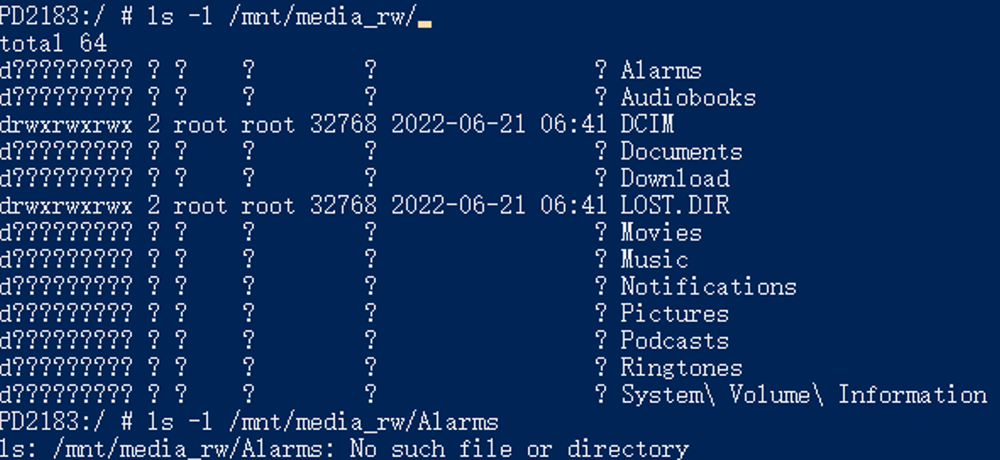
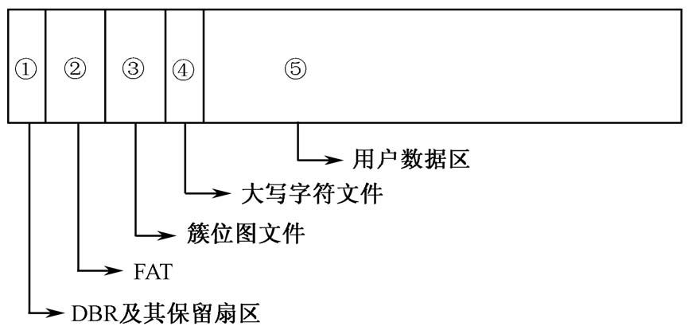

## 0. 概括

1. **问题描述：** 测试同事反馈了问题，发现采用新 Linux 内核的手机无法识别 exFAT 格式的 U 盘，访问文件时只能读取到文件名，读取不到其他的元数据。

   > Colleague testing feedback revealed an issue where smartphones using the new Linux kernel are unable to recognize exFAT-formatted USB drives. When accessing files, only the file names can be read, and other metadata cannot be accessed.

2. **问题定位：** 初步排查，发现，在挂载时，新版本的 exFAT 文件系统，不支持 `namecase` 参数，也就是说，新版本内核不支持文件名大小写敏感。

   > Upon initial investigation, it was discovered that with the new version of the exFAT file system, the `namecase` parameter is not supported during mounting. In other words, the new kernel version does not support case sensitivity for file names.

3. **证实推测：** 使用老版本内核的 `fsck.exfat` 工具，设定 `namecase` 参数为 0，对损坏的 U 盘进行修复。修复后，新版内核下 U 盘可以被正确识别。对比修复前后的二进制数据，发现校验和和文件名哈希这两个字段，发生了变化。

   > Using the `fsck.exfat` tool with an older kernel version, by setting the `namecase` parameter to 0, the damaged USB drive was repaired. After the repair, the USB drive can be correctly recognized by the new kernel version. A comparison of the binary data before and after the repair revealed changes in the checksum and file name hash fields.

4. **问题排查：** 然后是调试内核代码，去定位出现问题的代码段。首先，让问题复现，并运行 `ls -l` 命令，发现只能看到文件名而看不到其他文件记录数据，尝试访问某个文件时出现 "找不到文件" 错误。然后使用 strace, ftrace 等一系列工具，最终定位到是一个遍历目录项的系统调用，返回了异常错误码。这个系统调用，调用了 exFAT 的遍历目录的接口函数，它的作用是，解析文件名路径，计算校验和和哈希值，并和磁盘上的值进行比对。新版内核和老版内核在生成文件名哈希时，由于 `namecase` 参数的设计，采用了不同的计算方式，导致了文件无法识别。

   > Next, the debugging process involved locating the problematic code segment within the kernel. Initially, the issue was reproduced, and the `ls -l` command was executed, revealing that only file names were visible, while other file record data could not be accessed. Attempting to access a specific file resulted in a "File not found" error.
   >
   > Subsequently, a series of tools, such as strace and ftrace, were used, leading to the identification of a system call responsible for directory entry traversal, which returned an abnormal error code. This system call invoked exFAT's directory traversal interface function, which parsed the file name path, calculated checksums and hashes, and compared them to the values on the disk. The discrepancy in file name hash generation between the new and old kernel versions, due to the design of the `namecase` parameter, was identified as the root cause of the problem.

5. **问题解决：** 为解决问题，提出了两种解决方案：一是修改内核代码以跳过对 name hash 的判断，二是修改 fsck 修复工具的代码，让它能够按照老版本的方式，计算校验和、哈希值。

   > To address the issue, two solutions were proposed:
   >
   > 1. Modify the kernel code to bypass the check for name hash.
   > 2. Modify the fsck repair tool's code to calculate checksums and hash values in the manner of the older version.

## 1. 问题描述

测试同事反馈，某一批新版手机无法识别 exFAT 格式的 U 盘内容。

这是表层的问题体现，实质上是在 5.10 版本以后的内核都会触发该问题。

## 2. 问题定位

因此容易联想到，是文件系统驱动存在问题。先使用 mount 命令 `mount | grep exfat`，分别查看新老版本的 exFAT 在挂载时的参数区别，可以发现：

老版内核的 exFAT 文件系统支持 namecase 参数，该参数作用是控制文件系统的文件名大小写敏感。新版内核的 exFAT 文件系统不支持这个参数。

因此推测，是新版内核的 exFAT 文件系统不支持识别 namecase 参数，导致文件在磁盘上的二进制数据识别有误。

如何验证这个推测：对损坏的 U 盘使用老板内核的 fsck.exfat 修复工具，指定 namecase 参数为 0，对 U 盘进行修复。修复后，在新版内核可以识别。

## 3. 证实推测

对老板内核，文件大小写敏感的文件系统，使用 fsck 工具修复，用工具查看文件的二进制数据，对比修复前后数据发生的变化。发现，校验和（checksum）和文件名哈希（namehash）发生了改变，其他的数据都没有变化。这种校验字段的计算，通常和文件名等信息有关，因此判断是因为大小写敏感的原因，导致校验和计算不一致，进而导致系统无法识别。

然后就需要调试内核代码，定位出问题的具体位置。

## 4. 问题排查

启动老板内核，挂载一个 exFAT 文件系统，并设定参数为大小写敏感。插入到手机中，输入 `ls -l` 命令，出现情况：只能看到文件名，而看不到文件的其他记录数据（文件的权限信息、用户、文件大小、修改时间等）。

并尝访问某个具体文件（比如针对某个文件使用 `ls` 或者 `cat`），提示 “no such file or directory”（找不到文件）。

访问文件，在内核中是属于 inode 操作。inode 在内存中有特定的数据结构存储，包含了内核在操作文件或目录时需要的全部元数据。在文件系统的设计中，inode 就相当于一个类，它通过函数指针绑定的方式，绑定了一系列函数。

而访问某个文件的属性报错，推测是 lookup 函数有异常。后面我证实了这个猜想。

lookup 函数的作用是通过文件名寻找 inode，返回 inode 的编号。

然后使用 strace 工具，追踪 ls 命令的系统调用流程，可以发现是执行 `newfstatat` 系统调用时报错。

> strace 工具会跟踪执行指定命令时所涉及的系统调用，列出每个涉及的系统调用的参数和返回值。

`newfstatat` 主要完成两个工作，执行具体文件系统 lookup 接口，查找到文件缓存起来后，通过具体文件系统 getattr 接口获取文件属性。

然后使用 linux 内核的调试工具：ftrace，跟踪函数调用链，追踪这个 lookup 的全部的执行流。

> ftrace 功能有很多，最常见的是跟踪函数调用链。还有一个常用的功能是 trace event，它可以在跟踪特定的函数的同时输出一些指定的参数，变量信息，但是这需要开发人员针对自己的模块，给出相应的支持。exfat 原生不支持 event，调试起来需要自己打log，因此我在文件读写的一些关键函数上，给它加上了这个功能，并提交到了 Linux 社区。

经过追踪，定位到 lookup 中报错位置，新版内核在**遍历一个目录的属性项时报错，该属性包含了 文件名哈希namehash 的值**）（在 `exfat_find_dir_entry` 函数中遍历 `exfat entry` 时报错）。

> 再次提醒：lookup 函数的作用是通过文件名寻找 inode，返回 inode 的编号。

> exfat中，每个文件都由目录项管控，每个目录项有三条属性
>
> - “属性1”目录项用来记录该目录项的附属目录项数、校验和、文件属性、时间戳等信息。
> - “属性2”目录项用来记录文件是否有碎片、文件名的字符数、文件名的Hash值、**文件的起始簇号**及**大小**等信息。
> - “属性3”目录项用来具体记录文件的名称。如果文件名很长，“属性3”可以包含多个目录项，每个目录项称为一个片段。
>

阅读源码可知，文件名哈希（namehash） 是文件、目录在重命名、移动或创建操作时，函数解析路径后生成的。

问题到这里就排查的比较清晰了，是由于老内核生成文件 (挂载时启用文件系统大小写敏感) 的 文件名哈希（namehash） 计算方式不同，导致的问题。exFAT 在遍历目录项时，会计算一遍哈希值，和文件的哈希值进行比较，这里比较的结果不一致，导致文件无法识别。

## 5. 问题解决

提出了2种解决方案：

1. 修改内核的方案：在新驱动中，遍历目录项的函数中，跳过对 name hash 的判断。
2. 不修改内核的方案：让新的修复工具支持解析 namecase 参数并修复文件名哈希（name hash）（即，遇到 namecase = 1 挂载的文件系统，把它按照大小写不敏感的计算方式进行处理）。

## exFAT 结构记录

- exFAT 的第一个簇是簇位图文件(bitmap)，第二个簇是大写字符文件，第三个簇是根目录簇。在整个 exFAT 文件系统中，簇位图文件是 cluster[2]，因为，第一个是 DBR，第二个是 FAT。**这个值（簇位图文件）记录在了 DBR 的首簇起始扇区号中。**
- 怎么定位文件：
  - 每个文件都由目录项管控，每个目录项有三条属性
  - “属性1”目录项用来记录该目录项的附属目录项数、校验和、文件属性、时间戳等信息。
  - “属性2”目录项用来记录文件是否有碎片、文件名的字符数、文件名的Hash值、**文件的起始簇号**及**大小**等信息。
  - “属性3”目录项用来具体记录文件的名称。如果文件名很长，“属性3”可以包含多个目录项，每个目录项称为一个片段。
  - **因此，定位文件时，从其父目录中找到该文件的起始簇号，然后去FAT表里查看它是否连续（FAT表相当于链表指针，连续记录了文件数据），根据连续的簇号，计算出在文件系统里的偏移即可。**
