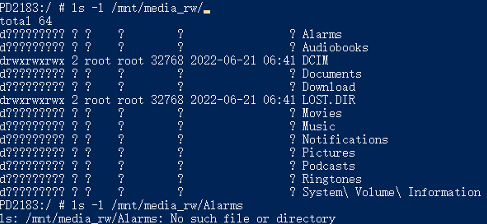
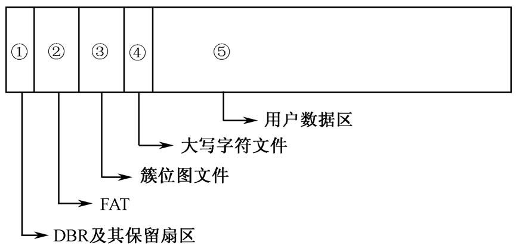

## 1. 问题描述

测试同事反馈，安卓12的机器无法识别 exfat 格式的 U 盘内容，而且先插到安卓11的机器再插入 安卓12会重复创建相同文件夹。

经过排查，安卓12 使用 5.10 kernel 的机型都有此表现。

## 2. 问题定位

什么是驱动？驱动就是 linux 内核里的文件系统代码。

老驱动：采用 github 第三方 exfat 驱动。

新驱动：问题复现的设备所采用的驱动，采用内核原生的 exfat 驱动。该驱动不支持 namecase 参数。

> 使用 `mount | grep exfat` 查看已经挂载的 exfat 文件系统的参数，这个命令可以知道 exfat 挂载时用的参数。

**手机系统 在挂载设备时，针对 exfat 文件系统，会自动调用 fsck 工具，检查文件系统的一致性。**因此，首先排除工具的影响，做法：

> 将 PD2183 手机里的 fsck.exfat 等工具改名，让系统识别不到这个工具，因此就无法正常调用。

在去掉 fsck 工具后，通过命令行手动挂载 U 盘，在老驱动上分别以 namecase 为 0、1 的参数，挂载，创建文件后，插入新驱动机器。经过实验后发现：

1. 老驱动上使用 namecase = 0 参数挂载后创建的文件，在新驱动上可以正常识别。

2. 老驱动上使用 namecase = 1 参数挂载后创建的文件，在新驱动上无法正常识别。
3. 对损坏的 U 盘使用fsck修复工具后，在新驱动上可以识别了。

**由此推测，该问题是由于安卓12用的 kernel 不支持识别 namecase 参数，识别文件 metadata 有问题，且工具能够修复文件 metadata。**

## 3. 证实推测

将老驱动上使用namecase=1的文件进行修复后，用工具查看文件的二进制数据，可以看到，checksum 和 namehash 发生了改变，其他的数据都不变。这种校验字段的计算，通常和文件名等信息有关，推测是因为大小写敏感的原因，导致校验和计算不一致，进而导致系统无法识别。

## 4. 问题排查

将老驱动下namecase=1创建的U盘插入新驱动的手机中，使用 ls -l 命令，出现了情况：

ls 命令通常可以看到文件的权限信息、用户、文件大小、修改时间等信息。但是在新驱动读取老驱动创建的文件时，只能看到文件名了。

再尝试访问某个具体文件，提示 "no such file or directory"（找不到文件）。

访问文件，在内核中是属于 inode 操作。inode 在内存中有特定的数据结构存储，包含了内核在操作文件或目录时需要的全部元数据。在文件系统的设计中，inode就相当于一个类，它通过函数指针绑定的方式，绑定了一系列函数。

而访问某个文件的属性报错，推测是 lookup 函数有异常。后面我证实了这个猜想。

lookup 函数的作用是通过文件名寻找inode，返回inode的编号。

然后使用 strace 工具，追踪 ls 命令的系统调用流程，可以发现是执行 `newfstatat` 系统调用时报错。这个工具会跟踪执行指定命令时所涉及的系统调用。

`newfstatat` 主要完成两个工作，执行具体文件系统 lookup 接口，查找到文件缓存起来后，通过具体文件系统 getattr 接口获取文件属性。

然后使用 linux 内核的调试工具， ftrace 的函数调用链功能，追踪这个系统调用的执行流。

> ftrace 功能有很多，最常见的是跟踪函数调用链。还有一个常用的功能是 trace event，它可以在跟踪特定的函数的同时输出一些指定的参数，变量信息，但是这需要开发人员针对自己的模块，给出相应的支持。exfat 原生不支持 event，调试起来需要自己打log，因此我在文件读写的一些关键函数上，给它加上了这个功能。

经过追踪，定位到lookup中报错位置，新驱动在exfat_find_dir_entry函数中遍历exfat entry时报错（**遍历一个目录的属性项时报错，是属性2，该属性包含了name hash 的值**）。

> lookup 函数的作用是通过文件名寻找inode，返回inode的编号。

exfat中，每个文件都由目录项管控，每个目录项有三条属性

- “属性1”目录项用来记录该目录项的附属目录项数、校验和、文件属性、时间戳等信息。
- “属性2”目录项用来记录文件是否有碎片、文件名的字符数、文件名的Hash值、**文件的起始簇号**及**大小**等信息。
- “属性3”目录项用来具体记录文件的名称。如果文件名很长，“属性3”可以包含多个目录项，每个目录项称为一个片段。

阅读源码可知，name_hash 是文件、目录在重命名、移动或创建操作时，函数解析路径后生成的。问题到这里就排查的比较清晰了，是由于老驱动生成文件(使用namecase=1挂载参数)的namehash值计算方式不同导致。

## 5. 问题解决

提出了2种解决方案：

1. 修改内核的方案：在新驱动中，遍历目录项的函数中，跳过对 name hash 的判断。
2. 不修改内核的方案：让新的修复工具支持解析 namecase 参数并修复 name hash。

## exFAT 结构记录

- exFAT 的第一个簇是簇位图文件(bitmap)，第二个簇是大写字符文件，第三个簇是根目录簇。在整个 exFAT 文件系统中，簇位图文件是 cluster[2]，因为，第一个是 DBR，第二个是 FAT。**这个值（簇位图文件）记录在了 DBR 的首簇起始扇区号中。**
- 怎么定位文件：
  - 每个文件都由目录项管控，每个目录项有三条属性
  - “属性1”目录项用来记录该目录项的附属目录项数、校验和、文件属性、时间戳等信息。
  - “属性2”目录项用来记录文件是否有碎片、文件名的字符数、文件名的Hash值、**文件的起始簇号**及**大小**等信息。
  - “属性3”目录项用来具体记录文件的名称。如果文件名很长，“属性3”可以包含多个目录项，每个目录项称为一个片段。
  - **因此，定位文件时，从其父目录中找到该文件的起始簇号，然后去FAT表里查看它是否连续（FAT表相当于链表指针，连续记录了文件数据），根据连续的簇号，计算出在文件系统里的偏移即可。**