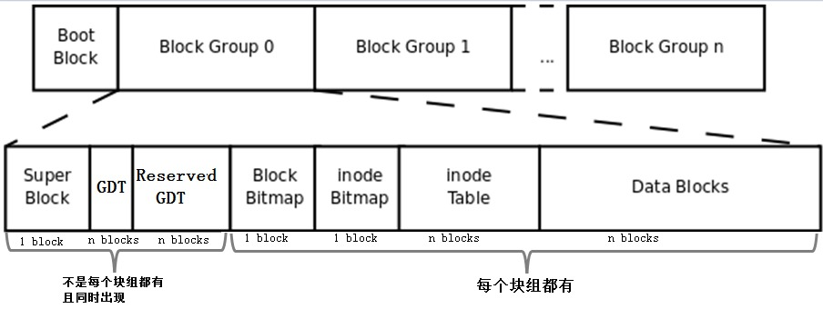
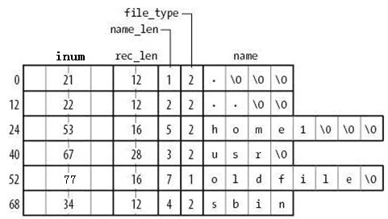
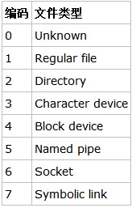

# ext4 高温损坏问题

## 0. ext类 文件系统结构

### 0.1 块结构描述

- **超级块：** 记录文件系统的总体元数据。block 总量、inode 数量、时间戳信息、空闲数量、挂载点、自检信息等。**ext4 在块组的 0、1、和3、5、7幂次方的块组中保存了超级块的信息。**
- **GDT：**块组描述符表，GDT 表记录了文件系统里所有块组的信息，每个块组用32字节描述。有：校验和、块位图起始地址，inode 位图起始地址，inode表起始地址，空闲块数，空闲inode数等。
- **保留 GDT：**为了文件系统扩容用，让 GDT 块能够延伸。
- **Block bitmap：**以比特位的方式标识该块组中被占用的块。可以快速定位出空闲的块。
- **inode bitmap：**以比特位的方式标识该块组中被占用的inode。可以快速定位出空闲的inode。
- **inode table：**inode 是 Linux 内核中索引文件的关键数据结构，一般在磁盘上有一个类似的物理实现。inode 表，以字段形式记录了该块组中所有的inode。
- **Data block：**数据块
  - 对于常规文件，文件的数据正常存储在数据块中。
  - 对于目录，该目录下的所有文件和一级子目录的目录名存储在数据块中。
    - **文件名和 inode 号不是存储在其自身的 inode 中，而是存储在其所在目录的 data block 中。**
  - 对于符号链接，如果目标路径名较短则直接保存在 inode 中以便更快地查找，如果目标路径名较长则分配一个数据块来保存。
  - 设备文件、FIFO 和 socket 等特殊文件没有数据块，设备文件的主设备号和次设备号保存在 inode 中。

### 0.2 data block

- inode 号存放在 data block 中。通过 inode 号可以从 inode table 中找到该 inode 号对应的 inode 记录。

- 文件类型：

  

  

### 0.3 如何根据 inode num 找到 inode

文件的 inum 储存在了父目录所在的 data block 数据区里。通过 inum 可以作为索引，定位到 inode table 中的 inode 数据结构，再通过其 i_blocks 字段定位到 data block 的位置。

**由此可见，目录 data block 中的 inode number 是找到 inode table 中对应 inode 记录的唯一方式。**

### 0.4 软连接与硬链接

**软链接，又名符号链接，**类似于 Windows 操作系统中的快捷方式，它的作用是指向原文件或目录。

它一般情况下不占用 data block，其 inode table 中记录的了指向目标路径的字符串，例如某个符号链接的指向方式为”rmt –> ../sbin/rmt”，则其文件大小为 11 字节；只有当符号链接指向的目标的路径名较长 (60 个字节) 时文件系统才会划分一个 data block 给它；它的权限如何也不重要，因它只是一个指向原文件的” 工具”，最终决定是否能读写执行的权限由原文件决定，所以很可能 ls -l 查看到的符号链接权限为 777。

**硬链接，**实质上是在 data block 中创建了一条记录。

- 每创建一个文件的硬链接，实质上是多一个指向该 inode 记录的 inode 指针，并且硬链接数加 1。
- 删除文件的实质是删除该文件所在目录 data block 中的对应的 inode 行，所以也是减少硬链接次数，由于 block 指针是存储在 inode 中的，所以不是真的删除数据，如果仍有其他 inode 号链接到该 inode，那么该文件的 block 指针仍然是可用的。当硬链接次数为 1 时再删除文件就是真的删除文件了，此时 inode 记录中 block 指针也将被删除。
- 因此，**不能跨分区创建硬链接**，因为不同文件系统的 inode 号可能会相同。

### 0.5 inode 文件寻址

- 在 ext2 和 ext3 文件系统中，一个 inode 中最多只能有 15 个指针，每个指针使用 i_block [n] 表示。
- 前 12 个指针 i_block [0] 到 i_block [11] 是直接寻址指针，每个指针指向一个数据区的 block。
- 第 13 个指针是一级间接寻址，14 是 二级间接， 15 是 三级间接。

### 0.6 文件操作

#### 1. 读文件

当执行 `cat /a/txt` ：

- 找到根文件系统的块组描述符表所在的 blocks，**读取 GDT (已在内存中) 找到 inode table 的 block 号。**（定位 inode table）
- 根文件系统 `/` 的 inum 固定为 2，直接从 inode table 中定位出根目录文件的 data block。
- 在 `/` 的 datablock 中记录了 a 目录名和 a 的 inode 号，从 inode table 中找到该 inode 记录，inode 记录中存储了指向 txt 的 block 指针，所以也就找到了 txt 文件的 data block。

#### 2. 删除文件

**删除普通文件：**

(1) 找到文件的 inode 和 data block (根据前一个小节中的方法寻找)；

(2) 将 inode table 中该 inode 记录中的 data block 指针删除；

(3) 在 imap 中将该文件的 inode 号标记为未使用；

(4) 在其所在目录的 data block 中将该文件名所在的记录行删除，删除了记录就丢失了指向 inode 的指针（**实际上不是真的删除，直接删除的话会在目录 data block 的数据结构中产生空洞，所以实际的操作是将待删除文件的 inode 号设置为特殊的值 0，这样下次新建文件时就可以重用该行记录**）；

(5) 将 bmap 中 data block 对应的 block 号标记为未使用（对于 ext 文件系统，这个步骤可能会导致删除大文件时间较久，资源消耗较多，对于其它文件系统，则视情况而定）。

**删除目录文件：**

找到目录和目录下所有文件、子目录、子文件的 inode 和 data block；在 imap 中将这些 inode 号标记为未使用；将 bmap 中将这些文件占用的 block 号标记为未使用；在该目录的父目录的 data block 中将该目录名所在的记录行删除。

**移动文件：**

只是修改了 data block 里面的记录而已。**因此在 ext 文件系统中，移动文件速度非常快**。

**存储文件：**

- 读取 GDT，找到各个 (或部分) 块组 imap 中未使用的 inode 号，并为待存储文件分配 inode 号；
- 在 inode table 中完善该 inode 号所在行的记录；
- 在目录的 data block 中添加一条该文件的相关记录；
- 将数据填充到 data block 中。
  - 注意，填充到 data block 中的时候会调用 block 分配器：一次分配 4KB 大小的 block 数量，当填充完 4KB 的 data block 后会继续调用 block 分配器分配 4KB 的 block，然后循环直到填充完所有数据。也就是说，如果存储一个 100M 的文件需要调用 block 分配器 100*1024/4=25600 次。
  - 另一方面，在 block 分配器分配 block 时，block 分配器并不知道真正有多少 block 要分配，只是每次需要分配时就分配，在每存储一个 data block 前，就去 bmap 中标记一次该 block 已使用，它无法实现一次标记多个 bmap 位。这一点在 ext4 中进行了优化。
- 填充完之后，去 inode table 中更新该文件 inode 记录中指向 data block 的寻址指针。

**文件系统挂载**

比如挂载点是 /mnt，实质上是给 /mnt 重新分配了一个 inode 号，它指向的 data block 是挂载的目录的数据。

卸载，就是在 inode table 中移除新建的 inode 记录。

### 0.7 ext2、ext3、ext4

**ext3**

相比 ext2 文件系统，ext3 多了一个日志功能。

在 ext2 文件系统中，只有两个区：数据区和元数据区。如果正在向 data block 中填充数据时突然断电，那么下一次启动时就会检查文件系统中数据和状态的一致性，这段检查和修复可能会消耗大量时间，甚至检查后无法修复。之所以会这样是因为文件系统在突然断电后，它不知道上次正在存储的文件的 block 从哪里开始、哪里结束，所以它会扫描整个文件系统进行排除 (也许是这样检查的吧)。

而在创建 ext3 文件系统时会划分三个区：数据区、日志区和元数据区。每次存储数据时，先在日志区中进行 ext2 中元数据区的活动，直到文件存储完成后标记上 commit 才将日志区中的数据转存到元数据区。当存储文件时突然断电，下一次检查修复文件系统时，只需要检查日志区的记录，将 bmap 对应的 data block 标记为未使用，并把 inode 号标记未使用，这样就不需要扫描整个文件系统而耗费大量时间。

虽说 ext3 相比 ext2 多了一个日志区转写元数据区的动作而导致 ext3 相比 ext2 性能要差一点，特别是写众多小文件时。但是由于 ext3 其他方面的优化使得 ext3 和 ext2 性能几乎没有差距。

**ext4**

ext2、ext3存在的问题：

- 使用block为存储单元，每个block使用bmap中的位来标记是否空闲，对于一个巨大的文件，扫描整个bmap都将是一件浩大的工程。
- 在inode寻址方面，ext2/3使用直接和间接的寻址方式，对于三级间接指针，可能要遍历的指针数量是非常非常巨大的。

**改进：**

- ext4文件系统在ext3的基础上使用区(extent，或称为段)的概念来管理。一个extent尽可能的包含物理上连续的一堆block。
- ext4的 inode 结构做了重大改变，为增加新的信息，大小由 ext3 的128字节增加到默认的256字节，同时inode寻址索引不再使用ext3的"12个直接寻址块+1个一级间接寻址块+1个二级间接寻址块+1个三级间接寻址块"的索引模式，而改为4个Extent片断流，每个片断流设定片断的起始block号及连续的block数量(有可能直接指向数据区，也有可能指向索引块区)。

### 0.8 ext 缺点

最大的缺点是它在创建文件系统的时候就划分好一切需要划分的东西，以后用到的时候可以直接进行分配，也就是说它不支持动态划分和动态分配。对于较小的分区来说速度还好，但是对于一个超大的磁盘，速度是极慢极慢的。例如将一个几十 T 的磁盘阵列格式化为 ext4 文件系统，可能你会因此而失去一切耐心。

除了格式化速度超慢以外，ext4 文件系统还是非常可取的。当然，不同公司开发的文件系统都各有特色，最主要的还是根据需求选择合适的文件系统类型。