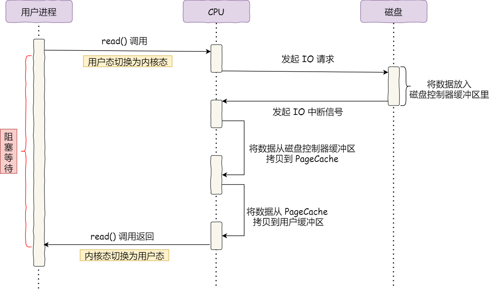
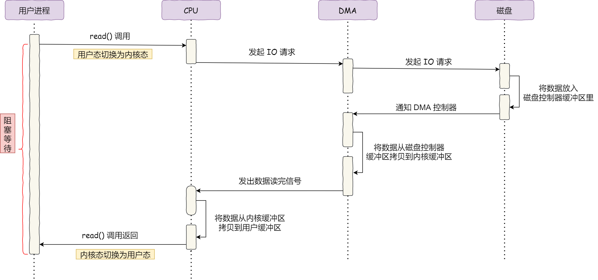
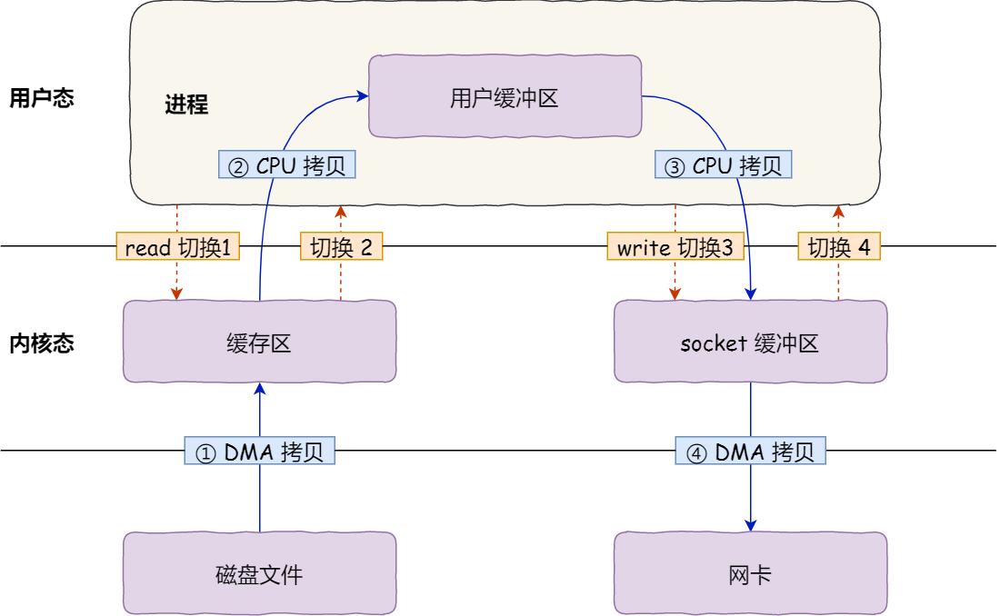
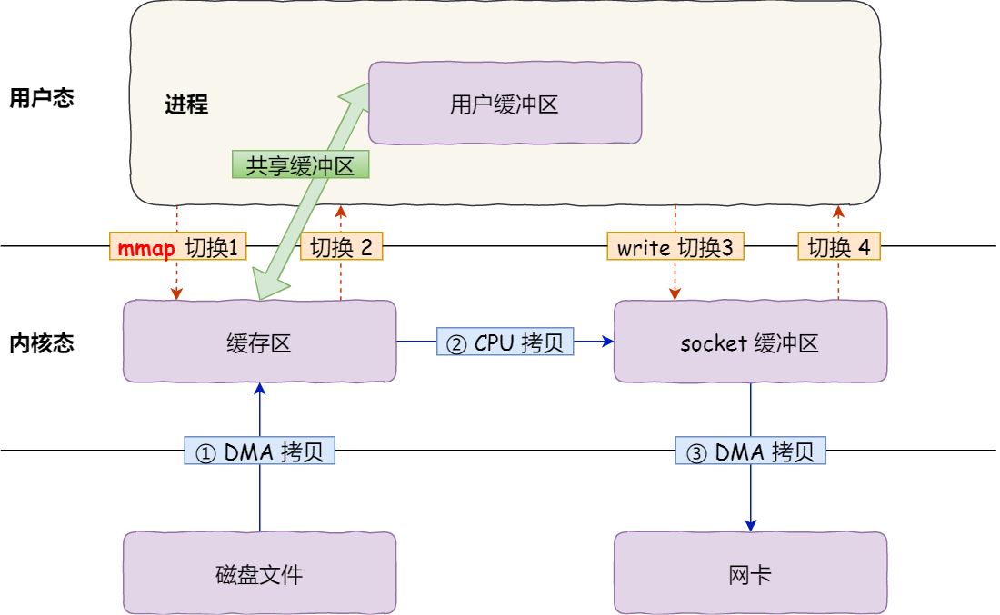
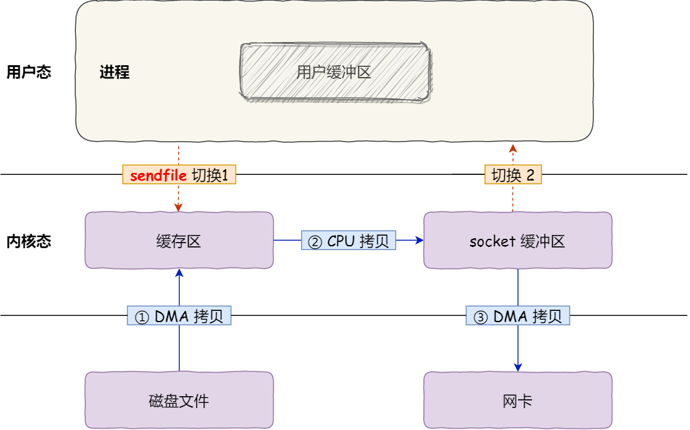

[TOC]


#### 问题

线程池 + 多反应堆模型可以避免“惊群”问题。

"惊群效应"（Thundering Herd Effect）是指在多线程编程中的一种现象，通常出现在等待某个资源的线程中。当资源可用时，所有等待的线程都被唤醒，但实际上只有一个线程能够获得资源并执行，其他线程会重新进入等待状态。这种现象可能会导致性能下降和系统资源浪费。


#### HTTP 协议


#### 零拷贝技术

DMA 技术：在进行 I/O 设备和内存的数据传输的时候，数据搬运的工作全部交给 DMA 控制器，而 CPU 不再参与任何与数据搬运相关的事情，这样 CPU 就可以去处理别的事务。


在没有 DMA 技术前，I/O 的过程是这样的：

- CPU 发出对应的指令给磁盘控制器，然后返回；
- 磁盘控制器收到指令后，于是就开始准备数据，会把数据放入到磁盘控制器的内部缓冲区中，然后产生一个**中断**；
- CPU 收到中断信号后，停下手头的工作，接着把磁盘控制器的缓冲区的数据一次一个字节地读进自己的寄存器，然后再把寄存器里的数据写入到内存，而在数据传输的期间 CPU 是无法执行其他任务的。




有了 DMA 技术之后，访问方式如下：



**CPU 不再参与「将数据从磁盘控制器缓冲区搬运到内核空间」的工作，这部分工作全程由 DMA 完成**。但是 CPU 在这个过程中也是必不可少的，因为传输什么数据，从哪里传输到哪里，都需要 CPU 来告诉 DMA 控制器。


- 对于网络传输，普通的文件传输需要4次数据复制。




- 要以零拷贝的方式实现传输，有3种
  - mmap + write
  - sendfile
  - 硬件级别支持
- mmap + write 实现：
- 

- `mmap()` 系统调用函数会直接把内核缓冲区里的数据「**映射**」到用户空间，这样，操作系统内核与用户空间就不需要再进行任何的数据拷贝操作。
- 这种方式可以减少一次数据复制。


- sendfile：
- 

- 减少一次上下文切换的开销。


- 如果是硬件级别支持，比如网络传输的过程中，网卡的 DMA 控制器可以直接从内核缓存区将数据复制至网卡缓冲区，再减少一次数据复制（减少了 内核缓冲区 -> socket 缓冲区）


## 一、IO 多路复用

### 1. 什么是多路复用

IO多路复用是一种网络通信的手段，可以同时监测多个文件描述符，并且这个过程是阻塞的，一旦检测到有文件描述符就绪（ 可以读数据或者可以写数据）程序的阻塞就会被解除，之后就可以基于这些（一个或多个）就绪的文件描述符进行通信了。通过这种方式在单线程/进程的场景下也可以在服务器端实现并发。

常见的IO多路转接方式有：select、poll、epoll。


**工作过程：**

- IO多路复用函数：委托内核检测服务器端所有的文件描述符
- 这个检测过程会导致进程/线程的阻塞，如果检测到已就绪的文件描述符阻塞解除，并将这些已就绪的文件描述符传出
- 根据类型对传出的所有已就绪文件描述符进行判断，并做出不同的处理
  - 监听的文件描述符：和客户端建立连接。此时调用accept()是不会导致程序阻塞的，因为监听的文件描述符是已就绪的（有新请求）
  - 通信的文件描述符：调用通信函数和已建立连接的客户端通信
- 对这些文件描述符进行下一轮检测


**和多进程相比的好处：**

I/O多路复用技术的最大优势是系统开销小，系统不必创建进程/线程，也不必维护这些进程/线程，从而大大减小了系统的开销。


### 2 三个复用函数

#### 2.1 select

`int select(int nfds, fd_set *readfds, fd_set *writefds, fd_set *exceptfds, struct timeval * timeout)`;

- 该函数跨平台
- 把读、写、异常的文件描述符，整合成三个集合
  - 当文件描述符对应的读缓冲区有数据，该读文件描述符就绪
  - 当文件描述符对应的写缓冲区不为 full，该写文件描述符就绪
  - 读写异常：当文件描述符对应的读写缓冲区有异常，该文件描述符就绪
- 委托检测的文件描述符被遍历检测完毕之后，已就绪的这些满足条件的文件描述符会通过select()的参数分3个集合传出。
- 最后一个参数是超时时长，用来强制解除select()函数的阻塞的。


**处理流程**

1. 创建监听的套接字 `lfd = socket()`;

2. 将监听的套接字和本地的IP和端口绑定 `bind()`
3. 给监听的套接字设置监听 `listen()`
4. 创建一个文件描述符集合 `fd_set`，用于存储需要检测读事件的所有的文件描述符
   - 通过 `FD_ZERO()` 初始化
   - 通过 `FD_SET()` 将监听的文件描述符放入检测的读集合中
5. 循环调用 `select()`，周期性的对所有的文件描述符进行检测
6. `select()` 解除阻塞返回，得到内核传出的满足条件的就绪的文件描述符集合
   - 通过 `FD_ISSET()` 判断集合中的标志位是否为 1
     - 如果这个文件描述符是监听的文件描述符，调用 `accept()` 和客户端建立连接
       - 将得到的新的通信的文件描述符，通过 `FD_SET()` 放入到检测集合中
   - 如果这个文件描述符是通信的文件描述符，调用通信函数和客户端通信
     - 如果客户端和服务器断开了连接，使用 `FD_CLR()` 将这个文件描述符从检测集合中删除
     - 如果没有断开连接，正常通信即可
7. 重复第6步


**局限性**

- 待检测集合（第2、3、4个参数）需要频繁的在用户区和内核区之间进行数据的拷贝，效率低

- 内核对于select传递进来的待检测集合的检测方式是线性的
  - 如果集合内待检测的文件描述符很多，检测效率会比较低
  - 如果集合内待检测的文件描述符相对较少，检测效率会比较高
- 使用select能够检测的最大文件描述符个数有上限，默认是1024，这是在内核中被写死了的。


### 2.2 poll

poll的机制与select类似，与select在本质上没有多大差别，使用方法也类似，下面的是对于二者的对比：

- 内核对应文件描述符的检测也是以线性的方式进行轮询，根据描述符的状态进行处理
- poll和select检测的文件描述符集合会在检测过程中频繁的进行用户区和内核区的拷贝，它的开销随着文件描述符数量的增加而线性增大，从而效率也会越来越低。
- select检测的文件描述符个数上限是1024，poll没有最大文件描述符数量的限制
- select可以跨平台使用，poll只能在Linux平台使用

函数原型：

```c
#include <poll.h>
// 每个委托poll检测的fd都对应这样一个结构体
struct pollfd {
    int   fd;         /* 委托内核检测的文件描述符 */
    short events;     /* 委托内核检测文件描述符的什么事件 */
    short revents;    /* 文件描述符实际发生的事件 -> 传出 */
};

struct pollfd myfd[100];
int poll(struct pollfd *fds, nfds_t nfds, int timeout);
```

**函数参数：**

- fds: 这是一个 `struct pollfd` 类型的数组, 里边存储了待检测的文件描述符的信息，这个数组中有三个成员：

  - fd：委托内核检测的文件描述符
  - events：委托内核检测的fd事件（输入、输出、错误），每一个事件有多个取值
  - revents：这是一个传出参数，数据由内核写入，存储内核检测之后的结果
- nfds: 这是第一个参数数组中最后一个有效元素的下标 + 1（也可以指定参数1数组的元素总个数）


**与 select 比较**

- `poll`和`select`进行IO多路复用的处理思路是完全相同的，但是使用poll编写的代码看起来会更直观一些
- `select`使用的位图的方式来标记要委托内核检测的文件描述符（每个比特位对应一个唯一的文件描述符），并且对这个`fd_set`类型的位图变量进行读写还需要借助一系列的宏函数，操作比较麻烦
- 而poll直接将要检测的文件描述符的相关信息封装到了一个结构体`struct pollfd`中，可以直接读写这个结构体变量。


### 2.3 epoll

epoll 全称 eventpoll，是select和poll的升级版，改进了工作方式，因此它更加高效。

- 对于待检测集合`select`和`poll`是基于线性方式处理的，`epoll`是基于红黑树来管理待检测集合的。

- `select`和`poll`每次都会线性扫描整个待检测集合，集合越大速度越慢，`epoll`使用的是回调机制，效率高，处理效率也不会随着检测集合的变大而下降
- `select`和`poll`工作过程中存在内核/用户空间数据的频繁拷贝问题，在`epoll`中内核和用户区使用的是共享内存（基于mmap内存映射区实现），省去了不必要的内存拷贝。
- 程序猿需要对`select`和`poll`返回的集合进行判断才能知道哪些文件描述符是就绪的，通过`epoll`可以直接得到已就绪的文件描述符集合，无需再次检测

当多路复用的文件数量庞大、IO流量频繁的时候，一般不太适合使用select()和poll()，这种情况下select()和poll()表现较差，推荐使用epoll()。


```c
#include <sys/epoll.h>
// 创建epoll实例，通过一棵红黑树管理待检测集合
int epoll_create(int size);
// 管理红黑树上的文件描述符(添加、修改、删除)
int epoll_ctl(int epfd, int op, int fd, struct epoll_event *event);
// 检测epoll树中是否有就绪的文件描述符
int epoll_wait(int epfd, struct epoll_event * events, int maxevents, int timeout);
```


**为什么 select 和 poll 相对低效？** 

select/poll低效的原因之一是将“添加/维护待检测任务”和“阻塞进程/线程”两个步骤合二为一。每次调用select都需要这两步操作，然而大多数应用场景中，需要监视的socket个数相对固定，并不需要每次都修改。epoll将这两个操作分开，先用`epoll_ctl()`维护等待队列，再调用`epoll_wait()`阻塞进程（解耦）。


**调用流程**

`epoll_create()`：创建一个红黑树模型的实例，用于管理待检测的文件描述符的集合。


`epoll_ctl()`：管理红黑树实例上的节点，可以进行添加、删除、修改操作。

```c
int epoll_ctl(int epfd, int op, int fd, struct epoll_event *event);

// 联合体, 多个变量共用同一块内存        
typedef union epoll_data {
 	void        *ptr;
	int          fd;	// 通常情况下使用这个成员, 和epoll_ctl的第三个参数相同即可
	uint32_t     u32;
	uint64_t     u64;
} epoll_data_t;

struct epoll_event {
	uint32_t     events;      /* Epoll events */
	epoll_data_t data;        /* User data variable */
};
```

- epfd：epoll_create() 函数的返回值，通过这个参数找到epoll实例

- op：这是一个枚举值，控制通过该函数执行什么操作
  - `EPOLL_CTL_ADD`：往epoll模型中添加新的节点
  - `EPOLL_CTL_MOD`：修改epoll模型中已经存在的节点
  - `EPOLL_CTL_DEL`：删除epoll模型中的指定的节点
- fd：文件描述符，即要添加/修改/删除的文件描述符
- event：epoll事件，用来修饰第三个参数对应的文件描述符的，指定检测这个文件描述符的什么事件
  - events：委托epoll检测的事件
    - `EPOLLIN`：读事件, 接收数据, 检测读缓冲区，如果有数据该文件描述符就绪
    - `EPOLLOUT`：写事件, 发送数据, 检测写缓冲区，如果可写该文件描述符就绪
    - `EPOLLERR`：异常事件
  - data：用户数据变量，这是一个联合体类型，通常情况下使用里边的fd成员，用于存储待检测的文件描述符的值，在调用epoll_wait()函数的时候这个值会被传出


`epoll_wait()`：检测创建的epoll实例中有没有就绪的文件描述符。

```c
int epoll_wait(int epfd, struct epoll_event * events, int maxevents, int timeout);
```


### 2.4 epoll 的工作模式

#### 2.4.1 水平模式 (LT)

内核通知使用者哪些文件描述符已经就绪，之后就可以对这些已就绪的文件描述符进行 IO 操作了。

具体来说，

读事件：如果文件描述符对应的缓冲区内还有数据，读事件就会触发，epoll_wait 解除阻塞。比如，接收到的数据的大小大于缓冲区时，读事件会被反复触发，直到数据被全部读出。

写事件：如果文件描述符对应的写缓冲区可写，写事件就会被触发，epoll_wait 解除阻塞。如果缓冲区没有写满，会被一直触发。**因为写数据是主动的，并且写缓冲区一般情况下都是可写的（缓冲区不满），因此对于写事件的检测不是必须的。**


#### 2.4.2 边沿模式 (ET)

这是一种高速工作模式，只支持非阻塞形式。**当文件描述符从未就绪变为就绪时，内核会通过epoll通知使用者。然后它会假设使用者知道文件描述符已经就绪，并且不会再为那个文件描述符发送更多的就绪通知（only once）。**

读事件：**当读缓冲区有新的数据进入，读事件被触发一次，没有新数据不会触发该事件。**因此，如果接收的数据长度大于缓冲区，它不会反复读出。

写事件：**当写缓冲区状态可写，写事件只会触发一次。**

- 如果写缓冲区被检测到可写，写事件被触发，epoll_wait() 解除阻塞

- 写事件被触发，就可以通过调用 write () / send() 函数，将数据写入到写缓冲区中
  - 写缓冲区从不满到被写满，期间写事件只会被触发一次
  - 写缓冲区从满到不满，状态变为可写，写事件只会被触发一次

综上所述：epoll 的边沿模式下 epoll_wait() 检测到文件描述符有新事件才会通知，如果不是新的事件就不通知，通知的次数比水平模式少，效率比水平模式要高。


## 二、多线程知识

- 线程的生命周期会随着主线程，主线程退出后，会销毁进程的全部地址空间，这意味着会把子线程一起销毁。使用 pthread_exit 可以在子线程中退出。
- 主线程和子线程之间的栈空间可以互相访问。
- 使用 pthread_detach 可以分离子线程，调用这个函数之后指定的子线程和主线程分离，当子线程退出的时候，其占用的内核资源就被系统的其他进程接管并回收了。线程分离之后在主线程中使用 pthread_join 就回收不到子线程资源了。


### 1.1 线程池

#### 1.1.1 线程池作用

- 主要是避免频繁地创建和销毁线程
- 处理过程中将任务添加到队列，然后在创建线程后自动启动这些任务。线程池中的线程，会从任务队列里取出任务（要运行的函数和数据结构），执行它，并在执行结束后不会销毁线程。
- 线程池一般会动态地调整池中的线程数量，通常来说，任务队列中等待处理的任务数量大于空闲的线程数量，会选择增加线程；如果忙线程数量小于空闲线程数量（要根据算法来设计，比如 忙的线程*2 < 存活的线程数 && 存活的线程>最小线程数），则选择销毁

#### 1.1.2 线程池构成部分

1. 任务队列，存储需要处理的任务，由工作的线程来处理这些任务

   - 通过线程池提供的API函数，将一个待处理的任务添加到任务队列，或者从任务队列中删除
   - 已处理的任务会被从任务队列中删除
   - 线程池的使用者，也就是调用线程池函数往任务队列中添加任务的线程就是生产者线程
2. 工作的线程（任务队列任务的消费者） ，N个
   - 线程池中维护了一定数量的工作线程, 他们的作用是是不停的读任务队列, 从里边取出任务并处理
   - 工作的线程相当于是任务队列的消费者角色，
   - 如果任务队列为空, 工作的线程将会被阻塞 (使用条件变量/信号量阻塞)
   - 如果阻塞之后有了新的任务, 由生产者将阻塞解除, 工作线程开始工作
3. 管理者线程（不处理任务队列中的任务），1个
   - 它的任务是周期性的对任务队列中的任务数量以及处于忙状态的工作线程个数进行检测
   - 当任务过多的时候, 可以适当的创建一些新的工作线程
   - 当任务过少的时候, 可以适当的销毁一些工作的线程


C++ with pthread 实现：https://subingwen.cn/linux/threadpool-cpp/


### 处理流程？

- 首先通过 `threadPoolInit` 函数得到线程池的实例

- 然后调用 `threadPoolRun` 启动这个线程池（初始化里面的每一个线程）

- 可以从线程池里取出某一个子线程，得到子线程之后，可以得到子线程里面的 `EventLoop` 实例

- 调用者可以通过这个 `EventLoop` 实例，往 `EventLoop` 里的任务队列里添加任务

- `EventLoop` 处理任务队列里的任务，`Dispatcher` 根据任务结点的类型，处理任务：
  - 添加、删除或修改
  
  
